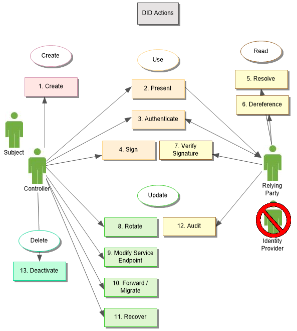

### 去中心化数字身份与可验证声明

#### 参考材料

> w3c：
>
> https://w3c.github.io/did-core/
>
> https://w3c.github.io/did-use-cases/
>
> https://www.w3.org/TR/vc-data-model/
>
> https://w3c-ccg.github.io/credential-handler-api/
>
> 百度DID开发者中心：https://did.baidu.com/

#### 什么是去中心化数字身份？

> 定义：基于区块链技术的分布式数字身份（Decentralized ID, DID)是可验证的、 自我主权的、新型数字身份
>
> 本质：DID就是一个存放公钥的地址，用区块链来存储相关的公钥 实现了从中心化PKI到分布式PKI的转变

#### 去中心化数字身份DID主要特点

| 目标 | 说明                                                         |
| ---- | ------------------------------------------------------------ |
| 分权 | 消除标识符管理中对集中式权限或单点故障的要求                 |
| 控制 | 赋予实体，直接控制其数字身份的权力，而无需依赖外部权威。     |
| 隐私 | 使实体能够控制其信息的隐私，包括属性或其他数据的最小、选择性和渐进式披露。 |

#### 去中心化数字身份DID架构


#### DID字段结构说明


其中`DID Method Specific String`=`base58(ripemd160(sha256(<Base DID Document>)))` （参考比特币，使用双 hash）。

其中`Base DID Document`为

```
{
  "@context": "https://w3id.org/did/v1",
  "publicKey": [
    {
      "id": "#keys-1",
      "type": "Secp256k1",
      "publicKeyHex": "02b97c30de767f084ce3080168ee293053ba33b235d7116a3263d29f1450936b71"
    },
    {
      "id": "#keys-2",
      "type": "Secp256k1",
      "publicKeyHex": "4b4042665b3235a12fb49730ff620fef1c96e9efa5c90119abd2e8acfe856053"
    }
  ],
  "authentication": ["#key-1"],
  "recovery": ["#key-2"]
}
```

#### DID Document结构说明

```
{
  "@context": "https://w3id.org/did/v1",
  "id": "did:ccp:7f8ca8982f6cc6e8ea087bd9457ab8024bd2",
  "version": 1,
  "created": "2016-02-08T16:02:20Z",
  "updated": "2016-02-08T16:02:20Z",
  "publicKey": [
    {
      "id": "did:ccp:7f8ca8982f6cc6e8ea087bd9457ab8024bd2#keys-1",
      "type": "Secp256k1",
      "publicKeyHex": "02b97c30de767f084ce3080168ee293053ba33b235d7116a3263d29f1450936b71"
    },
    {
      "id": "did:ccp:7f8ca8982f6cc6e8ea087bd9457ab8024bd2#keys-2",
      "type": "Secp256k1",
      "publicKeyHex": "e3080168ee293053ba33b235d7116a3263d29f1450936b71"
    }
  ],
  "authentication": ["did:ccp:7f8ca8982f6cc6e8ea087bd9457ab8024bd2#key-1"],
  "recovery": ["did:ccp:7f8ca8982f6cc6e8ea087bd9457ab8024bd2#key-2"],
  "service": [
    {
      "id": "did:ccp:7f8ca8982f6cc6e8ea087bd9457ab8024bd2#resolver",
      "type": "DIDResolve",
      "serviceEndpoint": "https://did.baidu.com"
    }
  ]
}
```

- `publicKey`： 是公钥的列表。
- `authentication`： 说明拥有哪个公钥对应的私钥的用户就是此 DID 的拥有者；通过`#keys-`来指定。
- `recovery`： 是可用于恢复的公钥列表；通过`#keys-`来指定哪个公钥。
- `service`： 一些能够使用此 DID 的 Endpoint，例如这里放了 DIDResolve 服务的地址。

#### DID User-Case



- `Controller` 是DID 的拥有者
- `Relying Party`是DID的依赖方

#### 什么是可验证声明？

> 可验证声明(Verifiable Claim，简称Claim)，是发证方使用自己的 DID 给用户的 DID 的某些属性做背书而签发的描述性声明，并附加自己的数字签名，可以认为是一种数字证书。
>
> 发证方的 DID 是做背书的，签发出来的Claim我们称之为：Proof Claim。
> 如果发证方就是用户自己，即一个 DID 对自己签发Claim，我们称之为：Profile Claim

#### Proof Claim字段结构

```
{
    "@context": [
        "https://www.w3.org/2018/credentials/v1"
    ],
    "id": "xxxxx",
    "type": [
        "ProofClaim"
    ],
    "issuer": "did:ccp:7f8ca8982f6cc6e8ea087bd9457ab8024bd2",
    "issuanceDate": "2017-04-01T12:01:20Z",
    "expirationDate": "2017-04-01T12:01:20Z",
    "credentialSubject": {
        "id": "did:ccp:97c30de767f084ce3080168ee293053ba33b235d71",
        "shortDescription": "xxx",
        "longDescription": "xxx",
        "type": "xxx"
    },
    "revocation": {
        "id": "https://example.com/v1/claim/revocations",
        "type": "SimpleRevocationListV1"
    },
    "proof": [
        {
            "creator": "did:ccp:7f8ca8982f6cc6e8ea087bd9457ab8024bd2/1",
            "type": "Secp256k1",
            "signatureValue": "eyJhbGciOiJSUzI1NiIsImI2NCI6ZmFsc2UsImNyaXQiOlsiYjY0Il19"
        }
    ]
}
```

- `id`：claim 的唯一 id，要求在发证方唯一即可，用于在发证方内唯一标识此 claim
- `type`：claim 所属大类的类型： `ProofClaim`, `ProfileClaim`
- `issuer`：签发 Claim 的 发证方的 DID
- `proof`：签名相关内容
- `revocation`：定义了查询 claim 吊销列表的地址

其中 `credentialSubject` 中的内容定义了发证方声明的内容:

- `id`：被签发方的 DID
- `shortDescription`：简短的描述
- `longDescription`：详细的描述
- `type`：claim 的类型,可根据企业实际情况填写

#### Proof Claim签发过程

> 用户向发证方Issuer申请，发证方（比如是公权力部门、大学、组织等）根据实际情况生成Proof Claim给用户。也可放到Identify Hub(cliam的云存储)中，让用户主动去获取。

#### 数字身份DID和可验证声明VC的案例场景

> 案例1：联合登录，统一登录/认证
>
> 流程：向支付宝申请支付宝用户声明（声明可包含用户选择的基础信息）、提供声明给第三方网站实现登录
>
> 案例2：房地产商验资要求
>
> 流程：向公安部申请实名认证声明、向浦发银行申请资产大于1000w的声明、提供2个声明给房地产商
>
> 案例3：一站式政务
> 背景：
>
> 居民的政务数据通常存在于不同部门，跨部门的政务办理往往需要先至A部门开具证明，再至B部门进行办理。对居民而言，这些流程过于复杂，办理的过程中文件也容易丢失；对政府部门而言，希望提高居民办理的用户体验，同时也确保居民的数据不被外泄。
>
> 流程：向A部门发起申请某可验证声明、向B部门发起申请某可验证声明、向C部门出示A、B两部门签发的可验证声明，即可完成政务的办理
>
> 案例4：入职新员工的背景调查
> 背景：
>
> 企业招聘新员工时通常会进行背景调查，用以验证员工的学历信息、前雇主信息等的真伪。
>
> 对于员工而言，需要花时间去每个机构获取最新的材料；对于企业而言，材料在流转和获取的过程中，也可能存在篡改行为，缺乏验证真伪的机制。
>
> 基本流程：
>
> 向学校和前雇主申请相应的可验证声明。员工提交声明，现雇主验证DID以及声明的真伪。

#### 案例1联合登录，统一登录/认证的实现流程


#### 系统核心关键功能


#### 几种潜在可落地的业务模式

> 1. DID和可验证声明标准的实现者- DID解析器、维护DID的区块链
> 2. 对于C端用户可提供DID的代理App存储可验证声明和DID
> 3. 对于B端用户可做DID授权可信节点,做DID验证可信节点

#### 市场现状

> 微软DID的白皮书：https://query.prod.cms.rt.microsoft.com/cms/api/am/binary/RE2DjfY
>
> 百度有DID开发者中心：https://did.baidu.com/ 介绍详细，有小程序、web页面