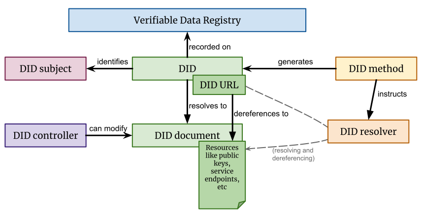

### 分布式数字身份与可验证声明

#### 什么是分布式数字身份？

> 定义：分布式数字身份（Decentralized ID, DID)是可验证的、 自我主权的、新型数字身份
>
> 本质：DID是一个数字身份标识，DID文档中存放公钥，掌握私钥就拥有这个DID的控制权。DID身份认证过程就是验证DID控制权。

#### 分布式数字身份DID架构



#### DID字段结构说明


其中`DID Method Specific String`=`base58(ripemd160(sha256(<Base DID Document>)))` （参考比特币，使用双 hash）。

其中`Base DID Document`为：

```
{
 "@context": "https://w3id.org/did/v1",
 "id": "did:dataqin:IhhhRLrcvSM52ZE3KU2A",
 "publicKey": [
  {
   "id": "did:dataqin:IhhhRLrcvSM52ZE3KU2A",
   "type": "Secp256k1VerificationKey2018",
   "controller": "did:dataqin:IhhhRLrcvSM52ZE3KU2A",
   "publicKeyHex": "0xb2699B49039556d4035f85A0920CbA78a8D46352"
  }
 ],
 "authentication": [
  "did:dataqin:IhhhRLrcvSM52ZE3KU2A"
 ],
 "created": "2020-06-17T16:33:18.164746339+08:00",
 "updated": "2020-06-17T16:33:18.164746339+08:00"
}
```

这是数秦公司员工编号sc209的DID数字身份文档。

#### DID Document结构说明

- `publicKey`： 是公钥的列表。
- `authentication`： 说明拥有哪个公钥对应的私钥的用户就是此 DID 的拥有者；通过`#keys-`来指定。

#### 什么是可验证声明

> 可验证声明(Verifiable Claim，简称Claim)，是发证方使用自己的 DID 给用户的 DID 的某些属性做背书而签发的描述性声明，并附加自己的数字签名，可以认为是一种数字证书。
>

#### 可验证声明字段结构

以下是数秦公司为数秦员工sc209生成的身份证书：

```
{
 "@context": [
  "https://www.w3.org/2018/credentials/v1"
 ],
 "id": "1001",
 "type": [
  "VerifiableCredential",
 ],
 "issuer": "did:dataqin:VZkQlYBueTdHv7YBK6zD",
 "issuanceDate": "2020-06-17T09:43:35Z",
 "credentialSubject": {
  "description": "sc209",
  "id": "did:dataqin:IhhhRLrcvSM52ZE3KU2A",
  "type": "employer"
 },
 "proof": {
  "type": "Secp256k1VerificationKey2018",
  "created": "2020-06-17T09:43:35Z",
  "proofValue": "68cb94c1a9e54ff9bec1757d3e2ec3cd0c3a63f0d07400005428ad8f119545ba491e494076bd38234e03115ee3dce08655c34e2fc886749776c9e37e5eab3d6f"
 }
}
```

- `id`：claim 的唯一 id，要求在发证方唯一即可，用于在发证方内唯一标识此 claim。数秦公司内部证书编号。

- `type`：claim 所属大类的类型：`VerifiableCredential` `ProofClaim`, `ProfileClaim` 。

  发证方的 DID 是做背书的，签发出来的Claim我们称之为：Proof Claim。
  如果发证方就是用户自己，即一个 DID 对自己签发Claim，我们称之为：Profile Claim

- `issuer`：签发 Claim 的 发证方的 DID。数秦公司的DID数字身份。

其中 `credentialSubject` 中的内容定义了发证方声明的内容:

- `id`：被签发方的 DID。 员工的DID数字身份
- `description`：claim描述。描述了员工编号。
- `type`：claim 的类型。 员工证明。

`proof`：签名相关内容。数秦公司的DID数字身份私钥进行签名的结果。

#### 员工数字身份和可验证声明签发过程

> 第1步：员工生成自己的数字身份。
>
> 第2步：员工向公司申请。公司签发可验证声明交给员工。
>
> 第3步：员工保存数字身份和可验证声明。

#### 数字身份和可验证声明进行身份认证过程

> 背景：楼下食堂宣布数秦员工有折扣。
>
> 第1步：员工出示自己的数字身份和数秦公司颁发的可验证声明。
>
> 第2步：食堂验证可验证声明真伪，验证员工数字身份真伪。通过提供服务。
>
> 验证真伪需要获取数秦DID和员工DID文档。

#### DID和可验证声明主要特点和价值

| 特点 | 说明                                                         |
| ---- | ------------------------------------------------------------ |
| 分权 | 数字身份标识符和可验证声明分布式存储和管理，可以去中心化存储 |
| 控制 | 实体直接控制其数字身份的权力，而无需依赖外部权威             |
| 隐私 | 实体能够控制隐私披露，做到最小、选择性和渐进式披露           |
| 信任 | 一个DID可以给另一个DID颁发证书，信任颁发者就信任其颁发的证书。信任传递。 |

#### 数字身份DID和可验证声明VC的案例场景

#### 场景1：联合登录的实现流程


#### 场景2：多角色的证明材料提供


#### 可落地的业务模式

> 1. DID和可验证声明标准的实现者- DID解析器、维护DID的区块链
> 2. 对于C端用户可提供DID的代理App存储可验证声明和DID
> 3. 对于B端用户可做DID授权可信节点,做DID验证可信节点

#### 影响的产业

> 1、身份信息和访问管理行业。
>
> 2、数据整合。可验证声明（数字证书）能在不同系统之间建立信任连接
>
> 3、身份隐私保护。渐近式隐私披露。

#### 市场现状

> 微软DID的白皮书：https://query.prod.cms.rt.microsoft.com/cms/api/am/binary/RE2DjfY
>
> 百度开放平台，百度内部有技术实现
>
> github上零星相关的代码实现，eth有几个相关的项目
>
> 总体而言，是较为前沿的。一旦有成熟业务落地，技术上有先发优势，有geek范，公司区块链技术能力体现。


#### 参考材料

> https://w3c.github.io/did-core/
>
> https://w3c.github.io/did-use-cases/
>
> https://www.w3.org/TR/vc-data-model/
>
> https://w3c-ccg.github.io/credential-handler-api/
>
> https://did.baidu.com/