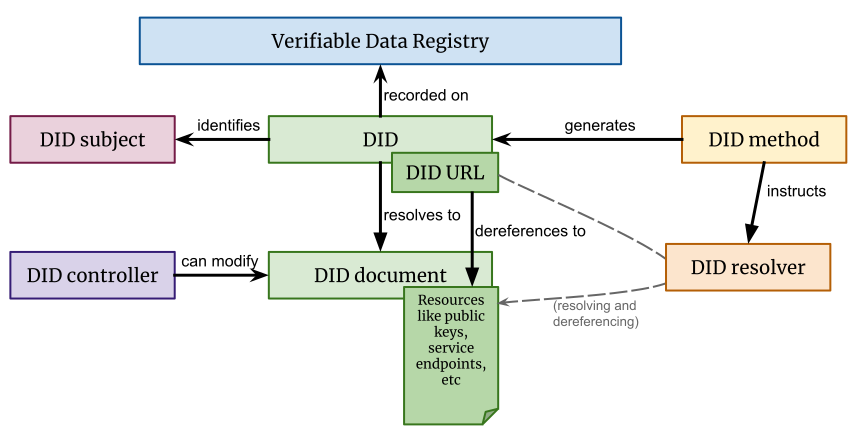
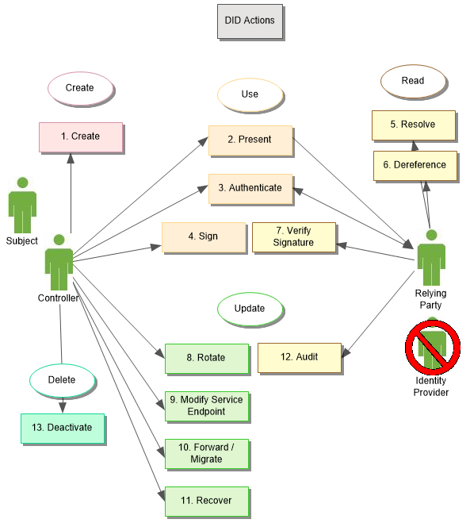

[TOC]


### 分布式身份认证


### 参考资料

#### Q:几种潜在可落地的业务模式

> 1. DID和可验证声明标准的实现者- DID解析器、DID客户端、维护DID的区块链
> 2. 对于C端用户可提供DID的代理App存储可验证声明和DID
> 3. 对于B端用户可做DID授权可信节点,做DID验证可信节点

#### Q:业务场景？

> 案例：联合登录，统一登录/认证
>
> 流程：向支付宝申请支付宝用户声明（声明可包含用户选择的基础信息）、提供声明给第三方网站实现登录
>
> 
>
> 案例：房地产商验资要求
>
> 流程：向公安部申请实名认证声明、向浦发银行申请资产大于1000w的声明、提供2个声明给房地产商
>
> 
>
> 案例：一站式政务
> 背景：
>
> 居民的政务数据通常存在于不同部门，跨部门的政务办理往往需要先至A部门开具证明，再至B部门进行办理。对居民而言，这些流程过于复杂，办理的过程中文件也容易丢失；对政府部门而言，希望提高居民办理的用户体验，同时也确保居民的数据不被外泄。
>
> 流程：向A部门发起申请某可验证声明、向B部门发起申请某可验证声明、向C部门出示A、B两部门签发的可验证声明，即可完成政务的办理
>
> 
>
> 案例：入职新员工的背景调查
> 背景：
>
> 企业招聘新员工时通常会进行背景调查，用以验证员工的学历信息、前雇主信息等的真伪。
>
> 对于员工而言，需要花时间去每个机构获取最新的材料；对于企业而言，材料在流转和获取的过程中，也可能存在篡改行为，缺乏验证真伪的机制。
>
> 基本流程：
>
> 向学校和前雇主申请相应的可验证声明。员工提交声明，现雇主验证DID以及声明的真伪。
>
> 
>
> ### Identifiers in an ecosystem of verifiable credentials (VCs)
>
> Remembering the [4 essential characteristics of a decentralized identifier](https://w3c.github.io/did-use-cases/#abstract), there are situations where DIDs offer tangible benefits over existing identifier schemes. For example:
>
> - Verifiable credential issuers publishing the list of subject attributes that they are authoritative for (their authoritative nature can be proven).
>
> - In similar vein, VC issuers may publish authoritative schemas for the types of credential that they issue.
>
> - Terms of use or other policy constraints that might apply to issued VCs.
>
> - A published list of the public keys used to sign credentials becomes useful in a chain of trust if that list can itself be verified.
>
> - The controller of a decentralized identifier can rotate (update) their cryptographic keys, either to overcome their existing keys being compromised or the development of superior technology. This does not affect the validity or proveability of any verifiable credentials associated with that identifier.
>
>   可验证凭据（VCs）生态系统中的标识符
>
>   记住分散标识符的4个基本特征，有些情况下，与现有标识符方案相比，did提供了切实的好处。例如：
>
>   可验证的证书颁发者发布他们具有权威性的主题属性列表（其权威性可以被证明）。
>
>   类似地，风投发行人可以发布他们发行的凭证类型的权威模式。
>
>   可能适用于已发行风投的使用条款或其他政策约束。
>
>   如果可以验证用于签名凭据的公钥的已发布列表，则该列表在信任链中会变得有用。
>
>   分散标识符的控制器可以旋转（更新）它们的密码密钥，以克服它们现有的密钥被破坏的问题，或者开发高级技术。这不会影响与该标识符关联的任何可验证凭据的有效性或可证明性。

W3C did：

> https://w3c.github.io/did-core/
>
> https://w3c.github.io/did-use-cases/
>
> github:https://github.com/w3c/did-core

W3C VC

> https://www.w3.org/TR/vc-data-model/
>
> https://w3c-ccg.github.io/credential-handler-api/

DID github组织

> https://github.com/decentralized-identity

did 百度 - 最重要

> https://did.baidu.com/did-spec/
>
> https://did.baidu.com/verifiable-claim/

微众银行

> github:https://github.com/WeBankFinTech/WeIdentity
>
> https://fintech.webank.com/weidentity/

pdu

> https://github.com/pdupub/go-pdu

sidetree

> https://identity.foundation/sidetree/spec/#introduction

颁发VC证书

> https://github.com/decentralized-identity/c19-vc.com

csdn:

> https://blog.csdn.net/treaser/article/details/99004355

微软DID白皮书

> https://query.prod.cms.rt.microsoft.com/cms/api/am/binary/RE2DjfY

uport官网

> https://www.uport.me/

uport文档

> https://developer.uport.me/guides/gettingstarted

第三方登录-OAuth方式

> https://blog.csdn.net/lihe460186709/article/details/52886116

第三方登录-DID方式

> https://github.com/ockam-network/did


### 背景

> 作为个人和组织，我们中的许多人在各种各样的环境中使用全球唯一的标识符。它们用作通信地址（电话号码、电子邮件地址、社交媒体上的用户名）、身份证号码（用于护照、驾驶执照、税号、医疗保险）和产品标识符（序列号、条形码、RFID）。Internet上的资源通过MAC地址形式的全局唯一标识符标识；uri（统一资源标识符）用于Web上的资源，并且您在浏览器中查看的每个网页都有全局唯一的URL（统一资源定位器）。
>
> 
>
> 这些全球唯一的标识符绝大多数不在我们的控制之下。它们是由外部主管部门发布的，由外部主管部门决定谁或什么身份以及何时可以撤销。它们只有在特定的环境下才有用，只有特定的机构（不是我们选择的机构）才能识别。它们可能会随着一个组织的失败而消失或失效。他们可能不必要地泄露个人信息。在许多情况下，它们可以被恶意的第三方（身份盗窃）欺诈性地复制和断言。
>
> 
>
> 本规范中定义的分散标识符（DID）是一种新型的全局唯一标识符，旨在使个人和组织能够使用我们信任的系统生成我们自己的标识符，并使用加密证明（例如，数字签名，保护隐私的生物识别协议，等等）。
>
> 
>
> 因为我们控制这些标识符的生成和断言，所以我们每个人都可以拥有尽可能多的did，以尊重我们期望的身份、角色和上下文分离（在这些词的日常意义上）。我们可以将这些标识符的使用范围扩展到最合适的上下文。我们可以与其他人、机构或系统进行交互，这些人、机构或系统要求我们标识自己（或我们控制的事物），同时保持对应披露多少个人或私人数据的控制，而不依赖中央机构来保证标识符的持续存在。
>
> 
>
> 本规范不需要任何特定的技术或密码来支持did的生成、持久性、解析或解释。相反，它定义了：a）所有DID的通用语法，b）对与DID相关联的元数据（称为DID文档）执行四个基本CRUD操作（创建、读取、更新、停用）的通用要求。
>
> 
>
> 这使得实现者能够设计特定类型的did来使用他们信任的计算基础设施（例如，区块链、分布式账本、分布式文件系统、分布式数据库、对等网络）。特定类型的DID的规范称为DID方法。使用DID的应用程序或系统的实现者可以选择支持最适合其特定用例的DID方法。

> DID方法也可以为在联邦或集中身份管理系统中注册的标识符开发。实际上，几乎所有类型的标识符系统都可以添加对did的支持。这在集中式、联合式和分散式标识符世界之间创建了一个互操作性桥梁。


### 设计目标

| 目标     | 说明                                                         |
| -------- | ------------------------------------------------------------ |
| 分权     | 消除标识符管理中对集中式权限或单点故障的要求，包括注册全局唯一标识符、公共验证密钥、服务端点和其他元数据。 |
| 控制     | 赋予实体，无论是人类还是非人类，直接控制其数字标识符的权力，而无需依赖外部权威。 |
| 隐私     | 使实体能够控制其信息的隐私，包括属性或其他数据的最小、选择性和渐进式披露。 |
| 安全     | 为依赖方提供足够的安全性，使其依赖于DID文件以获得所需的保证水平。 |
| 基于证据 | 使DID控制器在与其他实体交互时提供加密证明                    |
| 可发现性 | 使实体能够为其他实体发现DID，了解更多关于这些实体的信息或与它们交互 |
| 互操作性 | 使用可互操作的标准，基础设施也可以使用为互操作性而设计的现有工具和软件库。 |
| 可移植性 | 独立于系统和网络，使实体能够在任何支持DID和DID方法的系统中使用其数字标识符。 |
| 简单     | 倾向于减少一组简单的特性，使技术更易于理解、实现和部署。     |
| 可扩展性 | 在这里，只要不严重妨碍互操作性、可移植性或简单性，就可以启用可扩展性。 |

### 架构



#### DIDs and DID URLs

> ​		DID是一个URL资源定位符，由DID method产生, 指向DID文档
>
> 和其他资源定位府一样，由path,query,fragment

#### DID Subjects

> 根据定义，DID的主题是由DID标识的实体。DID对象也可以是DID控制器。任何事情都可以是DID的主题：人、组、组织、物理事物、逻辑事物等

#### DID Controllers

> DID的控制器是指具有DID方法定义的对DID文档进行更改的能力的实体（个人、组织或自主软件）。这种能力通常由代表控制器的软件使用的一组加密密钥的控制来断言，尽管它也可以通过其他机制来断言。注意，DID可以有多个控制器，并且控制器可以包括DID对象。

#### Verifiable Data Registries

> 为了能够解析为DID文档，DID通常记录在底层系统或某种网络上。无论使用何种技术，任何支持记录DID并返回生成DID文档所需数据的此类系统都称为可验证数据注册表。例如分布式账本、分散的文件系统、任何类型的数据库、对等网络和其他形式的可信数据存储。

#### DID documents

> DID文档包含与DID关联的元数据。它们通常表示与DID主题交互相关的验证方法（如公钥）和服务。DID文件根据特定语法进行序列化。DID本身就是id属性的值。DID文件中支持的通用属性。DID文件中的属性可根据适用操作进行更新。

#### DID Methods

> DID方法是使用特定的**可验证数据注册表**创建、解析、更新和停用特定类型的DID及其关联的DID文档的机制。使用单独的DID方法规范定义DID方法.
>
> 从概念上讲，此规范和DID方法规范之间的关系类似于IETF通用URI规范（[RFC3986]）和特定的URI方案（[IANA-URI-SCHEMES]（例如[RFC7230]中指定的http:和https:方案）之间的关系。它还类似于IETF通用URN规范（[RFC8141]）和特定URN命名空间定义（例如在[RFC4122]中定义的UUID URN命名空间）之间的关系。不同之处在于，DID方法规范以及定义特定的DID方案还指定了使用特定类型的可验证数据注册表创建、解析、更新和停用DID和DID文档的方法。

#### DID resolvers and DID resolution

> DID解析器是一个软件和/或硬件组件，它以DID（和相关选项）作为输入，并生成一致的DID文档（和相关元数据）作为输出。这个过程被称为DID解析。DID解析过程的输入和输出在有定义。决议。解析特定类型的DID的特定步骤由相关的DID方法规范定义。在[DID-RESOLUTION]中讨论了实现DID解析器的其他注意事项。

#### DID URL dereferencers and DID URL dereferencing

> DID URL解引用程序是一个软件和/或硬件组件，它以DID URL（和相关选项）作为输入，并生成资源（和相关元数据）作为输出。这个过程称为DID URL解引用。DID URL解引用过程的输入和输出在8.2 DID URL解引用中定义。在[DID-RESOLUTION]中讨论了实现DID URL解引用程序的其他注意事项。

#### service endpoint

> 一种网络地址，在这个地址上服务代表一个DID对象运行。特定服务的示例包括发现服务、社交网络、文件存储服务和可验证的声明存储库服务。服务端点也可以由通用数据交换协议（如可扩展数据交换）提供。

### 声明

> 符合DID是第3节规定的规则的任何具体表达。标识符，必须符合该节中的相关规范性声明。
>
> 
>
> 合格的DID文件是本规范中所述数据模型的任何具体表达，必须符合第4节中的相关规范性声明。数据模型和第5条。核心属性。一致性文件的序列化格式必须是确定性的、双向的和无损的，如第6节所述。核心陈述。符合要求的DID文件可以任何此类序列化格式传送或存储。
>
> 
>
> 合格的DID方法是指符合第7节中相关规范性声明的任何规范。方法。

#### verification method

> 一组参数，可用于根据特定方法独立验证一个证明。例如，公钥可以用作对数字签名的验证方法；在这种用法中，公钥验证签名者是否拥有关联的私钥。

### DID数据结构

```
did                = "did:" method-name ":" method-specific-id
method-name        = 1*method-char
method-char        = %x61-7A / DIGIT
method-specific-id = *( ":" *idchar ) 1*idchar
idchar             = ALPHA / DIGIT / "." / "-" / "_"

did-url            = did path-abempty [ "?" did-query ]
                     [ "#" fragment ]
did-query          = param *( "&" param )
param              = param-name "=" param-value
param-name         = 1*pchar
param-value        = *pchar
```

> DID应该是持久且不可变的。也就是说，一个DID是唯一和永久地绑定到它的一个和唯一的主题。即使在一个DID被停用之后，它也不会被重新利用。

```
did:example:123456/path
did:example:123456?query=true
did:example:123456#public-key-1
did:foo:21tDAKCERh95uGgKbJNHYp?foo:bar=high
did:example:21tDAKCERh95uGgKbJNHYp?foo:bar=low
did:example:21tDAKCERh95uGgKbJNHYp?service=agent&foo:bar=high
带命名空间did:foo:baz:21tDAKCERh95uGgKbJNHYp?foo:baz:hex=b612
```

### DID Document数据模型

> 本规范定义了DID文档的抽象数据模型，与任何特定的表示形式无关。本节提供数据模型的高级描述、表示的一组需求和可扩展性的一组需求。

> 分为2部分：核心属性和核心陈述

#### 核心属性

> DID指向DID文档。DID文件是第4节中概述的数据模型的序列化。
>
> 有些属性是可选的

| 属性名称           | 描述                                                         | 样例                                             | 是否必须 |
| ------------------ | ------------------------------------------------------------ | ------------------------------------------------ | -------- |
| id                 | 描述did 主题                                                 | {   "id": "did:example:21tDAKCERh95uGgKbJNHYp" } | 是       |
| verificationMethod | DID文档可以表示验证方法。验证方法可能需要很多参数。这方面的一个例子是一组五个加密密钥。参数可以来自某一个生物的特征数据。DID Controller必须明确DID主体和验证方法之间的验证关系 |                                                  | 是       |
| publicKey          | 如果DID文档包含公钥属性，则该属性的值必须是公钥对象数组。每个公钥对象必须具有type、controller和特定公钥属性，并且必须具有id属性。公钥对象可以包括其他属性。 |                                                  | 是       |
| authentication     | 身份验证属性是DID主体和一组验证方法（例如但不限于公钥）之间的关系。这意味着DID主体已经授权了一组验证方法（根据authentication属性的值）用于验证。authentication属性的值应为验证方法数组 |                                                  | 是       |
| controller         | 实现授权和委派。控制器属性的值必须是有效的DID或有效的DID数组。相应的DID文件应包含明确允许为特定目的使用某些验证方法的授权关系。 |                                                  | 是       |
| service            | 服务端点用于表示DID文档与DID主题通信的方式                   |                                                  | 应该     |
| created            | 创建时间                                                     | {   "created": "2002-10-10T17:00:00Z" }          | 应该     |
| updated            | 更新时间                                                     | {   "updated": "2016-10-17T02:41:00Z" }          | 应该     |
|                    |                                                              |                                                  |          |
|                    |                                                              |                                                  |          |

> publicKey : id属性的值必须是URI。公钥数组不能包含多个具有相同id的项.type属性的值必须正好是一个公钥类型。控制器属性的值（标识相应私钥的控制器）必须是有效的DID。

#### 核心表述

> 核心属性的在json中类型

### 方法集

> 要在特定的可验证数据注册表上启用DID和DID文档的全部功能，DID方法规范必须指定如何使用客户端执行创建、读取、更新和停用操作。每个操作都应该指定到构建和测试可互操作客户端实现所必需的详细级别。如果某个操作不受支持，例如update或deactivate，则建议DID方法规范声明它不受支持。这些操作可用于执行加密密钥管理系统（CKMS）所需的所有操作，例如：密钥注册、密钥替换、密钥旋转、密钥恢复和密钥过期。

> 以下5个方法必须存在

#### Create

> DID方法规范必须指定客户端如何在可验证数据注册表上创建DID及其关联的DID文档，包括建立控制证明所需的所有加密操作。

#### Read/Verify

> DID方法规范必须指定客户端如何使用DID从可验证数据注册表请求DID文档，包括客户端如何验证响应的真实性。

#### Update

> DID方法规范必须指定客户端如何更新可验证数据注册表上的DID文档，包括建立控制证明所需的所有加密操作，或声明无法进行更新。
>
> 
>
> 对DID的更新是在创建之后，用于生成DID文档的数据中的任何更改。DID方法实现者负责定义构成更新的内容，以及给定的DID方法支持DID文档的哪些属性。例如，更新操作在不更改密钥材料的情况下替换密钥材料，这可能是一个有效的更新，不会导致对DID文档的更改。

#### Deactivate

> DID方法规范必须指定客户端如何在可验证的数据注册表上停用DID，包括建立停用证明所需的所有加密操作，或声明无法停用。

#### 方法安全要求

> 至少必须考虑以下形式的攻击：窃听、重放、消息插入、删除、修改和中间人。还必须识别潜在的拒绝服务攻击。
>
> 如果协议包含加密保护机制，则DID方法规范必须明确指出数据的哪些部分受到保护，哪些是保护，并应指出加密保护易受哪些类型的攻击。例如，仅完整性、机密性、端点身份验证等。
>
> 要保密的数据（密钥材料、随机种子等）应清楚地标记。
>
> 如果技术涉及身份验证，特别是用户-主机身份验证，则必须明确指定身份验证方法的安全性。
>
> DID方法必须讨论DID被证明是唯一分配的策略机制。DID符合[RFC8141]中定义的URN的功能定义。也就是说，DID是一个持久标识符，它只分配给一个资源一次，而从不重新分配给另一个资源。这在安全上下文中特别重要，因为DID可用于标识受特定授权权限集约束的特定方。
>
> 引入新认证服务端点类型的方法（见第5.7节服务端点）应考虑支持的认证协议的安全要求。

#### 隐私安全

> 监视、存储数据泄露、主动通信、错误归属、相关性、标识、二次使用、披露、排除


### 实现

> DID方法注册表（参见[DID-SPEC-REGISTRIES]是DID方法名及其相应的DID方法规范的信息列表。实现者需要记住，没有中央机构来强制指定哪个DID方法规范将与任何特定的DID方法名称一起使用，但是在选择使用哪个DID解析器实现时，可以使用DID方法注册表来做出明智的决定


### 安全考虑

#### 证明DID对DID文档的控制权

> 签名是一种允许DID文档可加密验证的方法。
>
> 
>
> 自签名的DID文档上的验证签名本身并不能证明对DID的控制。它只证明：
>
> 
>
> DID文件自注册以来未被篡改。
>
> DID控制器在生成签名时控制用于签名的私钥。
>
> 要证明对DID的控制，即DID和描述它的DID文档之间的绑定，需要两步过程：
>
> 
>
> 根据DID方法规范将DID解析为DID文档。
>
> 验证生成的DID文档的id属性是否与已解析的DID匹配。
>
> 应注意的是，这一过程证明了对DID和DID文件的控制，无论DID文件是否已签署。
>
> 
>
> DID文件上的签名是可选的。DID方法规范应解释并指定其实现（如果适用）。
>
> 
>
> 将时间戳与签名结合起来是一种很好的做法。
>
> 
>
> 总结：1、根据DID取出DID文档，2、验证DID数字签名是否正确 3、验证DID文档中的id是否等于DID

#### 证明对公钥的控制权

> 有两种方法可以证明与DID文档中的公钥描述相对应的私钥的控制：静态和动态。
>
> 
>
> 静态方法是使用私钥对DID文档进行签名。这证明在不迟于DID文档注册的时间控制私钥。如果没有对DID文档进行签名，那么仍然可以按照以下方式动态证明对DID文档中描述的公钥的控制：
>
> 
>
> 将包含来自DID文档的公钥描述和nonce的质询消息发送到DID文档中描述的适当服务端点。
>
> 根据公钥描述验证响应消息的签名。
>
> 
>
> 总结：向DID文档中的服务端点发送带nonce随机值的消息，并用公钥验证签名。【零知识证明】

#### 授权与可验证声明（VC）

> DID和DID文件本身不包含任何PII（个人识别信息）。将DID绑定到现实世界中的某个对象（例如某人或公司）的过程（例如，具有与该DID相同的主题的凭据）超出了本规范的范围。有关更多信息，请参见[VC-DATA-MODEL]。

#### 授权与服务端点

> 如果一份DID文件发布了一个服务端点，目的是对DID主体进行认证或授权（见第5.7节服务端点），则服务端点提供者、主体或依赖方有责任遵守该服务端点支持的认证协议的要求。

#### 不可抵赖

> 假设主题为：
>
> 
>
> 监控未经授权的更新（见第9.5节DID文件变更通知）。
>
> 有足够的机会根据DID方法的访问控制机制恢复恶意更新（参见第5.5节认证）。
>
> 如果包含时间戳（参见创建的第5.8节和更新的第5.9节），并且目标DLT系统支持时间戳，则进一步支持不可否认性。

#### DID文件变更通知

> 针对未经授权的DID文档更改的一种缓解措施是，在发生更改时监视并主动通知DID主题。这类似于通过向文件中的电子邮件地址发送密码重置通知，帮助防止对传统用户名/密码帐户的帐户接管。
>
> 
>
> 在DID的情况下，没有中间注册人或账户提供者生成此类通知。但是，如果在其上注册DID的可验证数据注册表直接支持更改通知，则可以向DID控制器提供订阅服务。通知可以直接发送到现有DID中列出的相关服务端点。
>
> 
>
> 如果DID控制器选择依赖第三方监视服务（而不是可验证的数据注册表本身），则会引入另一种攻击向量。
>
> 总结：如果在其上注册DID的可验证数据注册表直接支持更改通知，则可以向DID控制器提供订阅服务。通知可以直接发送到现有DID中列出的相关服务端点。

#### 密钥和签名过期

> 在分散的标识符体系结构中，没有集中的权限来实施密钥或签名过期策略。因此，解析器和其他客户端应用程序是否需要验证密钥在使用时是否未过期。由于某些用例可能有合法的理由来扩展已经过期的密钥，请确保密钥过期不会阻止对该密钥的任何进一步使用，并且解析程序的实现应该与此类扩展行为兼容。

#### 密钥撤销和恢复

> 第7.2节方法操作规定了由DID方法规范支持的DID操作，包括通过用更新的DID文件替换DID文件来停用DID文件。这也取决于DID方法来定义如何撤销加密密钥。此外，DID方法规范还应支持受信任方的仲裁以启用密钥恢复。第5.6节“授权和委托”中建议了一些这样做的便利。并不是所有的DID方法规范都能识别使用其他DID方法注册的DID的控制，它们可能会将第三方控制限制为使用相同方法的DID。DID方法规范中的访问控制和密钥恢复还可以包括时间锁定功能，通过维护用于恢复的第二个控制轨道来防止密钥泄露。这类控制的进一步规范是未来工作的一个问题（见第D.4节时间锁定和文件恢复）。

#### 不变性

> 许多滥用网络安全的行为都依赖于利用现实与理性、诚信行为者的假设之间的差距。与任何生态系统一样，DID生态系统也有可能发生这种情况。由于此规范关注的是数据模型而不是协议，因此它对如何使用该模型的许多方面没有提供任何意见。但是，个别的DID方法可能希望考虑那些可以消除它们不需要的行为或语义的约束。DID方法在提供相同功能集的同时，越是被锁定，它就越不可能被恶意参与者操纵。
>

重点：

> 例如，考虑数据模型在更新方面提供的灵活性。对DID文档的一次编辑可以更改文档的任何内容，除了根id属性。数据模型中的任何单独JSON对象都可以更改其除id之外的所有属性，但服务端点在定义后是否确实需要更改其类型？或者一个键改变它的值？或者，当对象的某些基本属性发生更改时，需要一个新的id会更好吗？恶意接管网站通常是为了网站保留其标识符（主机名）的结果，但会在下面进行微妙的、危险的更改。如果规范要求站点的某些属性是不可变的（例如，与其IP地址相关联的ASN），则此类攻击可能更难执行，成本更高，异常检测也更容易。
>

> 不变性提供了一些网络安全好处这一概念与缓存特别相关。对于绑定到全局真相源的DID方法，总是可以直接、及时地查找最新版本的DID文档。然而，似乎缓存层最终可能位于客户机和真相来源之间。如果他们相信DID文档中某个对象的属性具有给定的状态，当它们实际上细微不同时，可能会招致攻击。如果某些查找是完整的DID文档，而其他查找是部分数据（假定上下文更大），则尤其如此。

DID文档中的加密数据

> DID文档通常是公开的。众所周知，由于密码学和计算能力的进步，加密算法会失败。建议实现者假设放在DID文档中的任何加密数据最终可能以明文形式提供给加密数据可用的同一访问群体。
>
> 从长远来看，对DID文档的全部或部分进行加密并不是保护数据的适当手段。类似地，在DID文档中放置加密数据并不是包含个人身份信息的适当方法。
>
> 鉴于上述注意事项，如果加密数据包含在DID文档中，则建议实现者不要使用不希望与DID相关的实体的公钥进行加密。

### 隐私考虑

> 通过设计将隐私原则应用于分散标识符体系结构的所有方面至关重要，因为通过设计，DID和DID文档由DID控制器直接管理。没有注册商、托管公司或其他中间服务提供商推荐或应用其他隐私保护措施。本规范的作者在其开发过程中应用了所有七项隐私设计原则。例如，本规范中的隐私是预防性的而不是补救性的，隐私是一种嵌入的默认设置。此外，分散标识符体系结构本身体现了“尊重用户隐私——以用户为中心”的原则7
>
> 
>
> 本节列出了实现者、委托者和DID主题应记住的其他隐私注意事项。

#### 个人身份信息（PII）保密

> 如果一个DID方法规范是为一个公开的可验证的数据注册中心编写的，其中所有的DID和DID文档都是公开的，那么DID文档不包含任何个人数据是至关重要的。所有个人数据都应该保存在DID主体控制下的服务端点后面。对于在服务端点中使用URL，还应进行额外的尽职调查，以防止意外的个人数据泄漏或服务端点URL内的关联。例如，包含用户名的URL可能会在DID文档中包含危险的内容，因为该用户名可能具有人为意义，可能会无意中泄露DID主题不同意共享的信息。通过这种隐私体系结构，个人数据可以在私有的、对等的基础上交换，使用由DID文档中的公钥描述识别和保护的通信通道。这也使得DID主体和依赖方能够实现GDPR被遗忘的权利，因为没有任何个人数据被写入不可变的分布式账本。

#### DID相关风险与假名DID

> 与任何类型的全局唯一标识符一样，did也可以用于关联。DID控制器可以通过使用成对唯一的DID来降低这种隐私风险，也就是说，为每个关系共享不同的私有DID。实际上，每个人都是化名。当DID主体明确授权这些当事方之间的关联时，假名只需要与多个当事方共享。如果默认使用假名DID，那么公共DID（DID公开发布或与大量当事人共享）的唯一需要是DID主体明确希望公开身份。

#### 是否记录相关风险

> 如果对应的DID文档中的数据可以关联，那么假名DID的反关联保护很容易失效。例如，在多个DID文档中使用相同的公钥描述或定制服务端点可以提供与使用同一DID相同的相关性信息。因此，DID文档的假名DID也需要使用成对的唯一公钥。在DID文档中使用一个假名DID的pairwise unique服务端点似乎很自然。然而，唯一的端点允许两个did之间的所有通信完全隔离到唯一的bucket中，在那里时间相关性和类似的分析很容易。因此，一个更好的端点隐私策略可能是在由许多不同主题控制的数千或数百万DID之间共享一个端点。

#### 群体隐私

> 当一个DID对象与群中的其他对象无法区分时，就可以使用隐私。当与另一方私下接触的行为本身就是一面可识别的旗帜时，隐私就会大打折扣。DID和DID方法需要努力改善群体隐私，特别是那些合法最需要的群体。选择默认保留匿名性和假名的技术和人机界面。为了减少数字指纹，在客户端实现中共享公共设置，将协商的选项保持在最低限度的在线协议中，使用加密的传输层，并将消息填充到标准长度。


### 样例

```
{
  "@context": "https://w3id.org/future-method/v1",
  "id": "did:example:123456789abcdefghi",

  "publicKey": [{
    "id": "did:example:123456789abcdefghi#keys-1",
    "type": "Ed25519VerificationKey2018",
    "controller": "did:example:123456789abcdefghi",
    "publicKeyBase58": "DggG1kT5JEFwTC6RJTsT6VQPgCz1qszCkX5Lv4nun98x"

  }, {
    "id": "did:example:123456789abcdefghi#keys-3",
    "type": "Ieee2410VerificationKey2018",
    "controller": "did:example:123456789abcdefghi",
    "publicKeyPem": "-----BEGIN PUBLIC KEY...END PUBLIC KEY-----\r\n"
  }],

  "authentication": [
    
    "did:example:123456789abcdefghi#keys-1",
    
    "did:example:123456789abcdefghi#keys-3",
    
    
    
    {
      "id": "did:example:123456789abcdefghi#keys-2",
      "type": "Ed25519VerificationKey2018",
      "controller": "did:example:123456789abcdefghi",
      "publicKeyBase58": "H3C2AVvLMv6gmMNam3uVAjZpfkcJCwDwnZn6z3wXmqPV"
    }
  ],

  "service": [{
    "id": "did:example:123456789abcdefghi#oidc",
    "type": "OpenIdConnectVersion1.0Service",
    "serviceEndpoint": "https://openid.example.com/"
  }, {
    "id": "did:example:123456789abcdefghi#vcStore",
    "type": "CredentialRepositoryService",
    "serviceEndpoint": "https://repository.example.com/service/8377464"
  }, {
    "id": "did:example:123456789abcdefghi#xdi",
    "type": "XdiService",
    "serviceEndpoint": "https://xdi.example.com/8377464"
  }, {
    "id": "did:example:123456789abcdefghi#hub",
    "type": "HubService",
    "serviceEndpoint": "https://hub.example.com/.identity/did:example:0123456789abcdef/"
  }, {
    "id": "did:example:123456789abcdefghi#messaging",
    "type": "MessagingService",
    "serviceEndpoint": "https://example.com/messages/8377464"
  }, {
    "type": "SocialWebInboxService",
    "id": "did:example:123456789abcdefghi#inbox",
    "serviceEndpoint": "https://social.example.com/83hfh37dj",
    "description": "My public social inbox",
    "spamCost": {
      "amount": "0.50",
      "currency": "USD"
    }
  }, {
    "type": "DidAuthPushModeVersion1",
    "id": "did:example:123456789abcdefghi#push",
    "serviceEndpoint": "http://auth.example.com/did:example:123456789abcdefghi"
  }, {
    "id": "did:example:123456789abcdefghi#bops",
    "type": "BopsService",
    "serviceEndpoint": "https://bops.example.com/enterprise/"
  }]
}
```

### 身份认证测试用例


#### 用户用例



#### 

#### create

#### Present

> did是uri，也就是说一个字符串。因此，它们可以与uri以相同的方式呈现，只需发送或呈现该字符串。然而，没有要求did是人类可读的。因此，它们可能包含以各种格式表示的长复数。为了易于使用，实现可以依赖诸如QR码的数据载体，以便于使用诸如智能电话之类的支持照相机的设备来捕获。

#### Authenticate

> 依赖方可能希望证明提交DID的个人实际上是其DID控制器或指定为特定服务端点的控制器。这个认证过程应该使用DID文档中的加密材料来测试声称的控制器是否能够证明控制，通常是通过某种挑战响应。DID文档和方法可以为不同的服务端点提供单独的证明，这与更新和删除操作不同。这种分离将支持预期经常使用的事务性证明，而控制性证明预期很少使用。

#### Sign

> 使用与DID文档中发现的内容相关联的加密材料，DID控制器可以签署数字资产或文档。稍后可以验证此签名以证明资产的真实性。这样，就可以将资产称为“由DID签署”。

### Resolve

> 将DID用于表示之外的任何事情的第一步是将DID解析为特定的DID文档，以显示与该DID相关联的加密材料和服务终结点。这种情况的发生方式应针对具体的方法，不属于DID工作组的工作范围。

### Dereference

> 解引用DID使用其DID文档中的材料返回资源。默认情况下，在不引用服务端点的情况下取消对DID的引用将返回DID文档本身。当一个DID与一个服务参数（形成一个DID URL）组合时，解引用将返回从指定的服务端点指向的资源，该资源是通过将DID解析为其DID文档并按名称查找该端点而发现的。这样，依赖方可以动态地发现给定DID的当前服务端点并与之交互。因此，可以为服务提供即使基础服务端点发生更改也不会更改的持久标识符。

### Verify Signature

### Rotate

> 控制器可以通过更新在其注册表中记录的DID文档来旋转（即，更新）DID的加密材料。不同的方法应该能够以不同的方式处理这一点，但其结果将是对证明对DID和DID文档的控制所需的核心加密证明的更新。

### Modify Service Endpoint

> DID控制器应该能够更改与DID关联的服务端点，包括作为任何给定端点的主体进行身份验证的证明机制。执行此操作的过程是特定于方法的，但其目的是允许控制器进行这些更改，而不必更改DID本身控制的主要证明机制。

### Forward / Migrate

> To support interoperability, some methods may provide a way for [DID Controllers](https://w3c.github.io/did-use-cases/#dfn-did-controllers) to record in their registry (by updating the DID Document), that the DID should be redirected to another DID, which now has full authority to represent the originating DID. This mechanism would allow [DID Controllers](https://w3c.github.io/did-use-cases/#dfn-did-controllers) to migrate a DID from one method or registry to another.

### Recover

> 如果DID现有的私有加密材料丢失，一些方法可以提供恢复对DID控制的方法。这些方法因方法而异，但可以包括社会恢复、多重签名、Shamir共享或预旋转密钥。一般来说，恢复触发对新证明的轮换，允许新证明的DID控制器在不与任何依赖方交互的情况下恢复对DID的控制。

#### Audit

> 有些方法可能会提供所有已执行操作的明确审核跟踪，包括操作发生的时间戳。对于基于分类账的分布式注册中心，这种审计跟踪是分类账记录交易方式的基础。这将允许依赖方查看，例如，DID最近是如何轮换的，或其服务端点是如何更新的，这可能会通知有关DID加密材料可靠性的某些分析。

### Deactivate

> 控制器不应该删除一个DID，而应该能够停用一个DID，这样下游的进程，如身份验证和取消引用，就不再起作用了。大多数分散的系统不能保证实际删除记录。事实上，分布式账本经常被吹捧为“不可变的”。方法应定义停用过程，以实现与删除相同的效果。失活的机制将因方法而异。

# 在 App 中使用 DID+VC 做统一登入/统一认证

./did-claim-login-pc.png