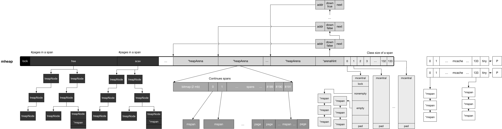
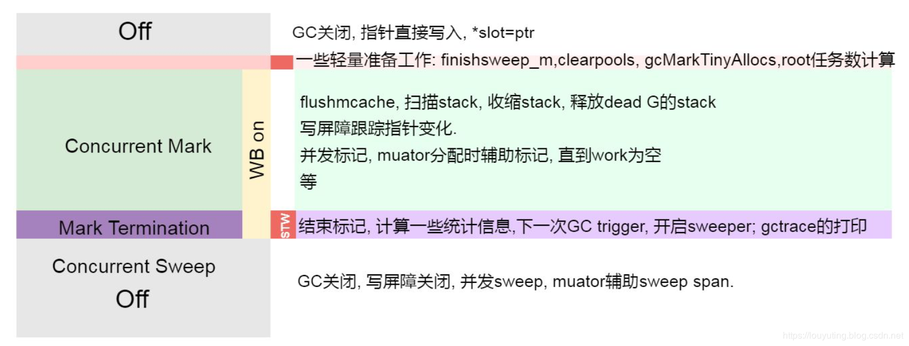
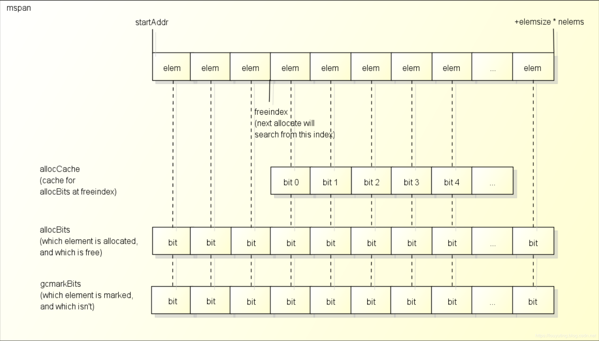
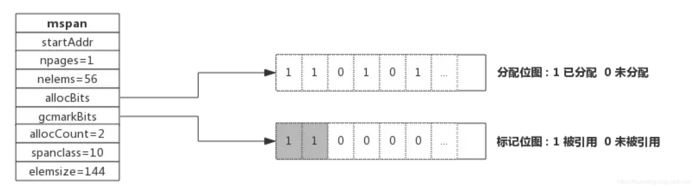
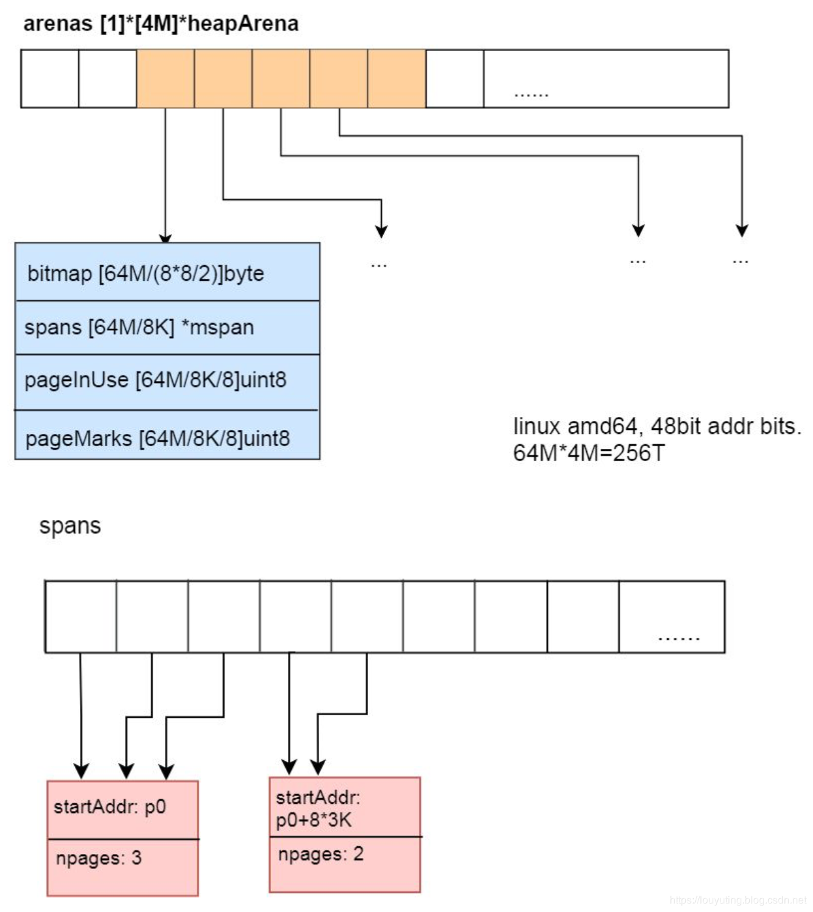

[TOC]

# golang源码分析

> 系列文章：https://blog.csdn.net/u010853261/category_8361413.html

## golang的汇编引导过程

编译二进制文件

```bash
$ CGO_ENABLED=0 GOOS=linux GOARCH=amd64 go build -o ./gateway -gcflags '-l -N' ./cmd/gateway
```

` --gcflags '-l -N'` 编译时禁止内联和优化

二进制文件导出汇编代码,比如

```bash
$ go tool objdump gateway >> gateway.dump
```

- 入口文件:go/go1.13/src/runtime/rt0_linux_amd64.s

```assembly
TEXT _rt0_amd64_linux(SB)  /home/znddzxx112/local/go/go1.13/src/runtime/rt0_linux_amd64.s
rt0_linux_amd64.s:8	0x460bf0		e9fbc5ffff		JMP _rt0_amd64(SB)	
```

`JMP` 汇编语言跳转指令

`go1.13/src/runtime` 文件夹下有许多 rt0_开头的文件，不同OS和ARCH时入口文件不同

- 源码文件:go/go1.13/src/runtime/asm_amd64.s

```assembly
TEXT _rt0_amd64(SB) /home/znddzxx112/local/go/go1.13/src/runtime/asm_amd64.s
  asm_amd64.s:15	0x45d1f0		488b3c24		MOVQ 0(SP), DI		
  asm_amd64.s:16	0x45d1f4		488d742408		LEAQ 0x8(SP), SI	
  asm_amd64.s:17	0x45d1f9		e902000000		JMP runtime.rt0_go(SB)
```

继续查看相同文件go/go1.13/src/runtime/asm_amd64.s下runtime.rt0_go(SB)

```assembly
TEXT runtime.rt0_go(SB) /home/znddzxx112/local/go/go1.13/src/runtime/asm_amd64.s
    ...
    CALL	runtime·args(SB)
	CALL	runtime·osinit(SB)
	CALL	runtime·schedinit(SB)

	// create a new goroutine to start program
	MOVQ	$runtime·mainPC(SB), AX		// entry
	PUSHQ	AX
	PUSHQ	$0			// arg size
	CALL	runtime·newproc(SB)
	POPQ	AX
	POPQ	AX

	// start this M
	CALL	runtime·mstart(SB)

	CALL	runtime·abort(SB)	// mstart should never return
	RET

	// Prevent dead-code elimination of debugCallV1, which is
	// intended to be called by debuggers.
	MOVQ	$runtime·debugCallV1(SB), AX
	RET

DATA	runtime·mainPC+0(SB)/8,$runtime·main(SB)
GLOBL	runtime·mainPC(SB),RODATA,$8
```

`CALL` 是汇编子程序调用指令，这里调用了许多重要的函数

`CALL runtime.schedinit(SB)` 很多重要的初始化工作，包括内存分配初始化，以后有计划分享内存分配的内容

`MOVQ	$runtime·mainPC(SB), AX		// entry` 这里往SB虚拟寄存器中赋值runtime.main函数的入口（proc.go中的main函数） `DATA	runtime·mainPC+0(SB)/8,$runtime·main(SB)`


`CALL	runtime·newproc(SB)`  创建第一个g, 设置g的函数入口地址为runtime.main, 文件位置proc.go

```
func newproc(siz int32, fn *funcval) {
	argp := add(unsafe.Pointer(&fn), sys.PtrSize)
	gp := getg()
	pc := getcallerpc()
	systemstack(func() {
		newproc1(fn, (*uint8)(argp), siz, gp, pc)
	})
}

func newproc1(fn *funcval, argp *uint8, narg int32, callergp *g, callerpc uintptr) {
    ...
    // g的函数入口地址为runtime.main
	newg.startpc = fn.fn
	...
}
```

`CALL	runtime·mstart(SB)`  先执行到`schedule()`  调度。随后会最先执行runtime.main函数，runtime.main函数中会调用函数`gcenable()` 开启打扫和清除二个g任务, 随后进入用户层是main.main入口

```
func gcenable() {
	// Kick off sweeping and scavenging.
	c := make(chan int, 2)
	go bgsweep(c) // 打扫
	go bgscavenge(c) // 清除
	<-c
	<-c
	memstats.enablegc = true // now that runtime is initialized, GC is okay
}
```

```
func mstart() {
	_g_ := getg()

	osStack := _g_.stack.lo == 0
	if osStack {
		// Initialize stack bounds from system stack.
		// Cgo may have left stack size in stack.hi.
		// minit may update the stack bounds.
		size := _g_.stack.hi
		if size == 0 {
			size = 8192 * sys.StackGuardMultiplier
		}
		_g_.stack.hi = uintptr(noescape(unsafe.Pointer(&size)))
		_g_.stack.lo = _g_.stack.hi - size + 1024
	}
	// Initialize stack guard so that we can start calling regular
	// Go code.
	_g_.stackguard0 = _g_.stack.lo + _StackGuard
	// This is the g0, so we can also call go:systemstack
	// functions, which check stackguard1.
	_g_.stackguard1 = _g_.stackguard0
	mstart1()

	// Exit this thread.
	if GOOS == "windows" || GOOS == "solaris" || GOOS == "illumos" || GOOS == "plan9" || GOOS == "darwin" || GOOS == "aix" {
		// Windows, Solaris, illumos, Darwin, AIX and Plan 9 always system-allocate
		// the stack, but put it in _g_.stack before mstart,
		// so the logic above hasn't set osStack yet.
		osStack = true
	}
	mexit(osStack)
}

```

```
func mstart1() {
	_g_ := getg()

	if _g_ != _g_.m.g0 {
		throw("bad runtime·mstart")
	}

	// Record the caller for use as the top of stack in mcall and
	// for terminating the thread.
	// We're never coming back to mstart1 after we call schedule,
	// so other calls can reuse the current frame.
	save(getcallerpc(), getcallersp())
	asminit()
	minit()

	// Install signal handlers; after minit so that minit can
	// prepare the thread to be able to handle the signals.
	if _g_.m == &m0 {
		mstartm0()
	}

	if fn := _g_.m.mstartfn; fn != nil {
		fn()
	}

	if _g_.m != &m0 {
		acquirep(_g_.m.nextp.ptr())
		_g_.m.nextp = 0
	}
	schedule()
}
```


- 源码文件：/go/go1.13/src/runtime/proc.go

  在执行用户层main函数之前，会启动sysmon协程，gc相关协程，如果协程出现panic，该协程进行切换与m解除绑定。

  解除绑定的流程是当前g的stack信息保留，执行位置保留。切换到m的g0栈执行，紧接着g0与m解除绑定，再执行调度，允许其他g来占用m

```golang
func main() {
	g := getg()

	// Racectx of m0->g0 is used only as the parent of the main goroutine.
	// It must not be used for anything else.
	g.m.g0.racectx = 0

	// Max stack size is 1 GB on 64-bit, 250 MB on 32-bit.
	// Using decimal instead of binary GB and MB because
	// they look nicer in the stack overflow failure message.
	if sys.PtrSize == 8 {
		maxstacksize = 1000000000
	} else {
		maxstacksize = 250000000
	}

	// Allow newproc to start new Ms.
	mainStarted = true

// sysmon协程启动
// 定时触发gc
// 某一个g占用m时间过长，执行合作式抢占工作
	if GOARCH != "wasm" { // no threads on wasm yet, so no sysmon
		systemstack(func() {
			newm(sysmon, nil)
		})
	}

	// Lock the main goroutine onto this, the main OS thread,
	// during initialization. Most programs won't care, but a few
	// do require certain calls to be made by the main thread.
	// Those can arrange for main.main to run in the main thread
	// by calling runtime.LockOSThread during initialization
	// to preserve the lock.
	// 独占上锁
	lockOSThread()

   // 必须为m0
	if g.m != &m0 {
		throw("runtime.main not on m0")
	}

   // 初始化runtime的工作
	doInit(&runtime_inittask) // must be before defer
	if nanotime() == 0 {
		throw("nanotime returning zero")
	}

	// Defer unlock so that runtime.Goexit during init does the unlock too.
	needUnlock := true
	defer func() {
		if needUnlock {
			unlockOSThread()
		}
	}()

	// Record when the world started.
	runtimeInitTime = nanotime()
  // 启动gc协程
	gcenable()

	main_init_done = make(chan bool)
	if iscgo {
		if _cgo_thread_start == nil {
			throw("_cgo_thread_start missing")
		}
		if GOOS != "windows" {
			if _cgo_setenv == nil {
				throw("_cgo_setenv missing")
			}
			if _cgo_unsetenv == nil {
				throw("_cgo_unsetenv missing")
			}
		}
		if _cgo_notify_runtime_init_done == nil {
			throw("_cgo_notify_runtime_init_done missing")
		}
		// Start the template thread in case we enter Go from
		// a C-created thread and need to create a new thread.
		startTemplateThread()
		cgocall(_cgo_notify_runtime_init_done, nil)
	}
  // 执行各个packet init函数
	doInit(&main_inittask)

	close(main_init_done)

	needUnlock = false
	unlockOSThread()
   // 如果是包，库，再这里返回
	if isarchive || islibrary {
		// A program compiled with -buildmode=c-archive or c-shared
		// has a main, but it is not executed.
		return
	}
	fn := main_main // make an indirect call, as the linker doesn't know the address of the main package when laying down the runtime
	// 执行用户层main函数
	fn()
	if raceenabled {
		racefini()
	}

	// Make racy client program work: if panicking on
	// another goroutine at the same time as main returns,
	// let the other goroutine finish printing the panic trace.
	// Once it does, it will exit. See issues 3934 and 20018.
	// 协程出现panic，但有recover处理
	if atomic.Load(&runningPanicDefers) != 0 {
		// Running deferred functions should not take long.
		for c := 0; c < 1000; c++ {
			if atomic.Load(&runningPanicDefers) == 0 {
				break
			}
			Gosched()
		}
	}
	// 如果协程出现panic，则会把这个协程进行切换
	if atomic.Load(&panicking) != 0 {
		gopark(nil, nil, waitReasonPanicWait, traceEvGoStop, 1)
	}

	exit(0)
	for {
		var x *int32
		*x = 0
	}
}
//go:linkname main_main main.main
func main_main()
```

汇编代码的引导过程到这里就结束了，从这个函数开始都是用golang编写。下面是main函数的汇编代码

```assembly
TEXT runtime.main(SB) /home/znddzxx112/local/go/go1.13/src/runtime/proc.go
...
  proc.go:203		0x430cae		488b056331e400		MOVQ 0xe43163(IP), AX				
  proc.go:203		0x430cb5		488d155c31e400		LEAQ 0xe4315c(IP), DX				
  proc.go:203		0x430cbc		ffd0			CALL AX	
  ...
```

结合汇编代码，说下我的理解：（不保证100%正确）

`func main_main()` 在链接时将golang程序的主包main函数地址与main_main()关联起来，寄存器AX应该放置了main函数地址, 执行`CALL AX`时就会去golang程序中的main函数代码了

- 使用gdb单步调试

  ```bash
  $ gdb gateway
  (gdb) b runtime.main(SB)
  (gdb) r
  (gdb) n
  ```

  `n` 一直按n进行单步调试，这里有多线程没有单步至`fn()`处，调度器不断在进行调度。

- 使用gdb attach方式观察程序

  ```bash
  $ ./gateway
  $ gdb attach 10564
  (gdb) info threads
  (gdb) thread 6
  (gdb) info stack
  ```

  `info threads` 看到的时内核线程，即GPM中M

  `thread 6` 是切到具体线程

  `info stack` 查看线程的栈情况

- 入口调试

  ```
  $ gdb malloc
  (gdb) b runtime.rt0_go
  (gdb) b runtime.mstart
  (gdb) b runtime.main
  (gdb) b main.main 用户级别入口函数
  (gdb) n
  
  ```

  

#### 总结

​		引导过程先从asm_amd64.s中rt0_go开始，完成`runtime·args(SB)`, `runtime·osinit(SB)` `runtime·schedinit(SB)` , 并且创建第一个g任务，g开始函数入口指向proc.go文件中`runtime.main`  函数,  随后调用文件proc.go文件中`runtime·mstart` 开始启动调度器。

​		调度器首先会执行proc.go文件中`runtime.main`  函数,在这个函数中会`gcenable()` 启动二个g任务分别是垃圾标记和清除，随后执行用户入口函数main_main。

​		在进入用户入口函数main_main时，已有3个go协程在运行了

​		学习和分析golang的汇编引导过程，能窥见golang全貌，接下去就是逐一学习和领悟


#### Golang系统调用学习笔记

> `x86(-64)` 上共有`int 80`, `sysenter`, `syscall`三种方式来实现系统调用。`int 80` 是最传统的调用方式，其通过中断/异常来实现。`sysenter` 与 `syscall` 则都是通过引入新的寄存器组( Model-Specific Register(MSR))存放所需信息，进而实现快速跳转

> 发生系统调用，程序控制权交给内核，处于内核态
>
> 系统调用结束，控制权返回给程序，处于用户态

- 文件位置: go1.13/src/syscall/syscall_unix.go

```goalng
func Syscall(trap, a1, a2, a3 uintptr) (r1, r2 uintptr, err Errno)
func Syscall6(trap, a1, a2, a3, a4, a5, a6 uintptr) (r1, r2 uintptr, err Errno)
func RawSyscall(trap, a1, a2, a3 uintptr) (r1, r2 uintptr, err Errno)
func RawSyscall6(trap, a1, a2, a3, a4, a5, a6 uintptr) (r1, r2 uintptr, err Errno)
```

`trap` 代表中断号/系统调用号 可在文件`go1.13/src/syscall/zsysnum_linux_amd64.go`文件中查看

`a1 ~ a2` 为参数

- 文件位置: go1.13/src/syscall/asm_linux_amd64.go

  ```assembly
  // func Syscall(trap int64, a1, a2, a3 uintptr) (r1, r2, err uintptr);
  // Trap # in AX, args in DI SI DX R10 R8 R9, return in AX DX
  TEXT ·Syscall(SB),NOSPLIT,$0-56
  	CALL	runtime·entersyscall(SB)
  	MOVQ	a1+8(FP), DI
  	MOVQ	a2+16(FP), SI
  	MOVQ	a3+24(FP), DX
  	MOVQ	$0, R10
  	MOVQ	$0, R8
  	MOVQ	$0, R9
  	MOVQ	trap+0(FP), AX	// syscall entry
  	SYSCALL
  	CMPQ	AX, $0xfffffffffffff001
  	JLS	ok
  	MOVQ	$-1, r1+32(FP)
  	MOVQ	$0, r2+40(FP)
  	NEGQ	AX
  	MOVQ	AX, err+48(FP)
  	CALL	runtime·exitsyscall(SB)
  	RET
  ok:
  	MOVQ	AX, r1+32(FP)
  	MOVQ	DX, r2+40(FP)
  	MOVQ	$0, err+48(FP)
  	CALL	runtime·exitsyscall(SB)
  	RET
  ```

  `Syscall`系统调用Syscall的实现，可以窥见传递参数和系统调用号后调用`SYSCALL`，系统调用结束后，获取返回值并调用`runtime·exitsyscall(SB)`

  再看RawSyscall()，与Syscall()少了`CALL	runtime·entersyscall(SB)`和`runtime·exitsyscall(SB)`

  ```
  // func RawSyscall(trap, a1, a2, a3 uintptr) (r1, r2, err uintptr)
  TEXT ·RawSyscall(SB),NOSPLIT,$0-56
  	MOVQ	a1+8(FP), DI
  	MOVQ	a2+16(FP), SI
  	MOVQ	a3+24(FP), DX
  	MOVQ	$0, R10
  	MOVQ	$0, R8
  	MOVQ	$0, R9
  	MOVQ	trap+0(FP), AX	// syscall entry
  	SYSCALL
  	CMPQ	AX, $0xfffffffffffff001
  	JLS	ok1
  	MOVQ	$-1, r1+32(FP)
  	MOVQ	$0, r2+40(FP)
  	NEGQ	AX
  	MOVQ	AX, err+48(FP)
  	RET
  ok1:
  	MOVQ	AX, r1+32(FP)
  	MOVQ	DX, r2+40(FP)
  	MOVQ	$0, err+48(FP)
  	RET
  ```

#### 封装系统调用

```golang
pid, _, _ := syscall.Syscall(39, 0, 0, 0) // 调用39号SYS_GETPID系统调用
fmt.Println("Process id: ", pid)
```

还可以直接使用 `os.Getpid() 或者 syscall.Getpid()`

再看下`os.Getpid() `源码

```golang
func Getpid() int { return syscall.Getpid() }
```

#### 总结

学习和分析golang系统调用，能得到编程启迪


## 内存管理

参考文章

> 非常棒的分析文章:https://www.debug8.com/golang/t_51650.html
>
> https://blog.csdn.net/u010853261/article/details/102945046

### 内存初始化过程

asm_amd64.s rt0_go程序

```
CALL	runtime·args(SB)
CALL	runtime·osinit(SB)
CALL	runtime·schedinit(SB)

// create a new goroutine to start program
MOVQ	$runtime·mainPC(SB), AX		// entry
```

os_linux.go 

```
func osinit() {
	ncpu = getproccount() // 获取cpu的核数量
	physHugePageSize = getHugePageSize() // 系统给线程分配页的大小 一般为4KB
}
```

文件位置：proc.go

```
func schedinit()  {
		...
		mallocinit()
		...
}
```

golang在运行时申请虚拟内存

#### mallocinit

通过`sysReserve` 向系统申请一块连续的内存 `spans+bitmap+arena`。其中arena为各个级别缓存结构提供的分配的内存块，spans是个指针数组用来按照page寻址arena区域。

> 最终sysReserve调用的是系统调用`mmap`。申请了512GB的虚拟地址空间，真正的物理内存则是用到的时候发生缺页才真实占用的。

```
func mallocinit() {
	 ...
	mheap_.init()
	_g_ := getg()  // 获取当前G
	_g_.m.mcache = allocmcache() // _g_.m 当前G分配mcache
	
	if sys.PtrSize == 8 { // 64位机器上
	        ...
	        for i := 0x7f; i >= 0; i-- {
	        // mheap中arnea区域初始化 
			hint := (*arenaHint)(mheap_.arenaHintAlloc.alloc())
			hint.addr = p
			hint.next, mheap_.arenaHints = mheap_.arenaHints, hint
			}
	}	
	
	...
}
	
```

> 0x7f = 128 
>
> 分配128个heapArea,每个heapArea是64MB，总共 128 * 64MB = 8GB的空间  2^13 MB
>
> 每个heapArea基地址保存在arenaHints列表结构中
>
> 这里分配的虚拟地址空间，在发生


#### 核心结构体

> heapArena: 保留整个虚拟地址空间
> mspan：是 mheap 上管理的一连串的页
> mheap：分配的堆，在页大小为 8KB 的粒度上进行管理
> mcentral：搜集了给定大小等级的所有 span
> mcache：为 per-P 的缓存。
> 页是向操作系统申请内存的最小单位，目前设计为 8kb。
>
> 在golang里面内存分为部分，传统意义上的栈由 runtime 统一管理，用户态不感知。而传统意义上的堆内存，又被 Go 运行时划分为了两个部分，
>
> 一个是 Go 运行时自身所需的堆内存，即堆外内存；
> 另一部分则用于 Go 用户态代码所使用的堆内存，也叫做 Go 堆。
> Go 堆负责了用户态对象的存放以及 goroutine 的执行栈。

#### mheap结构

golang内存管理使用mheap来管理，主要是6种区域arena、free、large、sweep、center、fixalloc

注解：我认为tcmalloc方式，使用不同规格的大小相同的块来使内存分配和回收合理，mheap是放在程序数据段，mheap管理的6个区域是在系统分配的空间上，传统意义的堆上。在系统分配的空间上形成go堆。

##### arena区域

```
type mheap struct {
	arenas [1 << arenaL1Bits]*[1 << arenaL2Bits]*heapArena
	allArenas []arenaIdx
	sweepArenas []arenaIdx
	curArena struct {
		base, end uintptr
	}
	arenaHints *arenaHint
}
type arenaIdx uint
```

> arenas 存储于go堆，并通过allArenas,sweepArenas索引访问，是一个二维数组
>
> arenaIdx 通过 l1()和l2()方法获取 二维数组行列数值
>
> Golang 的堆由很多个 arena 组成，每个 arena 在 64 位机器上是 64MB

```golang
const(
pageSize = 8192//8KB
heapArenaBytes = 67108864 //一个heapArena是64MB
heapArenaBitmapBytes = heapArenaBytes / 32 // 一个heapArena的bitmap占用2MB
pagesPerArena = heapArenaBytes / pageSize  // 一个heapArena包含8192个页 8k个页
)
type heapArena struct {
	bitmap [heapArenaBitmapBytes]byte //2,097,152  2MB 是一个2MB个byte数组来标记这个heap area 64M 内存的使用情况
	spans [pagesPerArena]*mspan / 8k个mspan,每个mspan是8kB,一个heapArena总共可用64MB空间
	pageInUse [pagesPerArena / 8]uint8 //是一个位图，使用1024 * 8 bit来标记 8192个页(8192*8KB = 64MB)中哪些页正在使用中
	pageMarks [pagesPerArena / 8]uint8
}
type arenaHint struct {
	addr uintptr
	down bool
	next *arenaHint
}
```

heapArena区域 描述了一个 heap arena 的元信息。

> bitmap = 2* 1024 * 1024 * 8 bit = 2MB 
>
> 按照1bit能表示1个Byte是否使用，所以 2MB的bitmap能标识 8*1024 * 8 * 1024 Byte = 64MB的空间
>
> arenaHint 是实际分配，链表形式存在

是 arenaHint 链表的节点结构，保存了arena 的起始地址、是否为最后一个 arena，以及下一个 arenaHint 指针。

hint指向了指向每个arena基地址

```
 // mheap中arnea区域初始化 
hint := (*arenaHint)(mheap_.arenaHintAlloc.alloc())
hint.addr = p
hint.next, mheap_.arenaHints = mheap_.arenaHints, hint
```


```
type mheap struct {
	 free      mTreap // free spans
}
type mTreap struct {
	treap           *treapNode
	unscavHugePages uintptr // number of unscavenged huge pages in the treap
}
type treapNode struct {
	right    *treapNode      // all treapNodes > this treap node
	left     *treapNode      // all treapNodes < this treap node
	parent   *treapNode      // direct parent of this node, nil if root
	key      uintptr         // base address of the span, used as primary sort key
	span     *mspan          // span at base address key
	maxPages uintptr         // the maximum size of any span in this subtree, including the root
	priority uint32          // random number used by treap algorithm to keep tree probabilistically balanced
	types    treapIterFilter // the types of spans available in this subtree
}
```

free区域稍后讲解


```
type mheap struct {
	// Malloc stats.
	largealloc  uint64                  // bytes allocated for large objects
	nlargealloc uint64                  // number of large object allocations
	largefree   uint64                  // bytes freed for large objects (>maxsmallsize)
	nlargefree  uint64                  // number of frees for large objects (>maxsmallsize)
}
```

large区域，存储大规格的对象。小对象都能存储在mspan上。稍后讲解


```
type mheap struct {
	sweepgen  uint32 // sweep generation, see comment in mspan
	sweepdone uint32 // all spans are swept
	sweepers  uint32 // number of active sweepone calls
	sweepSpans [2]gcSweepBuf
	pagesInUse         uint64  // pages of spans in stats mSpanInUse; R/W with mheap.lock
	pagesSwept         uint64  // pages swept this cycle; updated atomically
	pagesSweptBasis    uint64  // pagesSwept to use as the origin of the sweep ratio; updated atomically
	sweepHeapLiveBasis uint64  // value of heap_live to use as the origin of sweep ratio; written with lock, read without
	sweepPagesPerByte  float64 // proportional sweep ratio; written with lock, read without
}
```

> sweepSpans [2]gcSweepBuf 分为已打扫span和未打扫的span

sweep内存回收区域


```
type mheap struct {
	central [numSpanClasses]struct {
		mcentral mcentral
		pad      [cpu.CacheLinePadSize - unsafe.Sizeof(mcentral{})%cpu.CacheLinePadSize]byte
	}
	
}
```

numSpanClasses=134 = 67 * 2 每种类型分为有有指针和无指针

当 mcentral 中 nonempty 列表中也没有可分配的 span 时，则会向 mheap 提出请求，从而获得新的 span，并进而交给 mcache

center区域的初始化代码

```
for i := range h.central {
		h.central[i].mcentral.init(spanClass(i))
}
// Initialize a single central free list.
func (c *mcentral) init(spc spanClass) {
	c.spanclass = spc
	c.nonempty.init()
	c.empty.init()
}
```

#### mcenter结构体

```
type mcentral struct {
	lock      mutex
	spanclass spanClass
	nonempty  mSpanList // list of spans with a free object, ie a nonempty free list
	empty     mSpanList // list of spans with no free objects (or cached in an mcache)
	nmalloc uint64
}
```

#### mSpanList结构体

是一个链表

```
type mSpanList struct {
	first *mspan // first span in list, or nil if none
	last  *mspan // last span in list, or nil if none
}
```

总共134个mcenter,每个mcenter包含空闲和非空闲的mspan队列


```
type mheap struct {
	spanalloc             fixalloc // allocator for span*
	cachealloc            fixalloc // allocator for mcache*
	treapalloc            fixalloc // allocator for treapNodes*
	specialfinalizeralloc fixalloc // allocator for specialfinalizer*
	specialprofilealloc   fixalloc // allocator for specialprofile*
	speciallock           mutex    // lock for special record allocators.
	arenaHintAlloc        fixalloc // allocator for arenaHints
}
```

> fixalloc:分配固定大小的块

fixalloc区域


#### mheap_.init()

> 初始化Go堆，分配固定大小块

```golang
// Initialize the heap.
func (h *mheap) init() {
	h.treapalloc.init(unsafe.Sizeof(treapNode{}), nil, nil, &memstats.other_sys)
	h.spanalloc.init(unsafe.Sizeof(mspan{}), recordspan, unsafe.Pointer(h), &memstats.mspan_sys)
	h.cachealloc.init(unsafe.Sizeof(mcache{}), nil, nil, &memstats.mcache_sys)
	h.specialfinalizeralloc.init(unsafe.Sizeof(specialfinalizer{}), nil, nil, &memstats.other_sys)
	h.specialprofilealloc.init(unsafe.Sizeof(specialprofile{}), nil, nil, &memstats.other_sys)
	h.arenaHintAlloc.init(unsafe.Sizeof(arenaHint{}), nil, nil, &memstats.other_sys)

	h.spanalloc.zero = false

	// h->mapcache needs no init
	// mcenter初始化
	for i := range h.central {
		h.central[i].mcentral.init(spanClass(i))
	}
}
```


#### mcache结构

```
type mcache struct {
	alloc [numSpanClasses]*mspan // 67 * 2
}
```

每个mcache包含134个mspan

我们知道每个 Gorontine 的运行都是绑定到一个 P 上面，mcache 是每个 P 的 cache。这么做的好处是分配内存时不需要加锁

当 mcache 中 span 的数量不够使用时，会向 mcentral 的 nonempty 列表中获得新的 span。


#### mspan结构

runtime/mheap.go

```
type mspan stuct {
		next *mspan
		prev *mspan
		startAddr uintptr
		npages    uintptr
		spanclass   spanClass 
	    elemsize    uintptr
	    nelems uintptr
	    
		freeindex uintptr
		
		allocBits  *gcBits
	    gcmarkBits *gcBits
	    
	    sweepgen    uint32
	    
}
```

> startAddr 开始页地址
>
> npages   总共分配多少页，一个页大小是8KB
>
> spanclass   spanClass span存储的对象类型 1～67
> elemsize    uintptr   对象的大小
> nelems uintptr   最多能存储的对象个数  8kB/elemsize
>
> freeindex表示 <该位置的都被分配了, >=该位置的可能被分配, 也可能没有. 配合allocCache来寻找. 每次分配后, freeindex设置为分配的slot+1.
> allocBits表示上一次GC之后哪一些slot被使用了. 0未使用或释放, 1已分配.
> allocCache表示从freeindex开始的64个slot的分配情况, 1为未分配, 0为分配. 使 用ctz(Count Trailing Zeros指令)来找到第一个非0位. 使用完了就从allocBits加载, 取 反.
> 每次gc完之后, sweep阶段, 将allocBits设置为gcmarkBits.
>


#### 各种结构的关系



分配的整体顺序是从右向左，代价也越来越大。

小对象和微对象优先从白色区域 per-P 的 mcache 分配 span，这个过程不需要加锁（白色）；
若失败则会从 mheap 持有的 mcentral 加锁获得新的 span，这个过程需要加锁，但只是局部（灰色）；
若仍失败则会从右侧的 free 或 scav 进行分配，这个过程需要对整个 heap 进行加锁，代价最大（黑色）。

> 这张图有描述不准确的地方：heapArena结构体包含着bitmap, 以及指向mspan的指针
>
> 实际分配mspan的地方是area，不是heapArena。heapArena、mcache、mcentral、freelist区域都指向真正分配mspan的地方area中某一个mspn。
>
> 每一个mspan通过fixalloc分配器从area中划分出来，每个mspan指向了area中具体的开始地址和页的数量
>
> 每个mspan在heapArea结构体allspan中也有记录。

### 内存分配过程

runtime/malloc.go

```golang
// 为一种类型返回存储指针
func newobject(typ *_type) unsafe.Pointer {
	return mallocgc(typ.size, typ, true) 
}
const (
	maxSmallSize = 32768 //32kb
	maxTinySize = 16 //16byte
)
// 为对象分配存储字节
// 小对象被分配到p的mcache free列表中
// 大对象直接分配到mheap中
func mallocgc(size uintptr, typ *_type, needzero bool) unsafe.Pointer {
		...
		c := gomcache()  // mcache
	  var x unsafe.Pointer   // 分配到的空间
	  noscan := typ == nil || typ.ptrdata == 0  // 是否需要分配到非扫描列表中
	  if size <= maxSmallSize {
		if noscan && size < maxTinySize {
				// 不需要扫描并且是tiny 对象
		} else {
				// small 对象
				size = uintptr(class_to_size[sizeclass])
			spc := makeSpanClass(sizeclass, noscan)
			span := c.alloc[spc]
			v := nextFreeFast(span)  // 看能否获取到空闲mspan，有则返回指针
			if v == 0 {
				v, span, shouldhelpgc = c.nextFree(spc) // 向mheap中mcenter获取mspan，会加mcenter局部锁
			}
			x = unsafe.Pointer(v)
		}
	} else {
		// 大对象直接分配到mheap
	}
}
```


如果从mspan中找到空闲位置，返回指针，否则返回0. 

此处可以看到mspan中许多字段的作用

```
// nextFreeFast returns the next free object if one is quickly available.
// Otherwise it returns 0.
func nextFreeFast(s *mspan) gclinkptr {
	theBit := sys.Ctz64(s.allocCache) // Is there a free object in the allocCache?
	if theBit < 64 {
		result := s.freeindex + uintptr(theBit)
		if result < s.nelems {
			freeidx := result + 1
			if freeidx%64 == 0 && freeidx != s.nelems {
				return 0
			}
			s.allocCache >>= uint(theBit + 1)
			s.freeindex = freeidx
			s.allocCount++
			return gclinkptr(result*s.elemsize + s.base())
		}
	}
	return 0
}
```

如果上面函数返回0，意味着mcache中此种类型的mspan已经没有空闲位置。会通过下面的nextFree()获取。nextFreeIndex()函数再次向mcache中查询有无空闲位置。

```
func (c *mcache) nextFree(spc spanClass) (v gclinkptr, s *mspan, shouldhelpgc bool) {
	s = c.alloc[spc]
	shouldhelpgc = false
	freeIndex := s.nextFreeIndex()
	if freeIndex == s.nelems {
		// The span is full.
		if uintptr(s.allocCount) != s.nelems {
			println("runtime: s.allocCount=", s.allocCount, "s.nelems=", s.nelems)
			throw("s.allocCount != s.nelems && freeIndex == s.nelems")
		}
		c.refill(spc)
		shouldhelpgc = true
		s = c.alloc[spc]

		freeIndex = s.nextFreeIndex()
	}

	if freeIndex >= s.nelems {
		throw("freeIndex is not valid")
	}

	v = gclinkptr(freeIndex*s.elemsize + s.base())
	s.allocCount++
	if uintptr(s.allocCount) > s.nelems {
		println("s.allocCount=", s.allocCount, "s.nelems=", s.nelems)
		throw("s.allocCount > s.nelems")
	}
	return
}
```

c.refill(spc) 会向mcenter中申请一个新的mspan，s变量就是新的mspan

```
	s = mheap_.central[spc].mcentral.cacheSpan()
```

原先满的mspan会被操作atomic.Store(&s.sweepgen, mheap_.sweepgen)

```
func (c *mcache) refill(spc spanClass) {
	// Return the current cached span to the central lists.
	s := c.alloc[spc]

	if uintptr(s.allocCount) != s.nelems {
		throw("refill of span with free space remaining")
	}
	if s != &emptymspan {
		// Mark this span as no longer cached.
		if s.sweepgen != mheap_.sweepgen+3 {
			throw("bad sweepgen in refill")
		}
		atomic.Store(&s.sweepgen, mheap_.sweepgen)
	}

	// Get a new cached span from the central lists.
	s = mheap_.central[spc].mcentral.cacheSpan()
	if s == nil {
		throw("out of memory")
	}

	if uintptr(s.allocCount) == s.nelems {
		throw("span has no free space")
	}

	// Indicate that this span is cached and prevent asynchronous
	// sweeping in the next sweep phase.
	s.sweepgen = mheap_.sweepgen + 3

	c.alloc[spc] = s
}
```

再看下mcentral是如何获取可用mspan

加锁，遍历noempty队列，如果有空闲，插入到empty队列尾部，返回mspan

遍历empty队列，如果有空闲，返回mspan

```golang
// Allocate a span to use in an mcache.
func (c *mcentral) cacheSpan() *mspan {
	// Deduct credit for this span allocation and sweep if necessary.
		spanBytes := uintptr(class_to_allocnpages[c.spanclass.sizeclass()]) * _PageSize
	deductSweepCredit(spanBytes, 0)

	lock(&c.lock)
	traceDone := false
	if trace.enabled {
		traceGCSweepStart()
	}
	sg := mheap_.sweepgen
retry:
	var s *mspan
	for s = c.nonempty.first; s != nil; s = s.next {
		if s.sweepgen == sg-2 && atomic.Cas(&s.sweepgen, sg-2, sg-1) {
			c.nonempty.remove(s)
			c.empty.insertBack(s)
			unlock(&c.lock)
			s.sweep(true)
			goto havespan
		}
		if s.sweepgen == sg-1 {
			// the span is being swept by background sweeper, skip
			continue
		}
		// we have a nonempty span that does not require sweeping, allocate from it
		c.nonempty.remove(s)
		c.empty.insertBack(s)
		unlock(&c.lock)
		goto havespan
	}

	for s = c.empty.first; s != nil; s = s.next {
		if s.sweepgen == sg-2 && atomic.Cas(&s.sweepgen, sg-2, sg-1) {
			// we have an empty span that requires sweeping,
			// sweep it and see if we can free some space in it
			c.empty.remove(s)
			// swept spans are at the end of the list
			c.empty.insertBack(s)
			unlock(&c.lock)
			s.sweep(true)
			freeIndex := s.nextFreeIndex()
			if freeIndex != s.nelems {
				s.freeindex = freeIndex
				goto havespan
			}
			lock(&c.lock)
			// the span is still empty after sweep
			// it is already in the empty list, so just retry
			goto retry
		}
		if s.sweepgen == sg-1 {
			// the span is being swept by background sweeper, skip
			continue
		}
		// already swept empty span,
		// all subsequent ones must also be either swept or in process of sweeping
		break
	}
	if trace.enabled {
		traceGCSweepDone()
		traceDone = true
	}
	unlock(&c.lock)

	// Replenish central list if empty.
	s = c.grow()
	if s == nil {
		return nil
	}
	lock(&c.lock)
	c.empty.insertBack(s)
	unlock(&c.lock)

	// At this point s is a non-empty span, queued at the end of the empty list,
	// c is unlocked.
havespan:
	if trace.enabled && !traceDone {
		traceGCSweepDone()
	}
	n := int(s.nelems) - int(s.allocCount)
	if n == 0 || s.freeindex == s.nelems || uintptr(s.allocCount) == s.nelems {
		throw("span has no free objects")
	}
	// Assume all objects from this span will be allocated in the
	// mcache. If it gets uncached, we'll adjust this.
	atomic.Xadd64(&c.nmalloc, int64(n))
	usedBytes := uintptr(s.allocCount) * s.elemsize
	atomic.Xadd64(&memstats.heap_live, int64(spanBytes)-int64(usedBytes))
	if trace.enabled {
		// heap_live changed.
		traceHeapAlloc()
	}
	if gcBlackenEnabled != 0 {
		// heap_live changed.
		gcController.revise()
	}
	freeByteBase := s.freeindex &^ (64 - 1)
	whichByte := freeByteBase / 8
	// Init alloc bits cache.
	s.refillAllocCache(whichByte)

	// Adjust the allocCache so that s.freeindex corresponds to the low bit in
	// s.allocCache.
	s.allocCache >>= s.freeindex % 64

	return s
}
```

如果mcenter中此时empty列表也没有可用mspan, 则使用grow()方法获取一个新的mspan,插入到empty列表队尾。

grow函数是如何増长出新的mspan的?

```
func (c *mcentral) grow() *mspan {
	npages := uintptr(class_to_allocnpages[c.spanclass.sizeclass()])
	size := uintptr(class_to_size[c.spanclass.sizeclass()])

	s := mheap_.alloc(npages, c.spanclass, false, true)
	if s == nil {
		return nil
	}

	// Use division by multiplication and shifts to quickly compute:
	// n := (npages << _PageShift) / size
	n := (npages << _PageShift) >> s.divShift * uintptr(s.divMul) >> s.divShift2
	s.limit = s.base() + size*n
	heapBitsForAddr(s.base()).initSpan(s)
	return s
}
```

可以看到调用mheap_.alloc(npages, c.spanclass, false, true)，向mheap请求分配得到的

```
func (h *mheap) alloc(npage uintptr, spanclass spanClass, large bool, needzero bool) *mspan {
	// Don't do any operations that lock the heap on the G stack.
	// It might trigger stack growth, and the stack growth code needs
	// to be able to allocate heap.
	var s *mspan
	systemstack(func() {
		s = h.alloc_m(npage, spanclass, large)
	})

	if s != nil {
		if needzero && s.needzero != 0 {
			memclrNoHeapPointers(unsafe.Pointer(s.base()), s.npages<<_PageShift)
		}
		s.needzero = 0
	}
	return s
}
```

mheap分配mspan的过程

首先通过`lock(&h.lock)` 全局上锁，`s := h.allocSpanLocked(npage, &memstats.heap_inuse)` 获取分配到mspan，随后将span信息sweepSpans中，为回收做准备

```

func (h *mheap) alloc_m(npage uintptr, spanclass spanClass, large bool) *mspan {
	_g_ := getg()

	// To prevent excessive heap growth, before allocating n pages
	// we need to sweep and reclaim at least n pages.
	if h.sweepdone == 0 {
		h.reclaim(npage)
	}

	lock(&h.lock)
	// transfer stats from cache to global
	memstats.heap_scan += uint64(_g_.m.mcache.local_scan)
	_g_.m.mcache.local_scan = 0
	memstats.tinyallocs += uint64(_g_.m.mcache.local_tinyallocs)
	_g_.m.mcache.local_tinyallocs = 0

	s := h.allocSpanLocked(npage, &memstats.heap_inuse)
	if s != nil {
		// Record span info, because gc needs to be
		// able to map interior pointer to containing span.
		atomic.Store(&s.sweepgen, h.sweepgen)
		h.sweepSpans[h.sweepgen/2%2].push(s) // Add to swept in-use list.
		s.state = mSpanInUse
		s.allocCount = 0
		s.spanclass = spanclass
		if sizeclass := spanclass.sizeclass(); sizeclass == 0 {
			s.elemsize = s.npages << _PageShift
			s.divShift = 0
			s.divMul = 0
			s.divShift2 = 0
			s.baseMask = 0
		} else {
			s.elemsize = uintptr(class_to_size[sizeclass])
			m := &class_to_divmagic[sizeclass]
			s.divShift = m.shift
			s.divMul = m.mul
			s.divShift2 = m.shift2
			s.baseMask = m.baseMask
		}

		// Mark in-use span in arena page bitmap.
		arena, pageIdx, pageMask := pageIndexOf(s.base())
		arena.pageInUse[pageIdx] |= pageMask

		// update stats, sweep lists
		h.pagesInUse += uint64(npage)
		if large {
			memstats.heap_objects++
			mheap_.largealloc += uint64(s.elemsize)
			mheap_.nlargealloc++
			atomic.Xadd64(&memstats.heap_live, int64(npage<<_PageShift))
		}
	}
	// heap_scan and heap_live were updated.
	if gcBlackenEnabled != 0 {
		gcController.revise()
	}

	if trace.enabled {
		traceHeapAlloc()
	}

	// h.spans is accessed concurrently without synchronization
	// from other threads. Hence, there must be a store/store
	// barrier here to ensure the writes to h.spans above happen
	// before the caller can publish a pointer p to an object
	// allocated from s. As soon as this happens, the garbage
	// collector running on another processor could read p and
	// look up s in h.spans. The unlock acts as the barrier to
	// order these writes. On the read side, the data dependency
	// between p and the index in h.spans orders the reads.
	unlock(&h.lock)
	return s
}
```

`s := h.allocSpanLocked(npage, &memstats.heap_inuse)` 从free区域分配span，并从freelist移除

如果freelist也没有足够空间，则会调用grow()函数，向arena申请mspan, 申请到的mspan插入freelist队尾

```
func (h *mheap) allocSpanLocked(npage uintptr, stat *uint64) *mspan {
	t := h.free.find(npage)
	if t.valid() {
		goto HaveSpan
	}
	if !h.grow(npage) {
		return nil
	}
	t = h.free.find(npage)
	if t.valid() {
		goto HaveSpan
	}
	throw("grew heap, but no adequate free span found")

HaveSpan:
	s := t.span()
	if s.state != mSpanFree {
		throw("candidate mspan for allocation is not free")
	}

	// First, subtract any memory that was released back to
	// the OS from s. We will add back what's left if necessary.
	memstats.heap_released -= uint64(s.released())

	if s.npages == npage {
		h.free.erase(t)
	} else if s.npages > npage {
		// Trim off the lower bits and make that our new span.
		// Do this in-place since this operation does not
		// affect the original span's location in the treap.
		n := (*mspan)(h.spanalloc.alloc())
		h.free.mutate(t, func(s *mspan) {
			n.init(s.base(), npage)
			s.npages -= npage
			s.startAddr = s.base() + npage*pageSize
			h.setSpan(s.base()-1, n)
			h.setSpan(s.base(), s)
			h.setSpan(n.base(), n)
			n.needzero = s.needzero
			// n may not be big enough to actually be scavenged, but that's fine.
			// We still want it to appear to be scavenged so that we can do the
			// right bookkeeping later on in this function (i.e. sysUsed).
			n.scavenged = s.scavenged
			// Check if s is still scavenged.
			if s.scavenged {
				start, end := s.physPageBounds()
				if start < end {
					memstats.heap_released += uint64(end - start)
				} else {
					s.scavenged = false
				}
			}
		})
		s = n
	} else {
		throw("candidate mspan for allocation is too small")
	}
	// "Unscavenge" s only AFTER splitting so that
	// we only sysUsed whatever we actually need.
	if s.scavenged {
		// sysUsed all the pages that are actually available
		// in the span. Note that we don't need to decrement
		// heap_released since we already did so earlier.
		sysUsed(unsafe.Pointer(s.base()), s.npages<<_PageShift)
		s.scavenged = false
	}

	h.setSpans(s.base(), npage, s)

	*stat += uint64(npage << _PageShift)
	memstats.heap_idle -= uint64(npage << _PageShift)

	if s.inList() {
		throw("still in list")
	}
	return s
}
```

grow()函数, 会从当前arena区域获取空间，如果没有足够空间，则进行arena区域扩张。

```
func (h *mheap) grow(npage uintptr) bool {
	ask := npage << _PageShift

	nBase := round(h.curArena.base+ask, physPageSize)
	if nBase > h.curArena.end {
		// Not enough room in the current arena. Allocate more
		// arena space. This may not be contiguous with the
		// current arena, so we have to request the full ask.
		av, asize := h.sysAlloc(ask)
		if av == nil {
			print("runtime: out of memory: cannot allocate ", ask, "-byte block (", memstats.heap_sys, " in use)\n")
			return false
		}

		if uintptr(av) == h.curArena.end {
			// The new space is contiguous with the old
			// space, so just extend the current space.
			h.curArena.end = uintptr(av) + asize
		} else {
			// The new space is discontiguous. Track what
			// remains of the current space and switch to
			// the new space. This should be rare.
			if size := h.curArena.end - h.curArena.base; size != 0 {
				h.growAddSpan(unsafe.Pointer(h.curArena.base), size)
			}
			// Switch to the new space.
			h.curArena.base = uintptr(av)
			h.curArena.end = uintptr(av) + asize
		}

		// The memory just allocated counts as both released
		// and idle, even though it's not yet backed by spans.
		//
		// The allocation is always aligned to the heap arena
		// size which is always > physPageSize, so its safe to
		// just add directly to heap_released. Coalescing, if
		// possible, will also always be correct in terms of
		// accounting, because s.base() must be a physical
		// page boundary.
		memstats.heap_released += uint64(asize)
		memstats.heap_idle += uint64(asize)

		// Recalculate nBase
		nBase = round(h.curArena.base+ask, physPageSize)
	}

	// Grow into the current arena.
	v := h.curArena.base
	h.curArena.base = nBase
	h.growAddSpan(unsafe.Pointer(v), nBase-v)
	return true
}
```

`growAddSpan`函数获得空间，初始化成mspan, 随后插入freelist

```
func (h *mheap) growAddSpan(v unsafe.Pointer, size uintptr) {
   // Scavenge some pages to make up for the virtual memory space
   // we just allocated, but only if we need to.
   h.scavengeIfNeededLocked(size)

   s := (*mspan)(h.spanalloc.alloc())
   s.init(uintptr(v), size/pageSize)
   h.setSpans(s.base(), s.npages, s)
   s.state = mSpanFree
   // [v, v+size) is always in the Prepared state. The new span
   // must be marked scavenged so the allocator transitions it to
   // Ready when allocating from it.
   s.scavenged = true
   // This span is both released and idle, but grow already
   // updated both memstats.
   h.coalesce(s)
   h.free.insert(s)
}
```

`sysAlloc` 函数展示了arena区域扩张过程

```
func (h *mheap) sysAlloc(n uintptr) (v unsafe.Pointer, size uintptr) {
	...
}
```


#### 


### 垃圾回收过程

> https://blog.csdn.net/u010853261/article/details/103359762

#### 内存标记和内存清扫二个go协程启动

文件位置proc.go中main函数

```bash
func main() {
		...
		gcenable()
		...
}
```

```
func gcenable() {
	// Kick off sweeping and scavenging.
	c := make(chan int, 2)
	go bgsweep(c)  // 后台任务形式运行，清扫
	go bgscavenge(c)  // 后台任务形式运行
	<-c
	<-c
	memstats.enablegc = true // now that runtime is initialized, GC is okay
}

```

#### 标记和清扫过程总的总示意图



几个阶段：

1. 标记前准备(STW)
2. 并发标记
3. 标记终止(STW)
4. 并发回收

#### 标记过程

##### 三色标记记录



通常一个span包含了多个大小相同的元素, 一个元素会保存一个对象, 除非:

span用于保存大对象, 这种情况span只有一个元素
span用于保存极小对象且不包含指针的对象(tiny object), 这种情况span会用一个元素保存多个对象
span中有一个freeindex标记下一次分配对象时应该开始搜索的地址, 分配后freeindex会增加,在freeindex之前的元素都是已分配的, 在freeindex之后的元素有可能已分配, 也有可能未分配。

span每次GC以后都可能会回收掉一些元素, allocBits用于标记哪些元素是已分配的, 哪些元素是未分配的。使用freeindex + allocBits可以在分配时跳过已分配的元素, 把对象设置在未分配的元素中，但因为每次都去访问allocBits效率会比较慢, span中有一个整数型的allocCache用于缓存freeindex开始的bitmap, 缓存的bit值与原值相反。

gcmarkBits用于在gc时标记哪些对象存活, 每次gc以后gcmarkBits会变为allocBits。如下图：


回到GC中的三色表示，"三色"的概念可以简单的理解为:

黑色: 对象在这次GC中已标记, 且这个对象包含的子对象也已标记
灰色: 对象在这次GC中已标记, 但这个对象包含的子对象未标记
白色: 对象在这次GC中未标记
在go内部对象并没有保存颜色的属性, 三色只是对它们的状态的描述,

白色的对象在它所在的span的gcmarkBits中对应的bit为0,
灰色的对象在它所在的span的gcmarkBits中对应的bit为1, 并且对象在标记队列中,
黑色的对象在它所在的span的gcmarkBits中对应的bit为1, 并且对象已经从标记队列中取出并处理。
每个P中都有wbBuf(write barrier buffer.)和gcw gcWork, 以及全局的workbuf标记队列, 来实现生产者-消费者模型, 在这些队列中的指针为灰色对象, 表示已标记, 待扫描。

从队列中出来并把其引用对象入队的为黑色对象, 表示已标记, 已扫 描. (runtime.scanobject).

##### 扫描与对象元信息



标记入口函数 `gcStart` 

调用 sweepone 并行清扫上一轮GC未清扫的span;
1、检查触发GC的条件 GC参数，比如是否采用并行GC等等
2、 调用 gcBgMarkStartWorkers 来创建后台并发mark的协程，但是并没有开始运行，会阻塞知道进入Mark阶段
3、开始STW，然后：
      更改全局GC状态机为 _GCmark
      计算扫描根对象的任务数量
      启用辅助GC
4、结束STW，进入并发标记阶段。

标记的出发点是根对象（g上的栈中变量，数据段中全局变量，bss段中的变量），把可达的对象放入p中gcwork.

如果在标记过程中，出现指针赋值操作。使用写屏障，把指针对应的对象放入p中wbbuf中，是待标记对象，是可达的对象，防止漏标记。

标记结果mspan中gcMark字段打上标记。再协和allocbit字段就可以知道哪些是已分配未标记对象，就可以被清扫回收。

```
func gcStart(trigger gcTrigger) {
	// 防止重入，通过lock++实现
	mp := acquirem()
	if gp := getg(); gp == mp.g0 || mp.locks > 1 || mp.preemptoff != "" {
		releasem(mp)
		return
	}
	releasem(mp)
	mp = nil

	// Pick up the remaining unswept/not being swept spans concurrently
	//
	// This shouldn't happen if we're being invoked in background
	// mode since proportional sweep should have just finished
	// sweeping everything, but rounding errors, etc, may leave a
	// few spans unswept. In forced mode, this is necessary since
	// GC can be forced at any point in the sweeping cycle.
	//
	// We check the transition condition continuously here in case
	// this G gets delayed in to the next GC cycle.
	// trigger.test()是否达到触发条件， 并且没有可清扫，则开始标记
	for trigger.test() && sweepone() != ^uintptr(0) {
		sweep.nbgsweep++
	}

	// Perform GC initialization and the sweep termination
	// transition.
	semacquire(&work.startSema)
	// Re-check transition condition under transition lock.
	if !trigger.test() {
		semrelease(&work.startSema)
		return
	}

	// For stats, check if this GC was forced by the user.
	//  判断是否用户手动触发
	work.userForced = trigger.kind == gcTriggerCycle

	// In gcstoptheworld debug mode, upgrade the mode accordingly.
	// We do this after re-checking the transition condition so
	// that multiple goroutines that detect the heap trigger don't
	// start multiple STW GCs.
	// 标记模式：后台标记，debug状态下强制GC
	mode := gcBackgroundMode
	if debug.gcstoptheworld == 1 {
		mode = gcForceMode
	} else if debug.gcstoptheworld == 2 {
		mode = gcForceBlockMode
	}

	// Ok, we're doing it! Stop everybody else
	semacquire(&worldsema)

	if trace.enabled {
		traceGCStart()
	}

	// Check that all Ps have finished deferred mcache flushes.
	// 检测p的状态
	for _, p := range allp {
		if fg := atomic.Load(&p.mcache.flushGen); fg != mheap_.sweepgen {
			println("runtime: p", p.id, "flushGen", fg, "!= sweepgen", mheap_.sweepgen)
			throw("p mcache not flushed")
		}
	}

 // 并发标记worker
	gcBgMarkStartWorkers()

	systemstack(gcResetMarkState)

	work.stwprocs, work.maxprocs = gomaxprocs, gomaxprocs
	if work.stwprocs > ncpu {
		// This is used to compute CPU time of the STW phases,
		// so it can't be more than ncpu, even if GOMAXPROCS is.
		work.stwprocs = ncpu
	}
	work.heap0 = atomic.Load64(&memstats.heap_live)
	work.pauseNS = 0
	work.mode = mode

	now := nanotime()
	work.tSweepTerm = now
	work.pauseStart = now
	if trace.enabled {
		traceGCSTWStart(1)
	}
	systemstack(stopTheWorldWithSema)
	// Finish sweep before we start concurrent scan.
	// 完成清扫，在标记之前
	systemstack(func() {
		finishsweep_m()
	})
	// clearpools before we start the GC. If we wait they memory will not be
	// reclaimed until the next GC cycle.
	clearpools()

	work.cycles++

	gcController.startCycle()
	work.heapGoal = memstats.next_gc

	// In STW mode, disable scheduling of user Gs. This may also
	// disable scheduling of this goroutine, so it may block as
	// soon as we start the world again.
	if mode != gcBackgroundMode {
		schedEnableUser(false)
	}

	// Enter concurrent mark phase and enable
	// write barriers.
	//
	// Because the world is stopped, all Ps will
	// observe that write barriers are enabled by
	// the time we start the world and begin
	// scanning.
	//
	// Write barriers must be enabled before assists are
	// enabled because they must be enabled before
	// any non-leaf heap objects are marked. Since
	// allocations are blocked until assists can
	// happen, we want enable assists as early as
	// possible.
	// 开启写屏障
	setGCPhase(_GCmark)

	gcBgMarkPrepare() // Must happen before assist enable.
	gcMarkRootPrepare()

	// Mark all active tinyalloc blocks. Since we're
	// allocating from these, they need to be black like
	// other allocations. The alternative is to blacken
	// the tiny block on every allocation from it, which
	// would slow down the tiny allocator.
	gcMarkTinyAllocs()

	// At this point all Ps have enabled the write
	// barrier, thus maintaining the no white to
	// black invariant. Enable mutator assists to
	// put back-pressure on fast allocating
	// mutators.
	atomic.Store(&gcBlackenEnabled, 1)

	// Assists and workers can start the moment we start
	// the world.
	// 开始清扫
	gcController.markStartTime = now

	// Concurrent mark.
	systemstack(func() {
	   // stw结束，开始并发标记
		now = startTheWorldWithSema(trace.enabled)
		work.pauseNS += now - work.pauseStart
		work.tMark = now
	})
	// In STW mode, we could block the instant systemstack
	// returns, so don't do anything important here. Make sure we
	// block rather than returning to user code.
	if mode != gcBackgroundMode {
		Gosched()
	}

	semrelease(&work.startSema)
}
```

`gcBgMarkStartWorkers` 函数开启并发标记的worker, 但并未真正开始扫描。

每个worker会等待一个信号，才会开始真正扫描

```
func gcBgMarkStartWorkers() {
	// Background marking is performed by per-P G's. Ensure that
	// each P has a background GC G.
	for _, p := range allp {
		if p.gcBgMarkWorker == 0 {
			go gcBgMarkWorker(p)
			notetsleepg(&work.bgMarkReady, -1)
			noteclear(&work.bgMarkReady)
		}
	}
}
```

`gcBgMarkWorker` 函数， 开始标记时，更改g的状态

记录本次标记时间。`gcMarkDone()` 函数标记本次标记结束。

```

func gcBgMarkWorker(_p_ *p) {
	gp := getg()

	type parkInfo struct {
		m      muintptr // Release this m on park.
		attach puintptr // If non-nil, attach to this p on park.
	}
	// We pass park to a gopark unlock function, so it can't be on
	// the stack (see gopark). Prevent deadlock from recursively
	// starting GC by disabling preemption.
	gp.m.preemptoff = "GC worker init"
	park := new(parkInfo)
	gp.m.preemptoff = ""

	park.m.set(acquirem())
	park.attach.set(_p_)
	// Inform gcBgMarkStartWorkers that this worker is ready.
	// After this point, the background mark worker is scheduled
	// cooperatively by gcController.findRunnable. Hence, it must
	// never be preempted, as this would put it into _Grunnable
	// and put it on a run queue. Instead, when the preempt flag
	// is set, this puts itself into _Gwaiting to be woken up by
	// gcController.findRunnable at the appropriate time.
	// 在此处陷入睡眠，等到被唤醒，才开始标记
	notewakeup(&work.bgMarkReady)

	for {
		// Go to sleep until woken by gcController.findRunnable.
		// We can't releasem yet since even the call to gopark
		// may be preempted.
		// 将当前 goroutine 休眠，直到被gcController.findRunnable唤醒
		gopark(func(g *g, parkp unsafe.Pointer) bool {
			park := (*parkInfo)(parkp)

			// The worker G is no longer running, so it's
			// now safe to allow preemption.
			releasem(park.m.ptr())

			// If the worker isn't attached to its P,
			// attach now. During initialization and after
			// a phase change, the worker may have been
			// running on a different P. As soon as we
			// attach, the owner P may schedule the
			// worker, so this must be done after the G is
			// stopped.
			if park.attach != 0 {
				p := park.attach.ptr()
				park.attach.set(nil)
				// cas the worker because we may be
				// racing with a new worker starting
				// on this P.
				if !p.gcBgMarkWorker.cas(0, guintptr(unsafe.Pointer(g))) {
					// The P got a new worker.
					// Exit this worker.
					return false
				}
			}
			return true
		}, unsafe.Pointer(park), waitReasonGCWorkerIdle, traceEvGoBlock, 0)

		// Loop until the P dies and disassociates this
		// worker (the P may later be reused, in which case
		// it will get a new worker) or we failed to associate.
		if _p_.gcBgMarkWorker.ptr() != gp {
			break
		}

		// Disable preemption so we can use the gcw. If the
		// scheduler wants to preempt us, we'll stop draining,
		// dispose the gcw, and then preempt.
		park.m.set(acquirem())

		if gcBlackenEnabled == 0 {
			throw("gcBgMarkWorker: blackening not enabled")
		}

		startTime := nanotime()
		_p_.gcMarkWorkerStartTime = startTime

		decnwait := atomic.Xadd(&work.nwait, -1)
		if decnwait == work.nproc {
			println("runtime: work.nwait=", decnwait, "work.nproc=", work.nproc)
			throw("work.nwait was > work.nproc")
		}

		systemstack(func() {
			// Mark our goroutine preemptible so its stack
			// can be scanned. This lets two mark workers
			// scan each other (otherwise, they would
			// deadlock). We must not modify anything on
			// the G stack. However, stack shrinking is
			// disabled for mark workers, so it is safe to
			// read from the G stack.
			// 开始标记时，更改g的状态
			casgstatus(gp, _Grunning, _Gwaiting)
			switch _p_.gcMarkWorkerMode {
			default:
				throw("gcBgMarkWorker: unexpected gcMarkWorkerMode")
				// 这个模式下P应该专心执行标记
            // 执行标记, 直到被抢占, 并且需要计算后台的扫描量来减少辅助GC和唤醒等待中的G
			case gcMarkWorkerDedicatedMode:
				gcDrain(&_p_.gcw, gcDrainUntilPreempt|gcDrainFlushBgCredit)
				if gp.preempt {
					// We were preempted. This is
					// a useful signal to kick
					// everything out of the run
					// queue so it can run
					// somewhere else.
					lock(&sched.lock)
					for {
						gp, _ := runqget(_p_)
						if gp == nil {
							break
						}
						globrunqput(gp)
					}
					unlock(&sched.lock)
				}
				// Go back to draining, this time
				// without preemption.
				gcDrain(&_p_.gcw, gcDrainFlushBgCredit)
				// 这个模式下P应该适当执行标记
            // 执行标记, 直到被抢占, 并且需要计算后台的扫描量来减少辅助GC和唤醒等待中的G
			case gcMarkWorkerFractionalMode:
				gcDrain(&_p_.gcw, gcDrainFractional|gcDrainUntilPreempt|gcDrainFlushBgCredit)
				// 这个模式下P只在空闲时执行标记
            // 执行标记, 直到被抢占或者达到一定的量, 并且需要计算后台的扫描量来减少辅助GC和唤醒等待中的G
			case gcMarkWorkerIdleMode:
				gcDrain(&_p_.gcw, gcDrainIdle|gcDrainUntilPreempt|gcDrainFlushBgCredit)
			}
			casgstatus(gp, _Gwaiting, _Grunning)
		})

		// Account for time.
		duration := nanotime() - startTime
		switch _p_.gcMarkWorkerMode {
		/ 这个模式下P应该专心执行标记
            // 执行标记, 直到被抢占, 并且需要计算后台的扫描量来减少辅助GC和唤醒等待中的G
		case gcMarkWorkerDedicatedMode:
			atomic.Xaddint64(&gcController.dedicatedMarkTime, duration)
			atomic.Xaddint64(&gcController.dedicatedMarkWorkersNeeded, 1)
			// 这个模式下P应该适当执行标记
		case gcMarkWorkerFractionalMode:
			atomic.Xaddint64(&gcController.fractionalMarkTime, duration)
			atomic.Xaddint64(&_p_.gcFractionalMarkTime, duration)
			// 这个模式下P只在空闲时执行标记
		case gcMarkWorkerIdleMode:
			atomic.Xaddint64(&gcController.idleMarkTime, duration)
		}

		// Was this the last worker and did we run out
		// of work?
		incnwait := atomic.Xadd(&work.nwait, +1)
		if incnwait > work.nproc {
			println("runtime: p.gcMarkWorkerMode=", _p_.gcMarkWorkerMode,
				"work.nwait=", incnwait, "work.nproc=", work.nproc)
			throw("work.nwait > work.nproc")
		}

		// If this worker reached a background mark completion
		// point, signal the main GC goroutine.
		if incnwait == work.nproc && !gcMarkWorkAvailable(nil) {
			// Make this G preemptible and disassociate it
			// as the worker for this P so
			// findRunnableGCWorker doesn't try to
			// schedule it.
			_p_.gcBgMarkWorker.set(nil)
			releasem(park.m.ptr())
			// 触发标记完成
			gcMarkDone()

			// Disable preemption and prepare to reattach
			// to the P.
			//
			// We may be running on a different P at this
			// point, so we can't reattach until this G is
			// parked.
			park.m.set(acquirem())
			park.attach.set(_p_)
		}
	}
}
```

`gcDrain` 函数真正执行标记操作, 会扫描根对象和在work b uffersa中的对象，将灰色对象转化为黑色对象。

```
func gcDrain(gcw *gcWork, flags gcDrainFlags) {
	if !writeBarrier.needed {
		throw("gcDrain phase incorrect")
	}

	gp := getg().m.curg
	preemptible := flags&gcDrainUntilPreempt != 0
	flushBgCredit := flags&gcDrainFlushBgCredit != 0
	idle := flags&gcDrainIdle != 0

	initScanWork := gcw.scanWork

	// checkWork is the scan work before performing the next
	// self-preempt check.
	checkWork := int64(1<<63 - 1)
	var check func() bool
	if flags&(gcDrainIdle|gcDrainFractional) != 0 {
		checkWork = initScanWork + drainCheckThreshold
		if idle {
			check = pollWork
		} else if flags&gcDrainFractional != 0 {
			check = pollFractionalWorkerExit
		}
	}

	// Drain root marking jobs.
	// markrootJobs代表了需要标记的总数
	// markrootNext代表已标记的数量
	// 如果根对象未扫描完, 则先扫描根对象
	if work.markrootNext < work.markrootJobs {
		for !(preemptible && gp.preempt) {
			job := atomic.Xadd(&work.markrootNext, +1) - 1
			// 判断标记是否完成
			if job >= work.markrootJobs {
				break
			}
			markroot(gcw, job)
			if check != nil && check() {
				goto done
			}
		}
	}

// 根对象已经在标记队列中, 消费标记队列
    // 如果标记了preemptible, 循环直到被抢占
	// Drain heap marking jobs.
	for !(preemptible && gp.preempt) {
		// Try to keep work available on the global queue. We used to
		// check if there were waiting workers, but it's better to
		// just keep work available than to make workers wait. In the
		// worst case, we'll do O(log(_WorkbufSize)) unnecessary
		// balances.
		// 如果全局标记队列为空, 把本地标记队列的一部分工作分过去
        // (如果wbuf2不为空则移动wbuf2过去, 否则移动wbuf1的一半过去)
		if work.full == 0 {
			gcw.balance()
		}

		// 从本地标记队列中获取对象, 获取不到则从全局标记队列获取
		b := gcw.tryGetFast()
		if b == 0 {
			b = gcw.tryGet()
			if b == 0 {
				// Flush the write barrier
				// buffer; this may create
				// more work.
				wbBufFlush(nil, 0)
				b = gcw.tryGet()
			}
		}
		if b == 0 {
			// Unable to get work.
			break
		}
		// 扫描获取到的对象
		// 从灰色对象继续找可达对象放入gcw队列中
		scanobject(b, gcw)

		// Flush background scan work credit to the global
		// account if we've accumulated enough locally so
		// mutator assists can draw on it.
		if gcw.scanWork >= gcCreditSlack {
			atomic.Xaddint64(&gcController.scanWork, gcw.scanWork)
			if flushBgCredit {
				gcFlushBgCredit(gcw.scanWork - initScanWork)
				initScanWork = 0
			}
			checkWork -= gcw.scanWork
			gcw.scanWork = 0

			if checkWork <= 0 {
				checkWork += drainCheckThreshold
				if check != nil && check() {
					break
				}
			}
		}
	}

done:
	// Flush remaining scan work credit.
	if gcw.scanWork > 0 {
		atomic.Xaddint64(&gcController.scanWork, gcw.scanWork)
		if flushBgCredit {
			gcFlushBgCredit(gcw.scanWork - initScanWork)
		}
		gcw.scanWork = 0
	}
}
```

标记root对象（数据段全局变量，bss段，栈段变量），可达对象放入gcwork中。辅助GC从gcwork中取出，标记为黑色。

defaut为标记栈的变量代码，此时g的状态要为_Gwaiting

```
func markroot(gcw *gcWork, i uint32) {
	// TODO(austin): This is a bit ridiculous. Compute and store
	// the bases in gcMarkRootPrepare instead of the counts.
	baseFlushCache := uint32(fixedRootCount)
	baseData := baseFlushCache + uint32(work.nFlushCacheRoots)
	baseBSS := baseData + uint32(work.nDataRoots)
	baseSpans := baseBSS + uint32(work.nBSSRoots)
	baseStacks := baseSpans + uint32(work.nSpanRoots)
	end := baseStacks + uint32(work.nStackRoots)

	// Note: if you add a case here, please also update heapdump.go:dumproots.
	switch {
	case baseFlushCache <= i && i < baseData:
		flushmcache(int(i - baseFlushCache))

	case baseData <= i && i < baseBSS:
		for _, datap := range activeModules() {
			markrootBlock(datap.data, datap.edata-datap.data, datap.gcdatamask.bytedata, gcw, int(i-baseData))
		}

	case baseBSS <= i && i < baseSpans:
		for _, datap := range activeModules() {
			markrootBlock(datap.bss, datap.ebss-datap.bss, datap.gcbssmask.bytedata, gcw, int(i-baseBSS))
		}

	case i == fixedRootFinalizers:
		for fb := allfin; fb != nil; fb = fb.alllink {
			cnt := uintptr(atomic.Load(&fb.cnt))
			scanblock(uintptr(unsafe.Pointer(&fb.fin[0])), cnt*unsafe.Sizeof(fb.fin[0]), &finptrmask[0], gcw, nil)
		}

	case i == fixedRootFreeGStacks:
		// Switch to the system stack so we can call
		// stackfree.
		systemstack(markrootFreeGStacks)

	case baseSpans <= i && i < baseStacks:
		// mark mspan.specials
		markrootSpans(gcw, int(i-baseSpans))

	default:
	 //  标记栈上的变量
		// the rest is scanning goroutine stacks
		var gp *g
		if baseStacks <= i && i < end {
			gp = allgs[i-baseStacks]
		} else {
			throw("markroot: bad index")
		}

		// remember when we've first observed the G blocked
		// needed only to output in traceback
		status := readgstatus(gp) // We are not in a scan state
		if (status == _Gwaiting || status == _Gsyscall) && gp.waitsince == 0 {
			gp.waitsince = work.tstart
		}

		// scang must be done on the system stack in case
		// we're trying to scan our own stack.
		systemstack(func() {
			// If this is a self-scan, put the user G in
			// _Gwaiting to prevent self-deadlock. It may
			// already be in _Gwaiting if this is a mark
			// worker or we're in mark termination.
			userG := getg().m.curg
			selfScan := gp == userG && readgstatus(userG) == _Grunning
			if selfScan {
				casgstatus(userG, _Grunning, _Gwaiting)
				userG.waitreason = waitReasonGarbageCollectionScan
			}

			// TODO: scang blocks until gp's stack has
			// been scanned, which may take a while for
			// running goroutines. Consider doing this in
			// two phases where the first is non-blocking:
			// we scan the stacks we can and ask running
			// goroutines to scan themselves; and the
			// second blocks.
			scang(gp, gcw)

			if selfScan {
				casgstatus(userG, _Gwaiting, _Grunning)
			}
		})
	}
}
```

接下去的函数找到g中栈中的可达object，放入gcwork中。同时会object所在mspan中进行标记gcmarkBits

`markroot` -> `scang` ->  `scanstack` -> `scanblock`  函数调用链

```
mbits.setMarked()
if !gcw.putFast(obj) {
		gcw.put(obj)
}
```


标记完成`gcMarkDone`

```
func gcMarkDone() {
	// Ensure only one thread is running the ragged barrier at a
	// time.
	semacquire(&work.markDoneSema)

top:
	// Re-check transition condition under transition lock.
	//
	// It's critical that this checks the global work queues are
	// empty before performing the ragged barrier. Otherwise,
	// there could be global work that a P could take after the P
	// has passed the ragged barrier.
	if !(gcphase == _GCmark && work.nwait == work.nproc && !gcMarkWorkAvailable(nil)) {
		semrelease(&work.markDoneSema)
		return
	}

	// Flush all local buffers and collect flushedWork flags.
	gcMarkDoneFlushed = 0
	systemstack(func() {
		gp := getg().m.curg
		// Mark the user stack as preemptible so that it may be scanned.
		// Otherwise, our attempt to force all P's to a safepoint could
		// result in a deadlock as we attempt to preempt a worker that's
		// trying to preempt us (e.g. for a stack scan).
		casgstatus(gp, _Grunning, _Gwaiting)
		forEachP(func(_p_ *p) {
			// Flush the write barrier buffer, since this may add
			// work to the gcWork.
			wbBufFlush1(_p_)
			// For debugging, shrink the write barrier
			// buffer so it flushes immediately.
			// wbBuf.reset will keep it at this size as
			// long as throwOnGCWork is set.
			if debugCachedWork {
				b := &_p_.wbBuf
				b.end = uintptr(unsafe.Pointer(&b.buf[wbBufEntryPointers]))
				b.debugGen = gcWorkPauseGen
			}
			// Flush the gcWork, since this may create global work
			// and set the flushedWork flag.
			//
			// TODO(austin): Break up these workbufs to
			// better distribute work.
			_p_.gcw.dispose()
			// Collect the flushedWork flag.
			if _p_.gcw.flushedWork {
				atomic.Xadd(&gcMarkDoneFlushed, 1)
				_p_.gcw.flushedWork = false
			} else if debugCachedWork {
				// For debugging, freeze the gcWork
				// until we know whether we've reached
				// completion or not. If we think
				// we've reached completion, but
				// there's a paused gcWork, then
				// that's a bug.
				_p_.gcw.pauseGen = gcWorkPauseGen
				// Capture the G's stack.
				for i := range _p_.gcw.pauseStack {
					_p_.gcw.pauseStack[i] = 0
				}
				callers(1, _p_.gcw.pauseStack[:])
			}
		})
		casgstatus(gp, _Gwaiting, _Grunning)
	})

	if gcMarkDoneFlushed != 0 {
		if debugCachedWork {
			// Release paused gcWorks.
			atomic.Xadd(&gcWorkPauseGen, 1)
		}
		// More grey objects were discovered since the
		// previous termination check, so there may be more
		// work to do. Keep going. It's possible the
		// transition condition became true again during the
		// ragged barrier, so re-check it.
		goto top
	}

	if debugCachedWork {
		throwOnGCWork = true
		// Release paused gcWorks. If there are any, they
		// should now observe throwOnGCWork and panic.
		atomic.Xadd(&gcWorkPauseGen, 1)
	}

	// There was no global work, no local work, and no Ps
	// communicated work since we took markDoneSema. Therefore
	// there are no grey objects and no more objects can be
	// shaded. Transition to mark termination.
	now := nanotime()
	work.tMarkTerm = now
	work.pauseStart = now
	getg().m.preemptoff = "gcing"
	if trace.enabled {
		traceGCSTWStart(0)
	}
	systemstack(stopTheWorldWithSema)
	// The gcphase is _GCmark, it will transition to _GCmarktermination
	// below. The important thing is that the wb remains active until
	// all marking is complete. This includes writes made by the GC.

	if debugCachedWork {
		// For debugging, double check that no work was added after we
		// went around above and disable write barrier buffering.
		for _, p := range allp {
			gcw := &p.gcw
			if !gcw.empty() {
				printlock()
				print("runtime: P ", p.id, " flushedWork ", gcw.flushedWork)
				if gcw.wbuf1 == nil {
					print(" wbuf1=<nil>")
				} else {
					print(" wbuf1.n=", gcw.wbuf1.nobj)
				}
				if gcw.wbuf2 == nil {
					print(" wbuf2=<nil>")
				} else {
					print(" wbuf2.n=", gcw.wbuf2.nobj)
				}
				print("\n")
				if gcw.pauseGen == gcw.putGen {
					println("runtime: checkPut already failed at this generation")
				}
				throw("throwOnGCWork")
			}
		}
	} else {
		// For unknown reasons (see issue #27993), there is
		// sometimes work left over when we enter mark
		// termination. Detect this and resume concurrent
		// mark. This is obviously unfortunate.
		//
		// Switch to the system stack to call wbBufFlush1,
		// though in this case it doesn't matter because we're
		// non-preemptible anyway.
		restart := false
		systemstack(func() {
			for _, p := range allp {
				wbBufFlush1(p)
				if !p.gcw.empty() {
					restart = true
					break
				}
			}
		})
		if restart {
			getg().m.preemptoff = ""
			systemstack(func() {
				now := startTheWorldWithSema(true)
				work.pauseNS += now - work.pauseStart
			})
			goto top
		}
	}

	// Disable assists and background workers. We must do
	// this before waking blocked assists.
	atomic.Store(&gcBlackenEnabled, 0)

	// Wake all blocked assists. These will run when we
	// start the world again.
	gcWakeAllAssists()

	// Likewise, release the transition lock. Blocked
	// workers and assists will run when we start the
	// world again.
	semrelease(&work.markDoneSema)

	// In STW mode, re-enable user goroutines. These will be
	// queued to run after we start the world.
	schedEnableUser(true)

	// endCycle depends on all gcWork cache stats being flushed.
	// The termination algorithm above ensured that up to
	// allocations since the ragged barrier.
	nextTriggerRatio := gcController.endCycle()

	// Perform mark termination. This will restart the world.
	gcMarkTermination(nextTriggerRatio)
}
```

`gcMarkTermination`函数会进行stw操作，并记录mark结束时间。如果开启gctrace, 会打印信息。


#### 清扫过程

bgsweep` 清扫函数，将mspan归还。

分成二步：1、如果mspan存在已分配但未标记的对象，将这个mspan push进mheap的sweepspan中。

在内存分配时、从mcache归还mspan给mcenter时。

2、从sweepspan pop出mspan，开始归还这个mspan中object。这通过go sweep()独立协程完成。

```
func bgsweep(c chan int) {
	sweep.g = getg()

	lock(&sweep.lock)
	sweep.parked = true
	c <- 1
	// 陷入休眠
	goparkunlock(&sweep.lock, waitReasonGCSweepWait, traceEvGoBlock, 1)

	for {
	    // 开启循环清扫，每次清扫一个span，就进行Gosched(), 直到返回uintptr(0)都已清扫完毕。
		for sweepone() != ^uintptr(0) {
			sweep.nbgsweep++
			Gosched()
		}
		// 释放未使用（白色）归还给heap
		for freeSomeWbufs(true) {
			Gosched()
		}
		lock(&sweep.lock)
		if !isSweepDone() {
			// 判断清扫未完成，continue则继续清扫
			// This can happen if a GC runs between
			// gosweepone returning ^0 above
			// and the lock being acquired.
			unlock(&sweep.lock)
			continue
		}
		sweep.parked = true
		// 陷入休眠
		goparkunlock(&sweep.lock, waitReasonGCSweepWait, traceEvGoBlock, 1)
	}
}
```


判断是否清扫完毕，开始清扫mheap_.sweepdone置为0

```
func isSweepDone() bool {
	return mheap_.sweepdone != 0
}
```


通过`sg := mheap_.sweepgen` , `s = mheap_.sweepSpans[1-sg/2%2].pop()`返回可清扫的span

可清扫的span的state应该是mSpanInUse，正在使用的状态。同时s.sweepgen 显示处于未清扫的状态。

 把清扫的mspan中的pages数量返回，代表已清扫该span。

```
func sweepone() uintptr {
   _g_ := getg()
   sweepRatio := mheap_.sweepPagesPerByte // For debugging

   // increment locks to ensure that the goroutine is not preempted
   // in the middle of sweep thus leaving the span in an inconsistent state for next GC
   _g_.m.locks++
   if atomic.Load(&mheap_.sweepdone) != 0 {
      _g_.m.locks--
      return ^uintptr(0)
   }
   atomic.Xadd(&mheap_.sweepers, +1)

   // Find a span to sweep.
   // 找到一个可以被清扫的span
   var s *mspan
   sg := mheap_.sweepgen
   for {
      s = mheap_.sweepSpans[1-sg/2%2].pop()
      if s == nil {
         atomic.Store(&mheap_.sweepdone, 1)
         break
      }
      if s.state != mSpanInUse {
         // This can happen if direct sweeping already
         // swept this span, but in that case the sweep
         // generation should always be up-to-date.
         if !(s.sweepgen == sg || s.sweepgen == sg+3) {
            print("runtime: bad span s.state=", s.state, " s.sweepgen=", s.sweepgen, " sweepgen=", sg, "\n")
            throw("non in-use span in unswept list")
         }
         continue
      }
      if s.sweepgen == sg-2 && atomic.Cas(&s.sweepgen, sg-2, sg-1) {
         break
      }
   }

   // Sweep the span we found.
   npages := ^uintptr(0)
   if s != nil {
      npages = s.npages
	 // 清扫这个span
      if s.sweep(false) {
         // Whole span was freed. Count it toward the
         // page reclaimer credit since these pages can
         // now be used for span allocation.
         atomic.Xadduintptr(&mheap_.reclaimCredit, npages)
      } else {
         // Span is still in-use, so this returned no
         // pages to the heap and the span needs to
         // move to the swept in-use list.
         npages = 0
      }
   }

   // Decrement the number of active sweepers and if this is the
   // last one print trace information.
   if atomic.Xadd(&mheap_.sweepers, -1) == 0 && atomic.Load(&mheap_.sweepdone) != 0 {
      if debug.gcpacertrace > 0 {
         print("pacer: sweep done at heap size ", memstats.heap_live>>20, "MB; allocated ", (memstats.heap_live-mheap_.sweepHeapLiveBasis)>>20, "MB during sweep; swept ", mheap_.pagesSwept, " pages at ", sweepRatio, " pages/byte\n")
      }
   }
   _g_.m.locks--
   return npages
}
```

具体的清扫函数`sweep()` , 清扫在标记阶段未被标记（三色标记中的白色），清扫完成，归还到heap后返回true。

如果preserve=true不要将其返回堆，也不要在mcentral列表中重新链接

```
func (s *mspan) sweep(preserve bool) bool {
	// It's critical that we enter this function with preemption disabled,
	// GC must not start while we are in the middle of this function.
	_g_ := getg()
	if _g_.m.locks == 0 && _g_.m.mallocing == 0 && _g_ != _g_.m.g0 {
		throw("mspan.sweep: m is not locked")
	}
	sweepgen := mheap_.sweepgen
	if s.state != mSpanInUse || s.sweepgen != sweepgen-1 {
		print("mspan.sweep: state=", s.state, " sweepgen=", s.sweepgen, " mheap.sweepgen=", sweepgen, "\n")
		throw("mspan.sweep: bad span state")
	}

	if trace.enabled {
		traceGCSweepSpan(s.npages * _PageSize)
	}

	atomic.Xadd64(&mheap_.pagesSwept, int64(s.npages))

	spc := s.spanclass
	size := s.elemsize
	res := false

	c := _g_.m.mcache
	freeToHeap := false

	// The allocBits indicate which unmarked objects don't need to be
	// processed since they were free at the end of the last GC cycle
	// and were not allocated since then.
	// If the allocBits index is >= s.freeindex and the bit
	// is not marked then the object remains unallocated
	// since the last GC.
	// This situation is analogous to being on a freelist.

	// Unlink & free special records for any objects we're about to free.
	// Two complications here:
	// 1. An object can have both finalizer and profile special records.
	//    In such case we need to queue finalizer for execution,
	//    mark the object as live and preserve the profile special.
	// 2. A tiny object can have several finalizers setup for different offsets.
	//    If such object is not marked, we need to queue all finalizers at once.
	// Both 1 and 2 are possible at the same time.
	specialp := &s.specials
	special := *specialp
	for special != nil {
		// A finalizer can be set for an inner byte of an object, find object beginning.
		objIndex := uintptr(special.offset) / size
		p := s.base() + objIndex*size
		mbits := s.markBitsForIndex(objIndex)
		if !mbits.isMarked() {
			// This object is not marked and has at least one special record.
			// Pass 1: see if it has at least one finalizer.
			hasFin := false
			endOffset := p - s.base() + size
			for tmp := special; tmp != nil && uintptr(tmp.offset) < endOffset; tmp = tmp.next {
				if tmp.kind == _KindSpecialFinalizer {
					// Stop freeing of object if it has a finalizer.
					mbits.setMarkedNonAtomic()
					hasFin = true
					break
				}
			}
			// Pass 2: queue all finalizers _or_ handle profile record.
			for special != nil && uintptr(special.offset) < endOffset {
				// Find the exact byte for which the special was setup
				// (as opposed to object beginning).
				p := s.base() + uintptr(special.offset)
				if special.kind == _KindSpecialFinalizer || !hasFin {
					// Splice out special record.
					y := special
					special = special.next
					*specialp = special
					freespecial(y, unsafe.Pointer(p), size)
				} else {
					// This is profile record, but the object has finalizers (so kept alive).
					// Keep special record.
					specialp = &special.next
					special = *specialp
				}
			}
		} else {
			// object is still live: keep special record
			specialp = &special.next
			special = *specialp
		}
	}

	if debug.allocfreetrace != 0 || debug.clobberfree != 0 || raceenabled || msanenabled {
		// Find all newly freed objects. This doesn't have to
		// efficient; allocfreetrace has massive overhead.
		mbits := s.markBitsForBase()
		abits := s.allocBitsForIndex(0)
		for i := uintptr(0); i < s.nelems; i++ {
			if !mbits.isMarked() && (abits.index < s.freeindex || abits.isMarked()) {
				x := s.base() + i*s.elemsize
				if debug.allocfreetrace != 0 {
					tracefree(unsafe.Pointer(x), size)
				}
				if debug.clobberfree != 0 {
					clobberfree(unsafe.Pointer(x), size)
				}
				if raceenabled {
					racefree(unsafe.Pointer(x), size)
				}
				if msanenabled {
					msanfree(unsafe.Pointer(x), size)
				}
			}
			mbits.advance()
			abits.advance()
		}
	}

	// Count the number of free objects in this span.
	nalloc := uint16(s.countAlloc())
	if spc.sizeclass() == 0 && nalloc == 0 {
		s.needzero = 1
		freeToHeap = true
	}
	nfreed := s.allocCount - nalloc
	if nalloc > s.allocCount {
		print("runtime: nelems=", s.nelems, " nalloc=", nalloc, " previous allocCount=", s.allocCount, " nfreed=", nfreed, "\n")
		throw("sweep increased allocation count")
	}

	s.allocCount = nalloc
	wasempty := s.nextFreeIndex() == s.nelems
	s.freeindex = 0 // reset allocation index to start of span.
	if trace.enabled {
		getg().m.p.ptr().traceReclaimed += uintptr(nfreed) * s.elemsize
	}

	// gcmarkBits becomes the allocBits.
	// get a fresh cleared gcmarkBits in preparation for next GC
	s.allocBits = s.gcmarkBits
	s.gcmarkBits = newMarkBits(s.nelems)

	// Initialize alloc bits cache.
	s.refillAllocCache(0)

	// We need to set s.sweepgen = h.sweepgen only when all blocks are swept,
	// because of the potential for a concurrent free/SetFinalizer.
	// But we need to set it before we make the span available for allocation
	// (return it to heap or mcentral), because allocation code assumes that a
	// span is already swept if available for allocation.
	if freeToHeap || nfreed == 0 {
		// The span must be in our exclusive ownership until we update sweepgen,
		// check for potential races.
		if s.state != mSpanInUse || s.sweepgen != sweepgen-1 {
			print("mspan.sweep: state=", s.state, " sweepgen=", s.sweepgen, " mheap.sweepgen=", sweepgen, "\n")
			throw("mspan.sweep: bad span state after sweep")
		}
		// Serialization point.
		// At this point the mark bits are cleared and allocation ready
		// to go so release the span.
		atomic.Store(&s.sweepgen, sweepgen)
	}

	if nfreed > 0 && spc.sizeclass() != 0 {
		c.local_nsmallfree[spc.sizeclass()] += uintptr(nfreed)
		res = mheap_.central[spc].mcentral.freeSpan(s, preserve, wasempty)
		// mcentral.freeSpan updates sweepgen
	} else if freeToHeap {
		// Free large span to heap
		// 大对象回收直接通过mheap来负责回收
		if debug.efence > 0 {
			s.limit = 0 // prevent mlookup from finding this span
			sysFault(unsafe.Pointer(s.base()), size)
		} else {
			mheap_.freeSpan(s, true)
		}
		c.local_nlargefree++
		c.local_largefree += size
		res = true
	}
	if !res {
		// The span has been swept and is still in-use, so put
		// it on the swept in-use list.
		mheap_.sweepSpans[sweepgen/2%2].push(s)
	}
	return res
}
```

归还span到mcenter或者是mheap，大对象回收直接通过mheap来负责回收，负责通过mcenter回收

```
if nfreed > 0 && spc.sizeclass() != 0 {
		c.local_nsmallfree[spc.sizeclass()] += uintptr(nfreed)
		res = mheap_.central[spc].mcentral.freeSpan(s, preserve, wasempty)
	} else if freeToHeap {
		if debug.efence > 0 {
			s.limit = 0 // prevent mlookup from finding this span
			sysFault(unsafe.Pointer(s.base()), size)
		} else {
			mheap_.freeSpan(s, true)
		}
		c.local_nlargefree++
		c.local_largefree += size
		res = true
	}
```


`freeSpan` 具体来回收mspan, 如果`preserve` 为true，不会移动s。一般为false，归还到mheap.

如果wasempty为true，则表明这个mspan全部可以回收, wasempty为true，说明这个mapsn是存在于mcenter的empty列表中，所以要将mspan从empty移除，插入到nonempty队列中。

最后从nonempty队列中移除，再从mheap中去释放这个mspan

```
func (c *mcentral) freeSpan(s *mspan, preserve bool, wasempty bool) bool {
	if sg := mheap_.sweepgen; s.sweepgen == sg+1 || s.sweepgen == sg+3 {
		throw("freeSpan given cached span")
	}
	s.needzero = 1

	if preserve {
		// preserve is set only when called from (un)cacheSpan above,
		// the span must be in the empty list.
		if !s.inList() {
			throw("can't preserve unlinked span")
		}
		atomic.Store(&s.sweepgen, mheap_.sweepgen)
		return false
	}

	lock(&c.lock)

	// Move to nonempty if necessary.
	// wasempty为true，说明这个mapsn是存在于mcenter的empty列表中，所以要将mspan从empty移除，插入到nonempty队列中
	if wasempty {
		c.empty.remove(s)
		c.nonempty.insert(s)
	}

	// delay updating sweepgen until here. This is the signal that
	// the span may be used in an mcache, so it must come after the
	// linked list operations above (actually, just after the
	// lock of c above.)
	atomic.Store(&s.sweepgen, mheap_.sweepgen)

	if s.allocCount != 0 {
		unlock(&c.lock)
		return false
	}

	c.nonempty.remove(s)
	unlock(&c.lock)
	// 最后从nonempty队列中移除，再从mheap中去释放这个mspan
	mheap_.freeSpan(s, false)
	return true
}
```


`freeSpan` 函数调用 `freeSpanLocked` 函数

```
func (h *mheap) freeSpan(s *mspan, large bool) {
   systemstack(func() {
      mp := getg().m
      lock(&h.lock)
      memstats.heap_scan += uint64(mp.mcache.local_scan)
      mp.mcache.local_scan = 0
      memstats.tinyallocs += uint64(mp.mcache.local_tinyallocs)
      mp.mcache.local_tinyallocs = 0
      if msanenabled {
         // Tell msan that this entire span is no longer in use.
         base := unsafe.Pointer(s.base())
         bytes := s.npages << _PageShift
         msanfree(base, bytes)
      }
      if large {
         // Match accounting done in mheap.alloc.
         memstats.heap_objects--
      }
      if gcBlackenEnabled != 0 {
         // heap_scan changed.
         gcController.revise()
      }
      h.freeSpanLocked(s, true, true)
      unlock(&h.lock)
   })
}
```


`freeSpanLocked` 函数具体来释放，先arena区域 标识出对应mspan位置未使用

mspan状态设置为mSpanFree

把这个mspan插入到free区域的树中

```
func (h *mheap) freeSpanLocked(s *mspan, acctinuse, acctidle bool) {
   switch s.state {
   case mSpanManual:
      if s.allocCount != 0 {
         throw("mheap.freeSpanLocked - invalid stack free")
      }
   case mSpanInUse:
      if s.allocCount != 0 || s.sweepgen != h.sweepgen {
         print("mheap.freeSpanLocked - span ", s, " ptr ", hex(s.base()), " allocCount ", s.allocCount, " sweepgen ", s.sweepgen, "/", h.sweepgen, "\n")
         throw("mheap.freeSpanLocked - invalid free")
      }
      h.pagesInUse -= uint64(s.npages)

      // Clear in-use bit in arena page bitmap.
      arena, pageIdx, pageMask := pageIndexOf(s.base())
      arena.pageInUse[pageIdx] &^= pageMask
   default:
      throw("mheap.freeSpanLocked - invalid span state")
   }

   if acctinuse {
      memstats.heap_inuse -= uint64(s.npages << _PageShift)
   }
   if acctidle {
      memstats.heap_idle += uint64(s.npages << _PageShift)
   }
   s.state = mSpanFree

   // Coalesce span with neighbors.
   h.coalesce(s)

   // Insert s into the treap.
   h.free.insert(s)
}
```

## 调度原理

> https://blog.csdn.net/u010853261/article/details/84790392

#### go_park函数

go_park函数是协程切换，协程切换有多种原因

```
func gopark(unlockf func(*g, unsafe.Pointer) bool, lock unsafe.Pointer, reason waitReason, traceEv byte, traceskip int) {
	if reason != waitReasonSleep {
		checkTimeouts() // timeouts may expire while two goroutines keep the scheduler busy
	}
	// 获取当前m
	mp := acquirem()
	gp := mp.curg // 获取当前g
	status := readgstatus(gp) // 获取当前g的状态
	// g的状态如果不是运行状态，则不用切换
	if status != _Grunning && status != _Gscanrunning {
		throw("gopark: bad g status")
	}
	mp.waitlock = lock
	mp.waitunlockf = unlockf
	gp.waitreason = reason
	mp.waittraceev = traceEv
	mp.waittraceskip = traceskip
	releasem(mp)
	// can't do anything that might move the G between Ms here.
	mcall函数在golang需要进行协程切换时被调用，做的主要工作是：
保存当前协程的信息( PC/SP存储到g->sched)，当后续对当前协程调用goready函数时候能够恢复现场；
切换当前线程的堆栈从g的堆栈切换到g0的堆栈；
并在g0的堆栈上执行新的函数park_m；
// 总结：当前m与当前g解除绑定，绑定g0开始执行park_m函数
	mcall(park_m)
}
```

park_m 函数是在g0上执行, 让g0与m解除绑定，再执行一次调度。

```
// park continuation on g0.
func park_m(gp *g) {
// g0
	_g_ := getg()

	if trace.enabled {
		traceGoPark(_g_.m.waittraceev, _g_.m.waittraceskip)
	}
  // g0 状态变为_Gwaiting
	casgstatus(gp, _Grunning, _Gwaiting)
	// 解除g0与m的关系
	dropg()

	if fn := _g_.m.waitunlockf; fn != nil {
		ok := fn(gp, _g_.m.waitlock)
		_g_.m.waitunlockf = nil
		_g_.m.waitlock = nil
		if !ok {
			if trace.enabled {
				traceGoUnpark(gp, 2)
			}
			casgstatus(gp, _Gwaiting, _Grunnable)
			execute(gp, true) // Schedule it back, never returns.
		}
	}
	// 执行一次调度
	schedule()
}
```


## 原理提问问题

> 1、golang程序的系统加载和执行过程是怎样的？golang程序汇编引导过程是如何的？
>
> 2、golang内存初始化，内存分配、垃圾回收流程是怎样的？
>
> 3、golang的调度过程是怎样的？
>
> 4、channel底层是如何实现的？n个发送者对m个接受者，channel该如何关闭？
>
> 5、map底层，slice底层是如何实现的？
>
> 6、数据库连接池是如何实现的？
>
> 7、struct 的内存对齐是怎么样的？
>
> 8、三色标记中的灰色对象存放在哪里？gcw  如何区分出对象是白色还是灰色、黑色？mspan结构体中gcmarker   如何标识出mspan的对象是已分配还是未分配？mspan结构体中allocbit


### mallocinit()内存分配器

```
runtime包
1. 设置GC收集百分比
2. 设置P的数量 GOMAXPROC
3. 获取GOARCH、GOOS和GOROOT


1. 内存管理
2. 内存布局
3. go程调度 - GPM 模型
4. channel调度 - 缓冲与非缓冲，如何优雅关闭channel
https://blog.csdn.net/qq_33296108/article/details/82731686
N 个发送者 M个接收者，如何关闭？加一把锁
type MyChannel struct {
	C      chan T
	closed bool
	mutex  sync.Mutex
}
添加一个 停止通知 接收端告诉发送端不要发送了
5. 反射 valueOf，TypeOf， 断言，强转换
6. 启动顺序


```

### GPM模型

```
以前GM模型，从全局队列中获取G程时，频繁上锁，影响性能，所以加入了p(PROC 本地队列)。
多个P队列事先从Goblo队列获取G程，M绑定P队列时就可以执行P队列中的G程，竞争的情况少了许多。

M对应的是 内核线程KSE,一一对应，通过runtime.SetMaxThread设置
P对应的是 上下文，从全局队列获取Goroutine，拿到本地队列中。绑定了M，就开始执行其中的Goroutine。Goroutine如果有阻塞，就让GOroutine处于等待状态。可以通过runtime.MAXPROCESSNUM()
G对应的是 Gotoutine,通过go关键词生成，会划分GOroutine自己的堆栈和内存空间。同时有多个状态。

P与M是抢占式调度。


```

### map、slice

- https://ninokop.github.io/2017/10/24/go-hashmap/
- map
```
参考文章：https://i6448038.github.io/2018/08/26/map-secret/
主要有二个结构
hmap和bmap
bmap相当于bucket
hmap保存2^B个bucket
每一个bucket有8个CELL，每个cell就是一对key=>value

访问的过程：
key 使用aes散列函数或者memhash散列函数，生成一串hash值,hash值的后B位对应的十进制数就是bucket号
根据hash值的高8位对应一个bucket里某一个cell

冲突解决：
golang使用链表的方式，还有一种开放地址法，准备更多的空位

扩容过程：
当装载因子（有数据的位置/总位置）高了，就开始扩容更多位置。一倍一倍开始扩容。
新的hmap会指向旧的hmap，旧的hmap中的数据不会立马迁移到新的hmap中，当旧的hmap中数据被访问时，才会迁移到新的map
```

- slice
```
指针，长度len，容量cap
```


### channel


- https://ninokop.github.io/2017/11/07/go-channel/
- channel数据结构 
```
使用一个环形队列
保存发送者Goroutine队列
保存接受者Goroutine队列

```

- channel目的
```
接受：从一个goroutine中的内存数据拷贝到channel环形队列中
发送：从channel环形队列中拷贝到goroutine内存中
```

- 理解发送阻塞
```
当前goroutine被挂起，并且放到保存发送者Goroutine队列中。等环形队列被消费了，唤醒发送队列保存的goroutine
```

- 如何从channel获取数据
```
for-range
for-select

i,ok := <-ch
当ok为true说明获取到数据,当ok为false说明队列已经关闭

select实现
将每个case后面的管道，放到一起存放在队列中
随机对某一个case求值，如果能获取到数据则执行
否则执行default case，
否则阻塞

```

