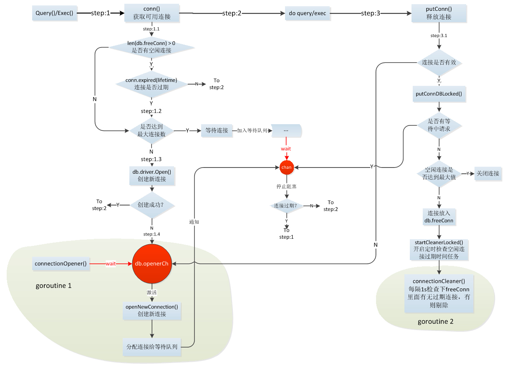

[TOC]

# golang源码分析

> 系列文章：https://blog.csdn.net/u010853261/category_8361413.html

## golang的汇编引导过程

编译二进制文件

```bash
$ CGO_ENABLED=0 GOOS=linux GOARCH=amd64 go build -o ./gateway -gcflags '-l -N' ./cmd/gateway
```

` --gcflags '-l -N'` 编译时禁止内联和优化

二进制文件导出汇编代码,比如

```bash
$ go tool objdump gateway >> gateway.dump
```

- 入口文件:go/go1.13/src/runtime/rt0_linux_amd64.s

```assembly
TEXT _rt0_amd64_linux(SB)  /home/znddzxx112/local/go/go1.13/src/runtime/rt0_linux_amd64.s
rt0_linux_amd64.s:8	0x460bf0		e9fbc5ffff		JMP _rt0_amd64(SB)	
```

`JMP` 汇编语言跳转指令

`go1.13/src/runtime` 文件夹下有许多 rt0_开头的文件，不同OS和ARCH时入口文件不同

- 源码文件:go/go1.13/src/runtime/asm_amd64.s

```assembly
TEXT _rt0_amd64(SB) /home/znddzxx112/local/go/go1.13/src/runtime/asm_amd64.s
  asm_amd64.s:15	0x45d1f0		488b3c24		MOVQ 0(SP), DI		
  asm_amd64.s:16	0x45d1f4		488d742408		LEAQ 0x8(SP), SI	
  asm_amd64.s:17	0x45d1f9		e902000000		JMP runtime.rt0_go(SB)
```

继续查看相同文件go/go1.13/src/runtime/asm_amd64.s下runtime.rt0_go(SB)

```assembly
TEXT runtime.rt0_go(SB) /home/znddzxx112/local/go/go1.13/src/runtime/asm_amd64.s
    ...
    CALL	runtime·args(SB)
	CALL	runtime·osinit(SB)
	CALL	runtime·schedinit(SB)

	// create a new goroutine to start program
	MOVQ	$runtime·mainPC(SB), AX		// entry
	PUSHQ	AX
	PUSHQ	$0			// arg size
	CALL	runtime·newproc(SB)
	POPQ	AX
	POPQ	AX

	// start this M
	CALL	runtime·mstart(SB)

	CALL	runtime·abort(SB)	// mstart should never return
	RET

	// Prevent dead-code elimination of debugCallV1, which is
	// intended to be called by debuggers.
	MOVQ	$runtime·debugCallV1(SB), AX
	RET

DATA	runtime·mainPC+0(SB)/8,$runtime·main(SB)
GLOBL	runtime·mainPC(SB),RODATA,$8
```

`CALL` 是汇编子程序调用指令，这里调用了许多重要的函数

`rt0_go` 中有第一个内核线程m0和对应的g0,g0包含内核栈等

`runtime·osinit(SB)` 获取到cpu核数、页大小64位为8KB

`CALL runtime.schedinit(SB)` 很多重要的初始化工作，包括模块数据，stackpool初始化，内存分配初始化，m初始化（m的id值）、记录程序的环境变量和参数、记录调试参数、GC初始化(标记和清扫完毕、标记比例)、创建P（设置P的状态为Pidle， mcache分配。通过mheap.cachealloc.alloc() 从Arena区域划分下来）

注解：var mheap, allp, allm这些数据存放于数据段中，不是go堆中。

`MOVQ	$runtime·mainPC(SB), AX		// entry` 这里往SB虚拟寄存器中赋值runtime.main函数的入口（proc.go中的main函数)

`CALL	runtime·newproc(SB)`  创建第一个g, 设置g的函数入口地址为runtime.main, 文件位置proc.go

```
func newproc(siz int32, fn *funcval) {
	argp := add(unsafe.Pointer(&fn), sys.PtrSize)
	gp := getg()
	pc := getcallerpc()
	systemstack(func() {
		newproc1(fn, (*uint8)(argp), siz, gp, pc)
	})
}

func newproc1(fn *funcval, argp *uint8, narg int32, callergp *g, callerpc uintptr) {
    ...
    // g的函数入口地址为runtime.main
	newg.startpc = fn.fn
	...
}
```


`runtime·mstart` 函数， 执行m初始化函数，m0会执行单独函数，再执行到`schedule()`  调度。随后会最先执行runtime.main函数。


```
func mstart() {
	_g_ := getg()

	osStack := _g_.stack.lo == 0
	if osStack {
		// Initialize stack bounds from system stack.
		// Cgo may have left stack size in stack.hi.
		// minit may update the stack bounds.
		size := _g_.stack.hi
		if size == 0 {
			size = 8192 * sys.StackGuardMultiplier
		}
		_g_.stack.hi = uintptr(noescape(unsafe.Pointer(&size)))
		_g_.stack.lo = _g_.stack.hi - size + 1024
	}
	// Initialize stack guard so that we can start calling regular
	// Go code.
	_g_.stackguard0 = _g_.stack.lo + _StackGuard
	// This is the g0, so we can also call go:systemstack
	// functions, which check stackguard1.
	_g_.stackguard1 = _g_.stackguard0
	mstart1()

	// Exit this thread.
	if GOOS == "windows" || GOOS == "solaris" || GOOS == "illumos" || GOOS == "plan9" || GOOS == "darwin" || GOOS == "aix" {
		// Windows, Solaris, illumos, Darwin, AIX and Plan 9 always system-allocate
		// the stack, but put it in _g_.stack before mstart,
		// so the logic above hasn't set osStack yet.
		osStack = true
	}
	mexit(osStack)
}

```

```
func mstart1() {
	_g_ := getg()

	if _g_ != _g_.m.g0 {
		throw("bad runtime·mstart")
	}

	// Record the caller for use as the top of stack in mcall and
	// for terminating the thread.
	// We're never coming back to mstart1 after we call schedule,
	// so other calls can reuse the current frame.
	save(getcallerpc(), getcallersp())
	asminit()
	minit()

	// Install signal handlers; after minit so that minit can
	// prepare the thread to be able to handle the signals.
	if _g_.m == &m0 {
		mstartm0()
	}

	if fn := _g_.m.mstartfn; fn != nil {
		fn()
	}

	if _g_.m != &m0 {
		acquirep(_g_.m.nextp.ptr())
		_g_.m.nextp = 0
	}
	schedule()
}
```

runtime.main函数

源码文件：/go/go1.13/src/runtime/proc.go

会启动sysmon协程，runtime的init工作、gc清扫协程，main的init函数、执行用户层main函数。

如果协程出现panic，调用`gopark`函数进行协程切换。该协程进行切换与m解除绑定。解除绑定的流程是当前g的stack信息保留，执行位置保留。切换到m的g0栈执行，紧接着g0与m解除绑定，再执行调度，允许其他g来占用m

如果协程存在defer函数，调用`Goshed`函数进行协程切换。

```golang
func main() {
	g := getg()

	// Racectx of m0->g0 is used only as the parent of the main goroutine.
	// It must not be used for anything else.
	g.m.g0.racectx = 0

	// Max stack size is 1 GB on 64-bit, 250 MB on 32-bit.
	// Using decimal instead of binary GB and MB because
	// they look nicer in the stack overflow failure message.
	if sys.PtrSize == 8 {
		maxstacksize = 1000000000
	} else {
		maxstacksize = 250000000
	}

	// Allow newproc to start new Ms.
	mainStarted = true

// sysmon协程启动
// 定时触发gc
// 某一个g占用m时间过长，执行合作式抢占工作
	if GOARCH != "wasm" { // no threads on wasm yet, so no sysmon
		systemstack(func() {
			newm(sysmon, nil)
		})
	}

	// Lock the main goroutine onto this, the main OS thread,
	// during initialization. Most programs won't care, but a few
	// do require certain calls to be made by the main thread.
	// Those can arrange for main.main to run in the main thread
	// by calling runtime.LockOSThread during initialization
	// to preserve the lock.
	// 独占上锁
	lockOSThread()

   // 必须为m0
	if g.m != &m0 {
		throw("runtime.main not on m0")
	}

   // 初始化runtime的工作
	doInit(&runtime_inittask) // must be before defer
	if nanotime() == 0 {
		throw("nanotime returning zero")
	}

	// Defer unlock so that runtime.Goexit during init does the unlock too.
	needUnlock := true
	defer func() {
		if needUnlock {
			unlockOSThread()
		}
	}()

	// Record when the world started.
	runtimeInitTime = nanotime()
  // 启动gc协程
	gcenable()

	main_init_done = make(chan bool)
	if iscgo {
		if _cgo_thread_start == nil {
			throw("_cgo_thread_start missing")
		}
		if GOOS != "windows" {
			if _cgo_setenv == nil {
				throw("_cgo_setenv missing")
			}
			if _cgo_unsetenv == nil {
				throw("_cgo_unsetenv missing")
			}
		}
		if _cgo_notify_runtime_init_done == nil {
			throw("_cgo_notify_runtime_init_done missing")
		}
		// Start the template thread in case we enter Go from
		// a C-created thread and need to create a new thread.
		startTemplateThread()
		cgocall(_cgo_notify_runtime_init_done, nil)
	}
  // 执行各个packet init函数
	doInit(&main_inittask)

	close(main_init_done)

	needUnlock = false
	unlockOSThread()
   // 如果是包，库，再这里返回
	if isarchive || islibrary {
		// A program compiled with -buildmode=c-archive or c-shared
		// has a main, but it is not executed.
		return
	}
	fn := main_main // make an indirect call, as the linker doesn't know the address of the main package when laying down the runtime
	// 执行用户层main函数
	fn()
	if raceenabled {
		racefini()
	}

	// Make racy client program work: if panicking on
	// another goroutine at the same time as main returns,
	// let the other goroutine finish printing the panic trace.
	// Once it does, it will exit. See issues 3934 and 20018.
	// 协程出现panic，但有recover处理
	if atomic.Load(&runningPanicDefers) != 0 {
		// Running deferred functions should not take long.
		for c := 0; c < 1000; c++ {
			if atomic.Load(&runningPanicDefers) == 0 {
				break
			}
			Gosched()
		}
	}
	// 如果协程出现panic，则会把这个协程进行切换
	if atomic.Load(&panicking) != 0 {
		gopark(nil, nil, waitReasonPanicWait, traceEvGoStop, 1)
	}

	exit(0)
	for {
		var x *int32
		*x = 0
	}
}
//go:linkname main_main main.main
func main_main()
```

```
func gcenable() {
	// Kick off sweeping and scavenging.
	c := make(chan int, 2)
	go bgsweep(c) // 打扫
	go bgscavenge(c) // 清除
	<-c
	<-c
	memstats.enablegc = true // now that runtime is initialized, GC is okay
}
```

调用user层的main函数

```
fn := main_main // make an indirect call, as the linker doesn't know the address of the main package when laying down the runtime
	fn()
```

汇编代码的引导过程到这里就结束了，从这个函数开始都是用golang编写。下面是main函数的汇编代码

```assembly
TEXT runtime.main(SB) /home/znddzxx112/local/go/go1.13/src/runtime/proc.go
...
  proc.go:203		0x430cae		488b056331e400		MOVQ 0xe43163(IP), AX				
  proc.go:203		0x430cb5		488d155c31e400		LEAQ 0xe4315c(IP), DX				
  proc.go:203		0x430cbc		ffd0			CALL AX	
  ...
```

结合汇编代码，说下我的理解：

`func main_main()` 在链接时将golang程序的主包main函数地址与main_main()关联起来，寄存器AX应该放置了main函数地址, 执行`CALL AX`时就会去golang程序中的main函数代码了

- 使用gdb单步调试

  ```bash
  $ gdb gateway
  (gdb) b runtime.main(SB)
  (gdb) r
  (gdb) n
  ```

  `n` 一直按n进行单步调试，这里有多线程没有单步至`fn()`处，调度器不断在进行调度。

- 使用gdb attach方式观察程序

  ```bash
  $ ./gateway
  $ gdb attach 10564
  (gdb) info threads
  (gdb) thread 6
  (gdb) info stack
  ```

  `info threads` 看到的时内核线程，即GPM中M

  `thread 6` 是切到具体线程

  `info stack` 查看线程的栈情况

- 入口调试

  ```
  $ gdb malloc
  (gdb) b runtime.rt0_go
  (gdb) b runtime.mstart
  (gdb) b runtime.main
  (gdb) b main.main 用户级别入口函数
  (gdb) n
  
  ```

  

#### 总结

​		引导过程先从asm_amd64.s中rt0_go开始，完成`runtime·args(SB)`, `runtime·osinit(SB)` `runtime·schedinit(SB)` , 并且创建第一个g任务，g开始函数入口指向proc.go文件中`runtime.main`  函数,  随后调用文件proc.go文件中`runtime·mstart` 开始启动m。

​		m首先会执行m的初始化函数，找到一个执行的g并执行。注意当前只有一个G

​		执行`runtime.main`  函数,在这个函数中会`gcenable()` 启动二个g任务分别是垃圾标记和清除，随后执行用户入口函数main_main。

​		在进入用户入口函数main_main时，已有3个go协程在运行了

​		学习和分析golang的汇编引导过程，能窥见golang全貌，接下去就是逐一学习和领悟

#### 启动流程图


#### 特殊的M0和G0

**M0**

`M0`是启动程序后的编号为0的主线程，这个M对应的实例会在全局变量runtime.m0中，不需要在heap上分配，M0负责执行初始化操作和启动第一个G， 在之后M0就和其他的M一样了。

**G0**

`G0`是每次启动一个M都会第一个创建的gourtine，G0仅用于负责调度的G，调用schedule函数从G0绑定的M的P中找到一个可运行的G，G0不指向任何可执行的函数, 每个M都会有一个自己的G0。在调度或系统调用时会使用G0的栈空间, 全局变量的G0是M0的G0。

#### 注解：

1、每个m都会创建一个属于这个m的G0并绑定，然后再执行m启动函数。

2、M0是进程的第一个内核线程，也有自己的G0，绑定过程在rt0_go汇编代码中，在执行m启动函数前，会单独执行mstartm0()函数，执行完这个函数后就和不同M无异了


#### Golang系统调用学习笔记

> `x86(-64)` 上共有`int 80`, `sysenter`, `syscall`三种方式来实现系统调用。`int 80` 是最传统的调用方式，其通过中断/异常来实现。`sysenter` 与 `syscall` 则都是通过引入新的寄存器组( Model-Specific Register(MSR))存放所需信息，进而实现快速跳转

> 发生系统调用，程序控制权交给内核，处于内核态
>
> 系统调用结束，控制权返回给程序，处于用户态

- 文件位置: go1.13/src/syscall/syscall_unix.go

```goalng
func Syscall(trap, a1, a2, a3 uintptr) (r1, r2 uintptr, err Errno)
func Syscall6(trap, a1, a2, a3, a4, a5, a6 uintptr) (r1, r2 uintptr, err Errno)
func RawSyscall(trap, a1, a2, a3 uintptr) (r1, r2 uintptr, err Errno)
func RawSyscall6(trap, a1, a2, a3, a4, a5, a6 uintptr) (r1, r2 uintptr, err Errno)
```

`trap` 代表中断号/系统调用号 可在文件`go1.13/src/syscall/zsysnum_linux_amd64.go`文件中查看

`a1 ~ a2` 为参数

- 文件位置: go1.13/src/syscall/asm_linux_amd64.go

  ```assembly
  // func Syscall(trap int64, a1, a2, a3 uintptr) (r1, r2, err uintptr);
  // Trap # in AX, args in DI SI DX R10 R8 R9, return in AX DX
  TEXT ·Syscall(SB),NOSPLIT,$0-56
  	CALL	runtime·entersyscall(SB)
  	MOVQ	a1+8(FP), DI
  	MOVQ	a2+16(FP), SI
  	MOVQ	a3+24(FP), DX
  	MOVQ	$0, R10
  	MOVQ	$0, R8
  	MOVQ	$0, R9
  	MOVQ	trap+0(FP), AX	// syscall entry
  	SYSCALL
  	CMPQ	AX, $0xfffffffffffff001
  	JLS	ok
  	MOVQ	$-1, r1+32(FP)
  	MOVQ	$0, r2+40(FP)
  	NEGQ	AX
  	MOVQ	AX, err+48(FP)
  	CALL	runtime·exitsyscall(SB)
  	RET
  ok:
  	MOVQ	AX, r1+32(FP)
  	MOVQ	DX, r2+40(FP)
  	MOVQ	$0, err+48(FP)
  	CALL	runtime·exitsyscall(SB)
  	RET
  ```

  `Syscall`系统调用Syscall的实现，可以窥见传递参数和系统调用号后调用`SYSCALL`，系统调用结束后，获取返回值并调用`runtime·exitsyscall(SB)`

  再看RawSyscall()，与Syscall()少了`CALL	runtime·entersyscall(SB)`和`runtime·exitsyscall(SB)`

  ```
  // func RawSyscall(trap, a1, a2, a3 uintptr) (r1, r2, err uintptr)
  TEXT ·RawSyscall(SB),NOSPLIT,$0-56
  	MOVQ	a1+8(FP), DI
  	MOVQ	a2+16(FP), SI
  	MOVQ	a3+24(FP), DX
  	MOVQ	$0, R10
  	MOVQ	$0, R8
  	MOVQ	$0, R9
  	MOVQ	trap+0(FP), AX	// syscall entry
  	SYSCALL
  	CMPQ	AX, $0xfffffffffffff001
  	JLS	ok1
  	MOVQ	$-1, r1+32(FP)
  	MOVQ	$0, r2+40(FP)
  	NEGQ	AX
  	MOVQ	AX, err+48(FP)
  	RET
  ok1:
  	MOVQ	AX, r1+32(FP)
  	MOVQ	DX, r2+40(FP)
  	MOVQ	$0, err+48(FP)
  	RET
  ```

#### 封装系统调用

```golang
pid, _, _ := syscall.Syscall(39, 0, 0, 0) // 调用39号SYS_GETPID系统调用
fmt.Println("Process id: ", pid)
```

还可以直接使用 `os.Getpid() 或者 syscall.Getpid()`

再看下`os.Getpid() `源码

```golang
func Getpid() int { return syscall.Getpid() }
```

#### 总结

学习和分析golang系统调用，能得到编程启迪


## 内存管理

参考文章

> 非常棒的分析文章:https://www.debug8.com/golang/t_51650.html
>
> https://blog.csdn.net/u010853261/article/details/102945046

### 内存初始化过程

asm_amd64.s rt0_go程序

```
CALL	runtime·args(SB)
CALL	runtime·osinit(SB)
CALL	runtime·schedinit(SB)

// create a new goroutine to start program
MOVQ	$runtime·mainPC(SB), AX		// entry
```

os_linux.go 

```
func osinit() {
	ncpu = getproccount() // 获取cpu的核数量
	physHugePageSize = getHugePageSize() // 64位系统为8KB
}
```

文件位置：proc.go

```
func schedinit()  {
		...
		moduledataverify() 
		stackinit() // 初始化全局栈结构，全局栈内存来自于arena区域
		mallocinit() // 初始化mheap数据结构，mache数据结构
		mcommoninit() // 初始化当前g的栈空间中stackguard1,当前m的id，alllink, 检查m最大数量
		cpuinit() // 处理"GODEBUG="中有关cpu的调试
		modulesinit() 
		...
		goargs() //命令行参数
	  goenvs() // 环境变量
	  parsedebugvars() // godebug参数
	  gcinit() // gc相关参数初始化
	  // 创建一定数量的p，其中有一个p的状态为可运行
        procs := ncpu
        if n, ok := atoi32(gogetenv("GOMAXPROCS")); ok && n > 0 {
            procs = n
        }
        if procresize(procs) != nil {
            throw("unknown runnable goroutine during bootstrap")
        }
}
```

golang在运行时申请虚拟内存

#### mallocinit

通过`sysReserve` 向系统申请一块连续的内存 `spans+bitmap+arena`。其中arena为各个级别缓存结构提供的分配的内存块，spans是个指针数组用来按照page寻址arena区域。

> 最终sysReserve调用的是系统调用`mmap`。申请了512GB的虚拟地址空间，真正的物理内存则是用到的时候发生缺页才真实占用的。

```
func mallocinit() {
	 ...
	mheap_.init()
	_g_ := getg()  // 获取当前G
	_g_.m.mcache = allocmcache() // _g_.m 当前G分配mcache
	
	if sys.PtrSize == 8 { // 64位机器上
	        ...
	        for i := 0x7f; i >= 0; i-- {
	        // mheap中arnea区域初始化 
			hint := (*arenaHint)(mheap_.arenaHintAlloc.alloc())
			hint.addr = p
			hint.next, mheap_.arenaHints = mheap_.arenaHints, hint
			}
	}	
	
	...
}
	
```

> 0x7f = 128 
>
> 分配128个heapArea,每个heapArea是64MB，总共 128 * 64MB = 8GB的空间  2^13 MB
>
> 每个heapArea基地址保存在arenaHints列表结构中
>


#### 核心结构体

> heapArena: 保留整个虚拟地址空间
> mspan：是 mheap 上管理的一连串的页
> mheap：分配的堆，在页大小为 8KB 的粒度上进行管理
> mcentral：搜集了给定大小等级的所有 span
> mcache：为 per-P 的缓存。
> 页是向操作系统申请内存的最小单位，目前设计为 8kb。
>
> 在golang里面内存分为部分，传统意义上的栈由 runtime 统一管理，用户态不感知。而传统意义上的堆内存，又被 Go 运行时划分为了两个部分，
>
> 一个是 Go 运行时自身所需的堆内存，即堆外内存；
> 另一部分则用于 Go 用户态代码所使用的堆内存，也叫做 Go 堆。
> Go 堆负责了用户态对象的存放以及 goroutine 的执行栈。
>
> G0使用的是系统的栈，这样在切换的时候不会产生冲突。
>
> 普通G使用的是Go堆中的栈

#### mheap结构

golang内存管理使用mheap来管理，主要是6种区域arena、free、large、sweep、center、fixalloc

注解：我认为tcmalloc方式，使用不同规格的大小相同的块来使内存分配和回收合理，mheap是放在程序数据段，mheap管理的6个区域是在系统分配的空间上，传统意义的堆上。在系统分配的空间上形成go堆。

##### arena区域

```
type mheap struct {
	arenas [1 << arenaL1Bits]*[1 << arenaL2Bits]*heapArena
	allArenas []arenaIdx
	sweepArenas []arenaIdx
	curArena struct {
		base, end uintptr
	}
	arenaHints *arenaHint
}
type arenaIdx uint
```

> arenas 存储于go堆，并通过allArenas,sweepArenas索引访问，是一个二维数组
>
> arenaIdx 通过 l1()和l2()方法获取 二维数组行列数值
>
> Golang 的堆由很多个 arena 组成，每个 arena 在 64 位机器上是 64MB

```golang
const(
pageSize = 8192//8KB
heapArenaBytes = 67108864 //一个heapArena是64MB
//PtrSize的数值应为8
PtrSize = 4 << (^uintptr(0) >> 63) 
// 算式：heapArenaBitmapBytes = 64M / (8 * 8 / 2) = 2M
heapArenaBitmapBytes = heapArenaBytes / (sys.PtrSize * 8 / 2) // 一个heapArena的bitmap占用2MB
pagesPerArena = heapArenaBytes / pageSize  // 一个heapArena包含8192个页 8k个页
)
type heapArena struct {
	bitmap [heapArenaBitmapBytes]byte //2,097,152  2MB 是一个2MB个byte数组来标记这个heap area 64M 内存的使用情况
	spans [pagesPerArena]*mspan / 8k个mspan,每个mspan是8kB,一个heapArena总共可用64MB空间
	pageInUse [pagesPerArena / 8]uint8 //是一个位图，使用1024 * 8 bit来标记 8192个页(8192*8KB = 64MB)中哪些页正在使用中
	pageMarks [pagesPerArena / 8]uint8 // 表示一个页是否mspan被标记了
}
type arenaHint struct {
	addr uintptr
	down bool
	next *arenaHint
}
```

heapArena区域 描述了一个 heap arena 的元信息。

> bitmap = 2MB 计算过程见上面。用了2个bit来表示1个字(8B), 1个bit表示有没有分配对象，1个bit表示有没有被gc标记
>
> spans [pagesPerArena]*mspan 表示有多少个mspan最多是8k，因为一个页大小是8k,一个mspan最少包含一个页
>
> pageInUse [pagesPerArena / 8]uint8  同样使用位图思维，uint8等于一个字节，一个bit表示一个页有没有使用
>
> arenaHint 是实际分配，链表形式存在

是 arenaHint 链表的节点结构，保存了arena 的起始地址、是否为最后一个 arena，以及下一个 arenaHint 指针。

hint指向了指向每个arena基地址

```
 // mheap中arnea区域初始化 
hint := (*arenaHint)(mheap_.arenaHintAlloc.alloc())
hint.addr = p
hint.next, mheap_.arenaHints = mheap_.arenaHints, hint
```


```
type mheap struct {
	 free      mTreap // free spans
}
type mTreap struct {
	treap           *treapNode
	unscavHugePages uintptr // number of unscavenged huge pages in the treap
}
type treapNode struct {
	right    *treapNode      // all treapNodes > this treap node
	left     *treapNode      // all treapNodes < this treap node
	parent   *treapNode      // direct parent of this node, nil if root
	key      uintptr         // base address of the span, used as primary sort key
	span     *mspan          // span at base address key
	maxPages uintptr         // the maximum size of any span in this subtree, including the root
	priority uint32          // random number used by treap algorithm to keep tree probabilistically balanced
	types    treapIterFilter // the types of spans available in this subtree
}
```

free区域稍后讲解


```
type mheap struct {
	// Malloc stats.
	largealloc  uint64                  // bytes allocated for large objects
	nlargealloc uint64                  // number of large object allocations
	largefree   uint64                  // bytes freed for large objects (>maxsmallsize)
	nlargefree  uint64                  // number of frees for large objects (>maxsmallsize)
}
```

large区域，存储大规格的对象。小对象都能存储在mspan上。稍后讲解


```
type mheap struct {
	sweepgen  uint32 // sweep generation, see comment in mspan
	sweepdone uint32 // all spans are swept
	sweepers  uint32 // number of active sweepone calls
	sweepSpans [2]gcSweepBuf
	pagesInUse         uint64  // pages of spans in stats mSpanInUse; R/W with mheap.lock
	pagesSwept         uint64  // pages swept this cycle; updated atomically
	pagesSweptBasis    uint64  // pagesSwept to use as the origin of the sweep ratio; updated atomically
	sweepHeapLiveBasis uint64  // value of heap_live to use as the origin of sweep ratio; written with lock, read without
	sweepPagesPerByte  float64 // proportional sweep ratio; written with lock, read without
}
```

> sweepSpans [2]gcSweepBuf 分为已打扫span和未打扫的span

sweep内存回收区域


```
type mheap struct {
	central [numSpanClasses]struct {
		mcentral mcentral
		pad      [cpu.CacheLinePadSize - unsafe.Sizeof(mcentral{})%cpu.CacheLinePadSize]byte
	}
	
}
```

numSpanClasses=134 = 67 * 2 每种类型分为有有指针和无指针

当 mcentral 中 nonempty 列表中也没有可分配的 span 时，则会向 mheap 提出请求，从而获得新的 span，并进而交给 mcache

center区域的初始化代码

```
for i := range h.central {
		h.central[i].mcentral.init(spanClass(i))
}
// Initialize a single central free list.
func (c *mcentral) init(spc spanClass) {
	c.spanclass = spc
	c.nonempty.init()
	c.empty.init()
}
```

#### mcenter结构体

```
type mcentral struct {
	lock      mutex
	spanclass spanClass
	nonempty  mSpanList // list of spans with a free object, ie a nonempty free list
	empty     mSpanList // list of spans with no free objects (or cached in an mcache)
	nmalloc uint64
}
```

#### mSpanList结构体

是一个链表

```
type mSpanList struct {
	first *mspan // first span in list, or nil if none
	last  *mspan // last span in list, or nil if none
}
```

总共134个mcenter,每个mcenter包含空闲和非空闲的mspan队列


```
type mheap struct {
	spanalloc             fixalloc // allocator for span*
	cachealloc            fixalloc // allocator for mcache*
	treapalloc            fixalloc // allocator for treapNodes*
	specialfinalizeralloc fixalloc // allocator for specialfinalizer*
	specialprofilealloc   fixalloc // allocator for specialprofile*
	speciallock           mutex    // lock for special record allocators.
	arenaHintAlloc        fixalloc // allocator for arenaHints
}
```

> fixalloc:分配固定大小的块

fixalloc区域


#### mheap_.init()

> 初始化Go堆，分配固定大小块

```golang
// Initialize the heap.
func (h *mheap) init() {
	h.treapalloc.init(unsafe.Sizeof(treapNode{}), nil, nil, &memstats.other_sys)
	h.spanalloc.init(unsafe.Sizeof(mspan{}), recordspan, unsafe.Pointer(h), &memstats.mspan_sys)
	h.cachealloc.init(unsafe.Sizeof(mcache{}), nil, nil, &memstats.mcache_sys)
	h.specialfinalizeralloc.init(unsafe.Sizeof(specialfinalizer{}), nil, nil, &memstats.other_sys)
	h.specialprofilealloc.init(unsafe.Sizeof(specialprofile{}), nil, nil, &memstats.other_sys)
	h.arenaHintAlloc.init(unsafe.Sizeof(arenaHint{}), nil, nil, &memstats.other_sys)

	h.spanalloc.zero = false

	// h->mapcache needs no init
	// mcenter初始化
	for i := range h.central {
		h.central[i].mcentral.init(spanClass(i))
	}
}
```


#### mcache结构

```
type mcache struct {
	alloc [numSpanClasses]*mspan // 67 * 2
}
```

每个mcache包含134个mspan

我们知道每个 Gorontine 的运行都是绑定到一个 P 上面，mcache 是每个 P 的 cache。这么做的好处是分配内存时不需要加锁

当 mcache 中 span 的数量不够使用时，会向 mcentral 的 nonempty 列表中获得新的 span。


#### mspan结构

runtime/mheap.go

```
type mspan stuct {
		next *mspan
		prev *mspan
		startAddr uintptr
		npages    uintptr
		spanclass   spanClass 
	    elemsize    uintptr
	    nelems uintptr
	    
		freeindex uintptr
		
		allocBits  *gcBits
	    gcmarkBits *gcBits
	    
	    sweepgen    uint32
	    
}
```

> startAddr 开始页地址
>
> npages   总共分配多少页，一个页大小是8KB
>
> spanclass   spanClass span存储的对象类型 1～67
> elemsize    uintptr   对象的大小
> nelems uintptr   最多能存储的对象个数  8kB/elemsize
>
> freeindex表示 <该位置的都被分配了, >=该位置的可能被分配, 也可能没有. 配合allocCache来寻找. 每次分配后, freeindex设置为分配的slot+1.
> allocBits表示上一次GC之后哪一些slot被使用了. 0未使用或释放, 1已分配.
> allocCache表示从freeindex开始的64个slot的分配情况, 1为未分配, 0为分配. 使 用ctz(Count Trailing Zeros指令)来找到第一个非0位. 使用完了就从allocBits加载, 取 反.
> 每次gc完之后, sweep阶段, 将allocBits设置为gcmarkBits.
>


#### 各种结构的关系


分配的整体顺序是从右向左，代价也越来越大。

小对象和微对象优先从白色区域 per-P 的 mcache 分配 span，这个过程不需要加锁（白色）；
若失败则会从 mheap 持有的 mcentral 加锁获得新的 span，这个过程需要加锁，但只是局部（灰色）；
若仍失败则会从右侧的 free 或 scav 进行分配，这个过程需要对整个 heap 进行加锁，代价最大（黑色）。

> 这张图有描述不准确的地方：heapArena结构体包含着bitmap, 以及指向mspan的指针
>
> 实际分配mspan的地方是area，不是heapArena。heapArena、mcache、mcentral、freelist区域都指向真正分配mspan的地方area中某一个mspn。
>
> 每一个mspan通过fixalloc分配器从area中划分出来，每个mspan指向了area中具体的开始地址和页的数量
>
> 每个mspan在heapArea结构体allspan中也有记录。

### 内存分配过程

#### mallocgc

runtime/malloc.go

```golang
// 为一种类型返回存储指针
func newobject(typ *_type) unsafe.Pointer {
	return mallocgc(typ.size, typ, true) 
}
const (
	maxSmallSize = 32768 //32kb
	maxTinySize = 16 //16byte
)
// 为对象分配存储字节
// 小对象被分配到p的mcache free列表中
// 大对象直接分配到mheap中
func mallocgc(size uintptr, typ *_type, needzero bool) unsafe.Pointer {
		...
		c := gomcache()  // mcache
	  var x unsafe.Pointer   // 分配到的空间
	  noscan := typ == nil || typ.ptrdata == 0  // 是否需要分配到非扫描列表中
	  if size <= maxSmallSize {
		if noscan && size < maxTinySize {
				// 不需要扫描并且是tiny 对象
				// 什么是tiny对象？如typ是指针
				// 分配在mache的tiny上
				x = unsafe.Pointer(c.tiny + off)
				// 如果c的tiny已满， 从mcache的alloc中获取新的span
				span := c.alloc[tinySpanClass]
				v := nextFreeFast(span)
				x = unsafe.Pointer(v)
				c.tiny = uintptr(x)
		} else {
				// small 对象 分配在 mache的alloc上
				size = uintptr(class_to_size[sizeclass])
			spc := makeSpanClass(sizeclass, noscan)
			span := c.alloc[spc]
			v := nextFreeFast(span)  // 看能否获取到空闲mspan，有则返回指针
			if v == 0 {
				v, span, shouldhelpgc = c.nextFree(spc) // 向mheap中mcenter获取mspan，会加mcenter局部锁
			}
			x = unsafe.Pointer(v)
		}
	} else {
		// 大对象直接分配到mheap
	}
}
```

#### nextFreeFast

p的tiny和alloc都最终指向某一个mspan

如果从mspan中找到空闲位置，返回指针，否则返回0. 

此处可以看到mspan中许多字段的作用

```
// nextFreeFast returns the next free object if one is quickly available.
// Otherwise it returns 0.
func nextFreeFast(s *mspan) gclinkptr {
	theBit := sys.Ctz64(s.allocCache) // Is there a free object in the allocCache?
	if theBit < 64 {
		result := s.freeindex + uintptr(theBit)
		if result < s.nelems {
			freeidx := result + 1
			if freeidx%64 == 0 && freeidx != s.nelems {
				return 0
			}
			s.allocCache >>= uint(theBit + 1)
			s.freeindex = freeidx
			s.allocCount++
			return gclinkptr(result*s.elemsize + s.base())
		}
	}
	return 0
}
```

#### nextFree：此处mcache向mcenter申请

如果上面函数返回0，意味着mcache中此种类型的mspan已经没有空闲位置。

会通过下面的nextFree()获取。

nextFreeIndex()函数再次向mcache中查询有无空闲位置。

```
func (c *mcache) nextFree(spc spanClass) (v gclinkptr, s *mspan, shouldhelpgc bool) {
	s = c.alloc[spc]
	shouldhelpgc = false
	freeIndex := s.nextFreeIndex()
	if freeIndex == s.nelems {
		// The span is full.
		if uintptr(s.allocCount) != s.nelems {
			println("runtime: s.allocCount=", s.allocCount, "s.nelems=", s.nelems)
			throw("s.allocCount != s.nelems && freeIndex == s.nelems")
		}
		c.refill(spc)
		shouldhelpgc = true
		s = c.alloc[spc]

		freeIndex = s.nextFreeIndex()
	}

	if freeIndex >= s.nelems {
		throw("freeIndex is not valid")
	}

	v = gclinkptr(freeIndex*s.elemsize + s.base())
	s.allocCount++
	if uintptr(s.allocCount) > s.nelems {
		println("s.allocCount=", s.allocCount, "s.nelems=", s.nelems)
		throw("s.allocCount > s.nelems")
	}
	return
}
```

#### refill

c.refill(spc) 会向mcenter中申请一个新的mspan，s变量就是新的mspan

```
	s = mheap_.central[spc].mcentral.cacheSpan()
```

原先满的mspan会被操作atomic.Store(&s.sweepgen, mheap_.sweepgen)

```
func (c *mcache) refill(spc spanClass) {
	// Return the current cached span to the central lists.
	s := c.alloc[spc]

	if uintptr(s.allocCount) != s.nelems {
		throw("refill of span with free space remaining")
	}
	if s != &emptymspan {
		// Mark this span as no longer cached.
		if s.sweepgen != mheap_.sweepgen+3 {
			throw("bad sweepgen in refill")
		}
		atomic.Store(&s.sweepgen, mheap_.sweepgen)
	}

	// Get a new cached span from the central lists.
	s = mheap_.central[spc].mcentral.cacheSpan()
	if s == nil {
		throw("out of memory")
	}

	if uintptr(s.allocCount) == s.nelems {
		throw("span has no free space")
	}

	// Indicate that this span is cached and prevent asynchronous
	// sweeping in the next sweep phase.
	s.sweepgen = mheap_.sweepgen + 3

	c.alloc[spc] = s
}
```

#### mcentral.cacheSpan()

再看下mcentral是如何获取可用mspan

加锁

noempty队列是尚有空闲object的mspan队列

遍历noempty队列，如果有空闲，插入到empty队列尾部，返回mspan

遍历empty队列，如果有空闲，返回mspan

问题：什么情况下mcentral向mheap申请mspan？

答：noempty队列为空，empty队列的mspan的sweep >= h.sweep, 说明整个mcentral没有可用的mspan

```golang
// Allocate a span to use in an mcache.
func (c *mcentral) cacheSpan() *mspan {
	// Deduct credit for this span allocation and sweep if necessary.
		spanBytes := uintptr(class_to_allocnpages[c.spanclass.sizeclass()]) * _PageSize
	deductSweepCredit(spanBytes, 0)

	lock(&c.lock)
	traceDone := false
	if trace.enabled {
		traceGCSweepStart()
	}
	sg := mheap_.sweepgen
retry:
	var s *mspan
	for s = c.nonempty.first; s != nil; s = s.next {
		if s.sweepgen == sg-2 && atomic.Cas(&s.sweepgen, sg-2, sg-1) {
			c.nonempty.remove(s)
			c.empty.insertBack(s)
			unlock(&c.lock)
			s.sweep(true)
			goto havespan
		}
		if s.sweepgen == sg-1 {
			// the span is being swept by background sweeper, skip
			continue
		}
		// we have a nonempty span that does not require sweeping, allocate from it
		c.nonempty.remove(s)
		c.empty.insertBack(s)
		unlock(&c.lock)
		goto havespan
	}

	for s = c.empty.first; s != nil; s = s.next {
		if s.sweepgen == sg-2 && atomic.Cas(&s.sweepgen, sg-2, sg-1) {
			// we have an empty span that requires sweeping,
			// sweep it and see if we can free some space in it
			c.empty.remove(s)
			// swept spans are at the end of the list
			c.empty.insertBack(s)
			unlock(&c.lock)
			s.sweep(true)
			freeIndex := s.nextFreeIndex()
			if freeIndex != s.nelems {
				s.freeindex = freeIndex
				goto havespan
			}
			lock(&c.lock)
			// the span is still empty after sweep
			// it is already in the empty list, so just retry
			goto retry
		}
		if s.sweepgen == sg-1 {
			// the span is being swept by background sweeper, skip
			continue
		}
		// already swept empty span,
		// all subsequent ones must also be either swept or in process of sweeping
		break
	}
	if trace.enabled {
		traceGCSweepDone()
		traceDone = true
	}
	unlock(&c.lock)

	// Replenish central list if empty.
	// mcenter grow将返回的span插入empty中
	s = c.grow()
	if s == nil {
		return nil
	}
	lock(&c.lock)
	c.empty.insertBack(s)
	unlock(&c.lock)

	// At this point s is a non-empty span, queued at the end of the empty list,
	// c is unlocked.
havespan:
	if trace.enabled && !traceDone {
		traceGCSweepDone()
	}
	n := int(s.nelems) - int(s.allocCount)
	if n == 0 || s.freeindex == s.nelems || uintptr(s.allocCount) == s.nelems {
		throw("span has no free objects")
	}
	// Assume all objects from this span will be allocated in the
	// mcache. If it gets uncached, we'll adjust this.
	atomic.Xadd64(&c.nmalloc, int64(n))
	usedBytes := uintptr(s.allocCount) * s.elemsize
	atomic.Xadd64(&memstats.heap_live, int64(spanBytes)-int64(usedBytes))
	if trace.enabled {
		// heap_live changed.
		traceHeapAlloc()
	}
	if gcBlackenEnabled != 0 {
		// heap_live changed.
		gcController.revise()
	}
	freeByteBase := s.freeindex &^ (64 - 1)
	whichByte := freeByteBase / 8
	// Init alloc bits cache.
	s.refillAllocCache(whichByte)

	// Adjust the allocCache so that s.freeindex corresponds to the low bit in
	// s.allocCache.
	s.allocCache >>= s.freeindex % 64

	return s
}
```

#### grow: mcentral真正开始向mheap申请mspan

如果mcenter中此时empty列表也没有可用mspan, 则使用grow()方法获取一个新的mspan,插入到empty列表队尾。

grow函数是如何増长出新的mspan的? 向os申请内存

```
func (c *mcentral) grow() *mspan {
	npages := uintptr(class_to_allocnpages[c.spanclass.sizeclass()])
	size := uintptr(class_to_size[c.spanclass.sizeclass()])
	//  向mheap申请mspan
	s := mheap_.alloc(npages, c.spanclass, false, true)
	if s == nil {
		return nil
	}
	.. 
	return s
}
```

#### mheap.alloc

可以看到调用mheap_.alloc(npages, c.spanclass, false, true)，向mheap请求分配得到的

```
func (h *mheap) alloc(npage uintptr, spanclass spanClass, large bool, needzero bool) *mspan {
	// Don't do any operations that lock the heap on the G stack.
	// It might trigger stack growth, and the stack growth code needs
	// to be able to allocate heap.
	var s *mspan
	systemstack(func() {
		s = h.alloc_m(npage, spanclass, large)
	})
...
	return s
}
```

#### mheap.alloc_m

mheap分配mspan的过程

首先通过`lock(&h.lock)` 全局上锁

`s := h.allocSpanLocked(npage, &memstats.heap_inuse)` 获取分配到mspan

随后将span信息sweepSpans中，为回收做准备

```

func (h *mheap) alloc_m(npage uintptr, spanclass spanClass, large bool) *mspan {
	_g_ := getg()

	// To prevent excessive heap growth, before allocating n pages
	// we need to sweep and reclaim at least n pages.
	if h.sweepdone == 0 {
		h.reclaim(npage)
	}

	lock(&h.lock)
	// transfer stats from cache to global
	memstats.heap_scan += uint64(_g_.m.mcache.local_scan)
	_g_.m.mcache.local_scan = 0
	memstats.tinyallocs += uint64(_g_.m.mcache.local_tinyallocs)
	_g_.m.mcache.local_tinyallocs = 0

	s := h.allocSpanLocked(npage, &memstats.heap_inuse)
	if s != nil {
		// Record span info, because gc needs to be
		// able to map interior pointer to containing span.
		atomic.Store(&s.sweepgen, h.sweepgen)
		h.sweepSpans[h.sweepgen/2%2].push(s) // Add to swept in-use list.
		s.state = mSpanInUse
		s.allocCount = 0
		s.spanclass = spanclass
		if sizeclass := spanclass.sizeclass(); sizeclass == 0 {
			s.elemsize = s.npages << _PageShift
			s.divShift = 0
			s.divMul = 0
			s.divShift2 = 0
			s.baseMask = 0
		} else {
			s.elemsize = uintptr(class_to_size[sizeclass])
			m := &class_to_divmagic[sizeclass]
			s.divShift = m.shift
			s.divMul = m.mul
			s.divShift2 = m.shift2
			s.baseMask = m.baseMask
		}

		// Mark in-use span in arena page bitmap.
		arena, pageIdx, pageMask := pageIndexOf(s.base())
		arena.pageInUse[pageIdx] |= pageMask

		// update stats, sweep lists
		h.pagesInUse += uint64(npage)
		if large {
			memstats.heap_objects++
			mheap_.largealloc += uint64(s.elemsize)
			mheap_.nlargealloc++
			atomic.Xadd64(&memstats.heap_live, int64(npage<<_PageShift))
		}
	}
	// heap_scan and heap_live were updated.
	if gcBlackenEnabled != 0 {
		gcController.revise()
	}

	if trace.enabled {
		traceHeapAlloc()
	}

	unlock(&h.lock)
	return s
}
```

#### mheap.allocSpanLocked

看下`allocSpanLocked` 函数流程：

`s := h.allocSpanLocked(npage, &memstats.heap_inuse)` 从free区域寻找span，并从freelist移除

如果freelist也没有足够空间，则会调用grow()函数，向arena申请mspan, 申请到的mspan插入freelist队尾

mheap的free是一个平衡二叉树的结构

```
func (h *mheap) allocSpanLocked(npage uintptr, stat *uint64) *mspan {
	t := h.free.find(npage)
	if t.valid() {
		goto HaveSpan
	}
	if !h.grow(npage) {
		return nil
	}
	t = h.free.find(npage)
	if t.valid() {
		goto HaveSpan
	}
	throw("grew heap, but no adequate free span found")

HaveSpan:
	s := t.span()
	if s.state != mSpanFree {
		throw("candidate mspan for allocation is not free")
	}

	// First, subtract any memory that was released back to
	// the OS from s. We will add back what's left if necessary.
	memstats.heap_released -= uint64(s.released())

	if s.npages == npage {
		h.free.erase(t)
	} else if s.npages > npage {
		// Trim off the lower bits and make that our new span.
		// Do this in-place since this operation does not
		// affect the original span's location in the treap.
		n := (*mspan)(h.spanalloc.alloc())
		h.free.mutate(t, func(s *mspan) {
			n.init(s.base(), npage)
			s.npages -= npage
			s.startAddr = s.base() + npage*pageSize
			h.setSpan(s.base()-1, n)
			h.setSpan(s.base(), s)
			h.setSpan(n.base(), n)
			n.needzero = s.needzero
			// n may not be big enough to actually be scavenged, but that's fine.
			// We still want it to appear to be scavenged so that we can do the
			// right bookkeeping later on in this function (i.e. sysUsed).
			n.scavenged = s.scavenged
			// Check if s is still scavenged.
			if s.scavenged {
				start, end := s.physPageBounds()
				if start < end {
					memstats.heap_released += uint64(end - start)
				} else {
					s.scavenged = false
				}
			}
		})
		s = n
	} else {
		throw("candidate mspan for allocation is too small")
	}
	// "Unscavenge" s only AFTER splitting so that
	// we only sysUsed whatever we actually need.
	if s.scavenged {
		// sysUsed all the pages that are actually available
		// in the span. Note that we don't need to decrement
		// heap_released since we already did so earlier.
		sysUsed(unsafe.Pointer(s.base()), s.npages<<_PageShift)
		s.scavenged = false
	}

	h.setSpans(s.base(), npage, s)

	*stat += uint64(npage << _PageShift)
	memstats.heap_idle -= uint64(npage << _PageShift)

	if s.inList() {
		throw("still in list")
	}
	return s
}
```

#### mheap.grow

grow()函数, 会从当前arena区域划出`ask := npage << _PageShift`大小的空间，作为mspn 

如果没有足够空间，则进行arena区域扩张。

```
func (h *mheap) grow(npage uintptr) bool {
	ask := npage << _PageShift

	nBase := round(h.curArena.base+ask, physPageSize)
	if nBase > h.curArena.end {
		// Not enough room in the current arena. Allocate more
		// arena space. This may not be contiguous with the
		// current arena, so we have to request the full ask.
		av, asize := h.sysAlloc(ask)
		if av == nil {
			print("runtime: out of memory: cannot allocate ", ask, "-byte block (", memstats.heap_sys, " in use)\n")
			return false
		}

		if uintptr(av) == h.curArena.end {
			// The new space is contiguous with the old
			// space, so just extend the current space.
			h.curArena.end = uintptr(av) + asize
		} else {
			// The new space is discontiguous. Track what
			// remains of the current space and switch to
			// the new space. This should be rare.
			if size := h.curArena.end - h.curArena.base; size != 0 {
				h.growAddSpan(unsafe.Pointer(h.curArena.base), size)
			}
			// Switch to the new space.
			h.curArena.base = uintptr(av)
			h.curArena.end = uintptr(av) + asize
		}

		// The memory just allocated counts as both released
		// and idle, even though it's not yet backed by spans.
		//
		// The allocation is always aligned to the heap arena
		// size which is always > physPageSize, so its safe to
		// just add directly to heap_released. Coalescing, if
		// possible, will also always be correct in terms of
		// accounting, because s.base() must be a physical
		// page boundary.
		memstats.heap_released += uint64(asize)
		memstats.heap_idle += uint64(asize)

		// Recalculate nBase
		nBase = round(h.curArena.base+ask, physPageSize)
	}

	// Grow into the current arena.
	v := h.curArena.base
	h.curArena.base = nBase
	h.growAddSpan(unsafe.Pointer(v), nBase-v)
	return true
}
```

#### sysAlloc

`sysAlloc` 函数展示了arena区域扩张过程，并返回空间指针

`mmap` 文件内存映射。可参考`https://blog.csdn.net/dlutbrucezhang/article/details/9080173`

```
func (h *mheap) sysAlloc(n uintptr) (v unsafe.Pointer, size uintptr) {
	p, err := mmap(nil, n, _PROT_READ|_PROT_WRITE, _MAP_ANON|_MAP_PRIVATE, -1, 0)
	if err != 0 {
		if err == _EACCES {
			print("runtime: mmap: access denied\n")
			exit(2)
		}
		if err == _EAGAIN {
			print("runtime: mmap: too much locked memory (check 'ulimit -l').\n")
			exit(2)
		}
		return nil
	}
	mSysStatInc(sysStat, n)
	return p
}
```


#### mheap.growAddSpan

growAddSpan函数将获得空间指针，并获得mspan,  随后把该mspan插入freelist

```
func (h *mheap) growAddSpan(v unsafe.Pointer, size uintptr) {
   // Scavenge some pages to make up for the virtual memory space
   // we just allocated, but only if we need to.
   h.scavengeIfNeededLocked(size)

   s := (*mspan)(h.spanalloc.alloc())
   s.init(uintptr(v), size/pageSize)
   h.setSpans(s.base(), s.npages, s)
   s.state = mSpanFree
   // [v, v+size) is always in the Prepared state. The new span
   // must be marked scavenged so the allocator transitions it to
   // Ready when allocating from it.
   s.scavenged = true
   // This span is both released and idle, but grow already
   // updated both memstats.
   h.coalesce(s)
   h.free.insert(s)
}
```

#### fixalloc.alloc

通过`s := (*mspan)(h.spanalloc.alloc())`获得mspan

首先检查f.list指针，如果不为空则可以直接获取mspan。

在归还的时候，会将归还的mspan放在f.list下，从而形成一个list

如果 f.list为nil, 就使用`f.first(f.arg, v)`取获取mspan

初始化时spanalloc的初始化函数

```
func (h *mheap) init() {
	h.spanalloc.init(unsafe.Sizeof(mspan{}), recordspan, unsafe.Pointer(h), &memstats.mspan_sys)
}
```

```
func (f *fixalloc) alloc() unsafe.Pointer {
	if f.size == 0 {
		print("runtime: use of FixAlloc_Alloc before FixAlloc_Init\n")
		throw("runtime: internal error")
	}

	if f.list != nil {
		v := unsafe.Pointer(f.list)
		f.list = f.list.next
		f.inuse += f.size
		if f.zero {
			memclrNoHeapPointers(v, f.size)
		}
		return v
	}
	if uintptr(f.nchunk) < f.size {
		f.chunk = uintptr(persistentalloc(_FixAllocChunk, 0, f.stat))
		f.nchunk = _FixAllocChunk
	}

	v := unsafe.Pointer(f.chunk)
	if f.first != nil {
		f.first(f.arg, v)
	}
	f.chunk = f.chunk + f.size
	f.nchunk -= uint32(f.size)
	f.inuse += f.size
	return v
}
```

#### recordspan

mheap中的allspan切片存放了所有的mspan结构体指针

可以看到如果allspan没有剩余，通过`sysAlloc` 进行扩张，每次扩张cap(h.allspans) * 3 / 2。3/2倍速度扩张。

```
func recordspan(vh unsafe.Pointer, p unsafe.Pointer) {
	h := (*mheap)(vh)
	s := (*mspan)(p)
	if len(h.allspans) >= cap(h.allspans) {
		n := 64 * 1024 / sys.PtrSize
		if n < cap(h.allspans)*3/2 {
			n = cap(h.allspans) * 3 / 2
		}
		var new []*mspan
		sp := (*slice)(unsafe.Pointer(&new))
		sp.array = sysAlloc(uintptr(n)*sys.PtrSize, &memstats.other_sys)
		if sp.array == nil {
			throw("runtime: cannot allocate memory")
		}
		sp.len = len(h.allspans)
		sp.cap = n
		if len(h.allspans) > 0 {
			copy(new, h.allspans)
		}
		oldAllspans := h.allspans
		*(*notInHeapSlice)(unsafe.Pointer(&h.allspans)) = *(*notInHeapSlice)(unsafe.Pointer(&new))
		if len(oldAllspans) != 0 {
			sysFree(unsafe.Pointer(&oldAllspans[0]), uintptr(cap(oldAllspans))*unsafe.Sizeof(oldAllspans[0]), &memstats.other_sys)
		}
	}
	h.allspans = h.allspans[:len(h.allspans)+1]
	h.allspans[len(h.allspans)-1] = s
}
```


#### 分配过程总结

1、 mheap 结构体存放于数据段中，存放heapArena,allspan等结构体指针

2、mheap中[]*mspan 指向系统申请的连续空间存放mspan

3、每个mspan指向heapArena中开始页地址、页数量

4、mheap中free区域存放指向空闲mspan的指针，并且是平衡二叉树结构

5、mspanfixalloc 等固定大小分配器，维护、申请mspan,treapNodes,mcache,treapNodes,arenaHints空间

6、arenas [1 << arenaL1Bits]*[1 << arenaL2Bits]*heapArena = `[1][4M]heapArena` 

一个heapArena 大小64MB，有4M个 总共能表示256G空间,  一个heapArena有bitmap有2MB，8k个*mspan指针

问题：为何是8k个指针？答：页大小为8KB，一个heapArena 大小64MB。64MB/8kB = 8K个

### 垃圾标记过程

> https://blog.csdn.net/u010853261/article/details/103359762

#### 内存标记和内存清扫二个go协程启动

文件位置proc.go中runtime.main函数

```bash
func main() {
		...
		gcenable()
		...
}
```

```
func gcenable() {
	// Kick off sweeping and scavenging.
	c := make(chan int, 2)
	go bgsweep(c)  // 后台任务形式运行，清扫
	go bgscavenge(c)  // 后台任务形式运行
	<-c
	<-c
	memstats.enablegc = true // now that runtime is initialized, GC is okay
}

```

#### 标记和清扫过程总的总示意图


几个阶段：

1. 标记前准备(STW)
2. 并发标记
3. 标记终止(STW)
4. 并发回收

#### 标记过程

##### 三色标记记录


通常一个span包含了多个大小相同的元素, 一个元素会保存一个对象, 除非:

span用于保存大对象, 这种情况span只有一个元素
span用于保存极小对象且不包含指针的对象(tiny object), 这种情况span会用一个元素保存多个对象
span中有一个freeindex标记下一次分配对象时应该开始搜索的地址, 分配后freeindex会增加,在freeindex之前的元素都是已分配的, 在freeindex之后的元素有可能已分配, 也有可能未分配。

span每次GC以后都可能会回收掉一些元素, allocBits用于标记哪些元素是已分配的, 哪些元素是未分配的。使用freeindex + allocBits可以在分配时跳过已分配的元素, 把对象设置在未分配的元素中，但因为每次都去访问allocBits效率会比较慢, span中有一个整数型的allocCache用于缓存freeindex开始的bitmap, 缓存的bit值与原值相反。

gcmarkBits用于在gc时标记哪些对象存活, 每次gc以后gcmarkBits会变为allocBits。如下图：


回到GC中的三色表示，"三色"的概念可以简单的理解为:

黑色: 对象在这次GC中已标记, 且这个对象包含的子对象也已标记
灰色: 对象在这次GC中已标记, 但这个对象包含的子对象未标记
白色: 对象在这次GC中未标记
在go内部对象并没有保存颜色的属性, 三色只是对它们的状态的描述,

白色的对象在它所在的span的gcmarkBits中对应的bit为0,
灰色的对象在它所在的span的gcmarkBits中对应的bit为1, 并且对象在标记队列中,
黑色的对象在它所在的span的gcmarkBits中对应的bit为1, 并且对象已经从标记队列中取出并处理。
每个P中都有wbBuf(write barrier buffer.)和gcw gcWork, 以及全局的workbuf标记队列, 来实现生产者-消费者模型, 在这些队列中的指针为灰色对象, 表示已标记, 待扫描。

从队列中出来并把其引用对象入队的为黑色对象, 表示已标记, 已扫 描. (runtime.scanobject).

##### 扫描与对象元信息


#### 什么时候开始启动标记

1、runtime.main启动时开始并发标记Goroutine

```
func main() {
	...
	doInit(&runtime_inittask) // must be before defer
	...
}
func init() {
	go forcegchelper()
}
func forcegchelper() {
	forcegc.g = getg()
	for {
		...
		goparkunlock(&forcegc.lock, waitReasonForceGGIdle, traceEvGoBlock, 1)
		...
		gcStart(gcTrigger{kind: gcTriggerTime, now: nanotime()})
	}
}
```

2、分配内存时启动辅助gc

```
func mallocgc(size uintptr, typ *_type, needzero bool) unsafe.Pointer {
		...
		if shouldhelpgc {
			if t := (gcTrigger{kind: gcTriggerHeap}); t.test() {
				gcStart(t)
			}
		}
		return x
}
```

3、手动调用GC函数

```
func GC() {
	gcStart(gcTrigger{kind: gcTriggerCycle, n: n + 1})
}
```

上面三种方式通过gcTrigger的kind字段标识

```
type gcTriggerKind int
const (
	gcTriggerHeap gcTriggerKind = iota
	gcTriggerTime
	gcTriggerCycle
)
type gcTrigger struct {
	kind gcTriggerKind
	now  int64  // gcTriggerTime: current time
	n    uint32 // gcTriggerCycle: cycle number to start
}
```


#### 标记函数 `gcStart` 

首先调用 sweepone 并行清扫上一轮GC未清扫的span;
1、检查触发GC的条件 GC参数，比如是否采用并行GC等等
2、 调用 gcBgMarkStartWorkers 来创建后台并发mark的协程，但是并没有开始运行，会阻塞知道进入Mark阶段
3、开始STW，然后：
      更改全局GC状态机为 _GCmark
      计算扫描根对象的任务数量
      启用辅助GC
4、结束STW，进入并发标记阶段。

#### 概述扫描标记过程

标记的出发点是根对象（g上的栈中变量，数据段中全局变量，bss段中的变量），当前变量是指针，则把可达对象所在的mspan的gcmarkBits改写,同时修改heapArena的pageMarks，并将指向可达对象指针放入p的gcwork.

如果在标记过程中，出现指针赋值操作。使用写屏障，把指针对应的对象放入p中wbbuf中，是待标记对象，是可达的对象，防止漏标记。

标记结果mspan中gcMark字段打上标记。再结合allocbit字段就可以知道哪些是已分配未标记对象，就可以被清扫回收。

```
func gcStart(trigger gcTrigger) {
	// 防止重入，通过lock++实现
	mp := acquirem()
	if gp := getg(); gp == mp.g0 || mp.locks > 1 || mp.preemptoff != "" {
		releasem(mp)
		return
	}
	releasem(mp)
	mp = nil

	// trigger.test()是否达到触发条件， 并且没有可清扫，则开始标记
	for trigger.test() && sweepone() != ^uintptr(0) {
		sweep.nbgsweep++
	}

	// Perform GC initialization and the sweep termination
	// transition.
	semacquire(&work.startSema)
	// Re-check transition condition under transition lock.
	if !trigger.test() {
		semrelease(&work.startSema)
		return
	}

	//  判断是否用户手动触发
	work.userForced = trigger.kind == gcTriggerCycle

	// 标记工作模式：后台标记，debug状态下强制GC
	// 默认使用并发标记
	mode := gcBackgroundMode
	if debug.gcstoptheworld == 1 {
		mode = gcForceMode
	} else if debug.gcstoptheworld == 2 {
		mode = gcForceBlockMode
	}

	// 启动stopworld
	semacquire(&worldsema)

	if trace.enabled {
		traceGCStart()
	}

	// Check that all Ps have finished deferred mcache flushes.
	// 检测p的状态
	for _, p := range allp {
		if fg := atomic.Load(&p.mcache.flushGen); fg != mheap_.sweepgen {
			println("runtime: p", p.id, "flushGen", fg, "!= sweepgen", mheap_.sweepgen)
			throw("p mcache not flushed")
		}
	}

 // 并发标记worker
 // 为每个p创建g，g不会马上执行，等到调用gcController.findRunnable才会真正执行
 // 并且每个标记的g的指针记录再p的gcBgMarkWorker字段中
	gcBgMarkStartWorkers()
	...
	// 关闭stop world
	systemstack(stopTheWorldWithSema)
	
	// 在标记之前要完成清扫
	systemstack(func() {
		finishsweep_m()
	})
	
	// clearpools before we start the GC. If we wait they memory will not be
	// reclaimed until the next GC cycle.
	clearpools()

	work.cycles++
	// 新一轮的gc即将启动，将gc的控制器状态重置
	gcController.startCycle()
	work.heapGoal = memstats.next_gc

	...

	// 开启写屏障
	setGCPhase(_GCmark)

	gcBgMarkPrepare() // Must happen before assist enable.
	gcMarkRootPrepare()

	// 标记tinyAlloc
	gcMarkTinyAllocs()

    // 只有gcBlackenEnabled设置为1，才开始真正允许并发标记
	atomic.Store(&gcBlackenEnabled, 1)

	// Assists and workers can start the moment we start
	// the world.
	// 记录开始清扫时间
	gcController.markStartTime = now

	systemstack(func() {
		now = startTheWorldWithSema(trace.enabled)
		work.pauseNS += now - work.pauseStart
		work.tMark = now
	})
	// In STW mode, we could block the instant systemstack
	// returns, so don't do anything important here. Make sure we
	// block rather than returning to user code.
	if mode != gcBackgroundMode {
	 // 调度发生时，gp = gcController.findRunnableGCWorker(_g_.m.p.ptr())
	 // 获取运行标记的Goroutine从而开始真正标记
		Gosched()
	}

	semrelease(&work.startSema)
}
```

#### gcBgMarkStartWorkers

`gcBgMarkStartWorkers` 函数创建并发标记的worker, 但并未真正开始扫描
为每个p创建g，g不会马上执行，等到调用gcController.findRunnable才会真正执行
并且每个标记的g的指针记录再p的gcBgMarkWorker字段中

问题：什么时候才会调用gcController.findRunnable？

答：在exceu调度函数中，会先检查是否p上有标记Goroutine存在. 存在则运行。

```
func gcBgMarkStartWorkers() {
	// Background marking is performed by per-P G's. Ensure that
	// each P has a background GC G.
	for _, p := range allp {
		if p.gcBgMarkWorker == 0 {
			go gcBgMarkWorker(p)
			notetsleepg(&work.bgMarkReady, -1)
			noteclear(&work.bgMarkReady)
		}
	}
}
```

#### gcBgMarkWorker

循环执行`gcBgMarkWorker` 函数， 开始标记时，更改g的状态

记录本次标记时间。`gcMarkDone()` 函数标记本次标记结束。

问题：标记有几种模式？三种。如果是一心一意执行标记，产生抢占标识时，会把p本地Gouroutine放到全局队列，然后继续执行扫描。

```

func gcBgMarkWorker(_p_ *p) {
	gp := getg()

	type parkInfo struct {
		m      muintptr // Release this m on park.
		attach puintptr // If non-nil, attach to this p on park.
	}
	// We pass park to a gopark unlock function, so it can't be on
	// the stack (see gopark). Prevent deadlock from recursively
	// starting GC by disabling preemption.
	gp.m.preemptoff = "GC worker init"
	park := new(parkInfo)
	gp.m.preemptoff = ""

	park.m.set(acquirem())
	park.attach.set(_p_)
	notewakeup(&work.bgMarkReady)

	for {
		
		// 将当前 goroutine 休眠，直到被gcController.findRunnable唤醒
		gopark(func(g *g, parkp unsafe.Pointer) bool {
			park := (*parkInfo)(parkp)

			// The worker G is no longer running, so it's
			// now safe to allow preemption.
			releasem(park.m.ptr())

			if park.attach != 0 {
				p := park.attach.ptr()
				park.attach.set(nil)
				// 为每个p绑定一个标记的G
				if !p.gcBgMarkWorker.cas(0, guintptr(unsafe.Pointer(g))) {
					// The P got a new worker.
					// Exit this worker.
					return false
				}
			}
			return true
		}, unsafe.Pointer(park), waitReasonGCWorkerIdle, traceEvGoBlock, 0)

		// Loop until the P dies and disassociates this
		// worker (the P may later be reused, in which case
		// it will get a new worker) or we failed to associate.
		if _p_.gcBgMarkWorker.ptr() != gp {
			break
		}

		// Disable preemption so we can use the gcw. If the
		// scheduler wants to preempt us, we'll stop draining,
		// dispose the gcw, and then preempt.
		park.m.set(acquirem())

		if gcBlackenEnabled == 0 {
			throw("gcBgMarkWorker: blackening not enabled")
		}

		startTime := nanotime()
		_p_.gcMarkWorkerStartTime = startTime

		decnwait := atomic.Xadd(&work.nwait, -1)
		if decnwait == work.nproc {
			println("runtime: work.nwait=", decnwait, "work.nproc=", work.nproc)
			throw("work.nwait was > work.nproc")
		}

		systemstack(func() {
			// Mark our goroutine preemptible so its stack
			// can be scanned. This lets two mark workers
			// scan each other (otherwise, they would
			// deadlock). We must not modify anything on
			// the G stack. However, stack shrinking is
			// disabled for mark workers, so it is safe to
			// read from the G stack.
			// 开始标记时，更改g的状态
			casgstatus(gp, _Grunning, _Gwaiting)
			switch _p_.gcMarkWorkerMode {
			default:
				throw("gcBgMarkWorker: unexpected gcMarkWorkerMode")
				// 这个模式下P应该专心执行标记
            // 执行标记, 直到被抢占, 并且需要计算后台的扫描量来减少辅助GC和唤醒等待中的G
            // 一心一意执行标记,如果检测到抢占标记把本P中的G都放到全局队列中
			case gcMarkWorkerDedicatedMode:
				gcDrain(&_p_.gcw, gcDrainUntilPreempt|gcDrainFlushBgCredit)
				if gp.preempt {
					// We were preempted. This is
					// a useful signal to kick
					// everything out of the run
					// queue so it can run
					// somewhere else.
					lock(&sched.lock)
					for {
						gp, _ := runqget(_p_)
						if gp == nil {
							break
						}
						globrunqput(gp)
					}
					unlock(&sched.lock)
				}
				// Go back to draining, this time
				// without preemption.
				gcDrain(&_p_.gcw, gcDrainFlushBgCredit)
				// 这个模式下P应该适当执行标记
            // 执行标记, 直到被抢占, 并且需要计算后台的扫描量来减少辅助GC和唤醒等待中的G
			case gcMarkWorkerFractionalMode:
				gcDrain(&_p_.gcw, gcDrainFractional|gcDrainUntilPreempt|gcDrainFlushBgCredit)
				// 这个模式下P只在空闲时执行标记
            // 执行标记, 直到被抢占或者达到一定的量, 并且需要计算后台的扫描量来减少辅助GC和唤醒等待中的G
			case gcMarkWorkerIdleMode:
				gcDrain(&_p_.gcw, gcDrainIdle|gcDrainUntilPreempt|gcDrainFlushBgCredit)
			}
			casgstatus(gp, _Gwaiting, _Grunning)
		})

		// Account for time.
		duration := nanotime() - startTime
		switch _p_.gcMarkWorkerMode {
		/ 这个模式下P应该专心执行标记
            // 执行标记, 直到被抢占, 并且需要计算后台的扫描量来减少辅助GC和唤醒等待中的G
		case gcMarkWorkerDedicatedMode:
			atomic.Xaddint64(&gcController.dedicatedMarkTime, duration)
			atomic.Xaddint64(&gcController.dedicatedMarkWorkersNeeded, 1)
			// 这个模式下P应该适当执行标记
		case gcMarkWorkerFractionalMode:
			atomic.Xaddint64(&gcController.fractionalMarkTime, duration)
			atomic.Xaddint64(&_p_.gcFractionalMarkTime, duration)
			// 这个模式下P只在空闲时执行标记
		case gcMarkWorkerIdleMode:
			atomic.Xaddint64(&gcController.idleMarkTime, duration)
		}

		// Was this the last worker and did we run out
		// of work?
		incnwait := atomic.Xadd(&work.nwait, +1)
		if incnwait > work.nproc {
			println("runtime: p.gcMarkWorkerMode=", _p_.gcMarkWorkerMode,
				"work.nwait=", incnwait, "work.nproc=", work.nproc)
			throw("work.nwait > work.nproc")
		}

		// If this worker reached a background mark completion
		// point, signal the main GC goroutine.
		if incnwait == work.nproc && !gcMarkWorkAvailable(nil) {
			// Make this G preemptible and disassociate it
			// as the worker for this P so
			// findRunnableGCWorker doesn't try to
			// schedule it.
			_p_.gcBgMarkWorker.set(nil)
			releasem(park.m.ptr())
			// 触发标记完成
			gcMarkDone()

			// Disable preemption and prepare to reattach
			// to the P.
			//
			// We may be running on a different P at this
			// point, so we can't reattach until this G is
			// parked.
			park.m.set(acquirem())
			park.attach.set(_p_)
		}
	}
}
```

#### gcDrain：真正开始执行标记

`gcDrain` 函数真正执行标记操作, 会扫描根对象和在work b uffersa中的对象，将灰色对象转化为黑色对象。

```
func gcDrain(gcw *gcWork, flags gcDrainFlags) {
	if !writeBarrier.needed {
		throw("gcDrain phase incorrect")
	}

	gp := getg().m.curg
	preemptible := flags&gcDrainUntilPreempt != 0
	flushBgCredit := flags&gcDrainFlushBgCredit != 0
	idle := flags&gcDrainIdle != 0

	initScanWork := gcw.scanWork

	// checkWork is the scan work before performing the next
	// self-preempt check.
	checkWork := int64(1<<63 - 1)
	var check func() bool
	if flags&(gcDrainIdle|gcDrainFractional) != 0 {
		checkWork = initScanWork + drainCheckThreshold
		if idle {
			check = pollWork
		} else if flags&gcDrainFractional != 0 {
			check = pollFractionalWorkerExit
		}
	}

	// Drain root marking jobs.
	// markrootJobs代表了需要标记的总数
	// markrootNext代表已标记的数量
	// 如果根对象未扫描完, 则先扫描根对象
	if work.markrootNext < work.markrootJobs {
		for !(preemptible && gp.preempt) {
			job := atomic.Xadd(&work.markrootNext, +1) - 1
			// 判断标记是否完成
			if job >= work.markrootJobs {
				break
			}
			markroot(gcw, job)
			if check != nil && check() {
				goto done
			}
		}
	}

// 根对象已经在标记队列中, 消费标记队列
    // 如果标记了preemptible, 循环直到被抢占
	// Drain heap marking jobs.
	for !(preemptible && gp.preempt) {
		// Try to keep work available on the global queue. We used to
		// check if there were waiting workers, but it's better to
		// just keep work available than to make workers wait. In the
		// worst case, we'll do O(log(_WorkbufSize)) unnecessary
		// balances.
		// 如果全局标记队列为空, 把本地标记队列的一部分工作分过去
        // (如果wbuf2不为空则移动wbuf2过去, 否则移动wbuf1的一半过去)
		if work.full == 0 {
			gcw.balance()
		}

		// 从本地标记队列中获取对象, 获取不到则从全局标记队列获取
		b := gcw.tryGetFast()
		if b == 0 {
			b = gcw.tryGet()
			if b == 0 {
				// Flush the write barrier
				// buffer; this may create
				// more work.
				wbBufFlush(nil, 0)
				b = gcw.tryGet()
			}
		}
		if b == 0 {
			// Unable to get work.
			break
		}
		// 扫描获取到的对象
		// 从灰色对象继续找可达对象放入gcw队列中
		scanobject(b, gcw)

		// Flush background scan work credit to the global
		// account if we've accumulated enough locally so
		// mutator assists can draw on it.
		if gcw.scanWork >= gcCreditSlack {
			atomic.Xaddint64(&gcController.scanWork, gcw.scanWork)
			if flushBgCredit {
				gcFlushBgCredit(gcw.scanWork - initScanWork)
				initScanWork = 0
			}
			checkWork -= gcw.scanWork
			gcw.scanWork = 0

			if checkWork <= 0 {
				checkWork += drainCheckThreshold
				if check != nil && check() {
					break
				}
			}
		}
	}

done:
	// Flush remaining scan work credit.
	if gcw.scanWork > 0 {
		atomic.Xaddint64(&gcController.scanWork, gcw.scanWork)
		if flushBgCredit {
			gcFlushBgCredit(gcw.scanWork - initScanWork)
		}
		gcw.scanWork = 0
	}
}
```

#### markroot：从root根出发扫描object放到gcWork中

标记root对象（数据段全局变量，bss段，栈段变量），可达对象放入gcwork中。辅助GC从gcwork中取出，标记为黑色。

将指向可达对象的指针放入p的gcWork中

defaut为标记栈的变量代码，此时g的状态要为_Gwaiting

```
func markroot(gcw *gcWork, i uint32) {
	// TODO(austin): This is a bit ridiculous. Compute and store
	// the bases in gcMarkRootPrepare instead of the counts.
	baseFlushCache := uint32(fixedRootCount)
	baseData := baseFlushCache + uint32(work.nFlushCacheRoots)
	baseBSS := baseData + uint32(work.nDataRoots)
	baseSpans := baseBSS + uint32(work.nBSSRoots)
	baseStacks := baseSpans + uint32(work.nSpanRoots)
	end := baseStacks + uint32(work.nStackRoots)

	// Note: if you add a case here, please also update heapdump.go:dumproots.
	switch {
	case baseFlushCache <= i && i < baseData:
		flushmcache(int(i - baseFlushCache))

	case baseData <= i && i < baseBSS:
		for _, datap := range activeModules() {
			markrootBlock(datap.data, datap.edata-datap.data, datap.gcdatamask.bytedata, gcw, int(i-baseData))
		}

	case baseBSS <= i && i < baseSpans:
		for _, datap := range activeModules() {
			markrootBlock(datap.bss, datap.ebss-datap.bss, datap.gcbssmask.bytedata, gcw, int(i-baseBSS))
		}

	case i == fixedRootFinalizers:
		for fb := allfin; fb != nil; fb = fb.alllink {
			cnt := uintptr(atomic.Load(&fb.cnt))
			scanblock(uintptr(unsafe.Pointer(&fb.fin[0])), cnt*unsafe.Sizeof(fb.fin[0]), &finptrmask[0], gcw, nil)
		}

	case i == fixedRootFreeGStacks:
		// Switch to the system stack so we can call
		// stackfree.
		systemstack(markrootFreeGStacks)

	case baseSpans <= i && i < baseStacks:
		// mark mspan.specials
		markrootSpans(gcw, int(i-baseSpans))

	default:
	 //  标记栈上的变量
		// the rest is scanning goroutine stacks
		var gp *g
		if baseStacks <= i && i < end {
			gp = allgs[i-baseStacks]
		} else {
			throw("markroot: bad index")
		}

		// remember when we've first observed the G blocked
		// needed only to output in traceback
		status := readgstatus(gp) // We are not in a scan state
		if (status == _Gwaiting || status == _Gsyscall) && gp.waitsince == 0 {
			gp.waitsince = work.tstart
		}

		// scang must be done on the system stack in case
		// we're trying to scan our own stack.
		systemstack(func() {
			// If this is a self-scan, put the user G in
			// _Gwaiting to prevent self-deadlock. It may
			// already be in _Gwaiting if this is a mark
			// worker or we're in mark termination.
			userG := getg().m.curg
			selfScan := gp == userG && readgstatus(userG) == _Grunning
			if selfScan {
				casgstatus(userG, _Grunning, _Gwaiting)
				userG.waitreason = waitReasonGarbageCollectionScan
			}

			// TODO: scang blocks until gp's stack has
			// been scanned, which may take a while for
			// running goroutines. Consider doing this in
			// two phases where the first is non-blocking:
			// we scan the stacks we can and ask running
			// goroutines to scan themselves; and the
			// second blocks.
			scang(gp, gcw)

			if selfScan {
				casgstatus(userG, _Gwaiting, _Grunning)
			}
		})
	}
}
```

接下去的函数找到g中栈中的可达object，在object所在mspan中进行标记gcmarkBits，再将指向可达对象的指针放入gcwork中。

`markroot` -> `scang` ->  `scanstack` -> `scanblock`  函数调用链

scanblock 与scanobject过程非常像，调用findObject再调用greyobject

```
func scanblock(b0, n0 uintptr, ptrmask *uint8, gcw *gcWork, stk *stackScanState) {
	// Use local copies of original parameters, so that a stack trace
	// due to one of the throws below shows the original block
	// base and extent.
	b := b0
	n := n0

	for i := uintptr(0); i < n; {
		// Find bits for the next word.
		bits := uint32(*addb(ptrmask, i/(sys.PtrSize*8)))
		if bits == 0 {
			i += sys.PtrSize * 8
			continue
		}
		for j := 0; j < 8 && i < n; j++ {
			if bits&1 != 0 {
				// 与scanobject过程非常相思
				p := *(*uintptr)(unsafe.Pointer(b + i))
				if p != 0 {
					if obj, span, objIndex := findObject(p, b, i); obj != 0 {
						greyobject(obj, b, i, span, gcw, objIndex)
					} else if stk != nil && p >= stk.stack.lo && p < stk.stack.hi {
						stk.putPtr(p)
					}
				}
			}
			bits >>= 1
			i += sys.PtrSize
		}
	}
}
```

#### scanobject

找到指针b指向的object所在的bitmaps和span，判断object是否为指针，如果是object放入p的gcWork中

问题：如何通过heapArena知道object是指针？

答: 通过heapArena中的bitmap

```
func scanobject(b uintptr, gcw *gcWork) {
	// 找到指针b所在的bitmaps和span
	hbits := heapBitsForAddr(b)
	s := spanOfUnchecked(b)
	n := s.elemsize
	if n == 0 {
		throw("scanobject n == 0")
	}

  // 处理大对象
	if n > maxObletBytes {
		if b == s.base() {
			if s.spanclass.noscan() {
				// Bypass the whole scan.
				gcw.bytesMarked += uint64(n)
				return
			}
			for oblet := b + maxObletBytes; oblet < s.base()+s.elemsize; oblet += maxObletBytes {
				if !gcw.putFast(oblet) {
					gcw.put(oblet)
				}
			}
		}
		n = s.base() + s.elemsize - b
		if n > maxObletBytes {
			n = maxObletBytes
		}
	}

	var i uintptr
	for i = 0; i < n; i += sys.PtrSize {
		
		if i != 0 {
			hbits = hbits.next()
		}
		// Load bits once. See CL 22712 and issue 16973 for discussion.
		bits := hbits.bits()
		// 判断长度是否等于指针
		if i != 1*sys.PtrSize && bits&bitScan == 0 {
			break // no more pointers in this object
		}
		// bitmap的第1个bit表示是否分配,第2个bit表示是否是指针
		if bits&bitPointer == 0 {
			continue // not a pointer
		}
		obj := *(*uintptr)(unsafe.Pointer(b + i))
		if obj != 0 && obj-b >= n {
			// 通过指针拿到对象
			if obj, span, objIndex := findObject(obj, b, i); obj != 0 {
				greyobject(obj, b, i, span, gcw, objIndex)
			}
		}
	}
	gcw.bytesMarked += uint64(n)
	gcw.scanWork += int64(i)
}
```

#### greyobject:灰色对象的处理

放入gcw队列之前就把灰色对象gcMarkbits

```
func greyobject(obj, base, off uintptr, span *mspan, gcw *gcWork, objIndex uintptr) {
	...
		if mbits.isMarked() {
			return
		}
		mbits.setMarked()
		// Mark span.
		arena, pageIdx, pageMask := pageIndexOf(span.base())
		if arena.pageMarks[pageIdx]&pageMask == 0 {
			atomic.Or8(&arena.pageMarks[pageIdx], pageMask)
		}
		if !gcw.putFast(obj) {
			gcw.put(obj)
		}
}

```


#### gcMarkDone

标记完成`gcMarkDone`

```
func gcMarkDone() {
	// Ensure only one thread is running the ragged barrier at a
	// time.
	semacquire(&work.markDoneSema)

top:
	// Re-check transition condition under transition lock.
	//
	// It's critical that this checks the global work queues are
	// empty before performing the ragged barrier. Otherwise,
	// there could be global work that a P could take after the P
	// has passed the ragged barrier.
	if !(gcphase == _GCmark && work.nwait == work.nproc && !gcMarkWorkAvailable(nil)) {
		semrelease(&work.markDoneSema)
		return
	}

	// Flush all local buffers and collect flushedWork flags.
	gcMarkDoneFlushed = 0
	systemstack(func() {
		gp := getg().m.curg
		// Mark the user stack as preemptible so that it may be scanned.
		// Otherwise, our attempt to force all P's to a safepoint could
		// result in a deadlock as we attempt to preempt a worker that's
		// trying to preempt us (e.g. for a stack scan).
		casgstatus(gp, _Grunning, _Gwaiting)
		forEachP(func(_p_ *p) {
			// Flush the write barrier buffer, since this may add
			// work to the gcWork.
			wbBufFlush1(_p_)
			// For debugging, shrink the write barrier
			// buffer so it flushes immediately.
			// wbBuf.reset will keep it at this size as
			// long as throwOnGCWork is set.
			if debugCachedWork {
				b := &_p_.wbBuf
				b.end = uintptr(unsafe.Pointer(&b.buf[wbBufEntryPointers]))
				b.debugGen = gcWorkPauseGen
			}
			// Flush the gcWork, since this may create global work
			// and set the flushedWork flag.
			//
			// TODO(austin): Break up these workbufs to
			// better distribute work.
			_p_.gcw.dispose()
			// Collect the flushedWork flag.
			if _p_.gcw.flushedWork {
				atomic.Xadd(&gcMarkDoneFlushed, 1)
				_p_.gcw.flushedWork = false
			} else if debugCachedWork {
				// For debugging, freeze the gcWork
				// until we know whether we've reached
				// completion or not. If we think
				// we've reached completion, but
				// there's a paused gcWork, then
				// that's a bug.
				_p_.gcw.pauseGen = gcWorkPauseGen
				// Capture the G's stack.
				for i := range _p_.gcw.pauseStack {
					_p_.gcw.pauseStack[i] = 0
				}
				callers(1, _p_.gcw.pauseStack[:])
			}
		})
		casgstatus(gp, _Gwaiting, _Grunning)
	})

	if gcMarkDoneFlushed != 0 {
		if debugCachedWork {
			// Release paused gcWorks.
			atomic.Xadd(&gcWorkPauseGen, 1)
		}
		// More grey objects were discovered since the
		// previous termination check, so there may be more
		// work to do. Keep going. It's possible the
		// transition condition became true again during the
		// ragged barrier, so re-check it.
		goto top
	}

	if debugCachedWork {
		throwOnGCWork = true
		// Release paused gcWorks. If there are any, they
		// should now observe throwOnGCWork and panic.
		atomic.Xadd(&gcWorkPauseGen, 1)
	}

	// There was no global work, no local work, and no Ps
	// communicated work since we took markDoneSema. Therefore
	// there are no grey objects and no more objects can be
	// shaded. Transition to mark termination.
	now := nanotime()
	work.tMarkTerm = now
	work.pauseStart = now
	getg().m.preemptoff = "gcing"
	if trace.enabled {
		traceGCSTWStart(0)
	}
	systemstack(stopTheWorldWithSema)
	// The gcphase is _GCmark, it will transition to _GCmarktermination
	// below. The important thing is that the wb remains active until
	// all marking is complete. This includes writes made by the GC.

	if debugCachedWork {
		// For debugging, double check that no work was added after we
		// went around above and disable write barrier buffering.
		for _, p := range allp {
			gcw := &p.gcw
			if !gcw.empty() {
				printlock()
				print("runtime: P ", p.id, " flushedWork ", gcw.flushedWork)
				if gcw.wbuf1 == nil {
					print(" wbuf1=<nil>")
				} else {
					print(" wbuf1.n=", gcw.wbuf1.nobj)
				}
				if gcw.wbuf2 == nil {
					print(" wbuf2=<nil>")
				} else {
					print(" wbuf2.n=", gcw.wbuf2.nobj)
				}
				print("\n")
				if gcw.pauseGen == gcw.putGen {
					println("runtime: checkPut already failed at this generation")
				}
				throw("throwOnGCWork")
			}
		}
	} else {
		// For unknown reasons (see issue #27993), there is
		// sometimes work left over when we enter mark
		// termination. Detect this and resume concurrent
		// mark. This is obviously unfortunate.
		//
		// Switch to the system stack to call wbBufFlush1,
		// though in this case it doesn't matter because we're
		// non-preemptible anyway.
		restart := false
		systemstack(func() {
			for _, p := range allp {
				wbBufFlush1(p)
				if !p.gcw.empty() {
					restart = true
					break
				}
			}
		})
		if restart {
			getg().m.preemptoff = ""
			systemstack(func() {
				now := startTheWorldWithSema(true)
				work.pauseNS += now - work.pauseStart
			})
			goto top
		}
	}

	// Disable assists and background workers. We must do
	// this before waking blocked assists.
	atomic.Store(&gcBlackenEnabled, 0)

	// Wake all blocked assists. These will run when we
	// start the world again.
	gcWakeAllAssists()

	// Likewise, release the transition lock. Blocked
	// workers and assists will run when we start the
	// world again.
	semrelease(&work.markDoneSema)

	// In STW mode, re-enable user goroutines. These will be
	// queued to run after we start the world.
	schedEnableUser(true)

	// endCycle depends on all gcWork cache stats being flushed.
	// The termination algorithm above ensured that up to
	// allocations since the ragged barrier.
	nextTriggerRatio := gcController.endCycle()

	// Perform mark termination. This will restart the world.
	gcMarkTermination(nextTriggerRatio)
}
```

`gcMarkTermination`函数会进行stw操作，并记录mark结束时间。如果开启gctrace, 会打印信息。

#### 

#### 聊聊gcWork


#### 标记过程总结

gcStart 是标记入口函数，调用gcBgMarkStartWorkers，为每个p都分配一个标记工作Goroutine

标记工作的Goroutine不会立即执行，收到gcController发出的信号才会执行,

gcDrain函数具体标记过程：

1、 markroot函数扫描root根对象的指针，都放入盗p的gcWork中

2、scanobject函数从gcWork取出对象，如果对象依旧有可达对象，将可达对象标记后，再将指针放入到gcWork中

标记结束，调用gcMarkDone函数，清空p的gcWork，设置下一次gc触发`gcController.endCycle()`,发生一次stopTheWorld,记录种种信息

问题：哪几种情况会造成标记结束？

gcBgMarkStartWorkers中调用gcDrain时，设置了几种标记模式工作。

第一种标记一心一意抢占，不关心抢占标记

第二种关心抢占标记，发现抢占标记就推出当前标记工作

问题：如何判断可达对象是指针？


问题：如何通过指针找到对象所在heapArena、span？


### 清扫过程

#### 概述

主要过程将mspan的gcmackbit赋值给allocbit, 然后决定mspan是否归还给heap

如果归还mspan从mcentral中移除，放入到free的树节点中

#### bgsweep

bgsweep清扫函数，将mspan归还。

分成二步：

1、如果mspan存在已分配但未标记的对象，将这个mspan push进mheap的sweepspan中。

在内存分配时、从mcache归还mspan给mcenter时。

2、从sweepspan pop出mspan，开始归还这个mspan中object。这通过go sweep()独立协程完成。

```
func bgsweep(c chan int) {
	sweep.g = getg()

	lock(&sweep.lock)
	sweep.parked = true
	c <- 1
	// 陷入休眠
	goparkunlock(&sweep.lock, waitReasonGCSweepWait, traceEvGoBlock, 1)

	for {
	    // 开启循环清扫，每次清扫一个span，就进行Gosched(), 直到返回uintptr(0)都已清扫完毕。
		for sweepone() != ^uintptr(0) {
			sweep.nbgsweep++
			Gosched()
		}
		// 释放未使用（白色）归还给heap
		for freeSomeWbufs(true) {
			Gosched()
		}
		lock(&sweep.lock)
		if !isSweepDone() {
			// 判断清扫未完成，continue则继续清扫
			// This can happen if a GC runs between
			// gosweepone returning ^0 above
			// and the lock being acquired.
			unlock(&sweep.lock)
			continue
		}
		sweep.parked = true
		// 陷入休眠
		goparkunlock(&sweep.lock, waitReasonGCSweepWait, traceEvGoBlock, 1)
	}
}
```


判断是否清扫完毕，开始清扫mheap_.sweepdone置为0

```
func isSweepDone() bool {
	return mheap_.sweepdone != 0
}
```

#### sweepone

通过`sg := mheap_.sweepgen` , `s = mheap_.sweepSpans[1-sg/2%2].pop()`返回可清扫的span

可清扫的span的state应该是mSpanInUse，正在使用的状态。同时s.sweepgen 显示处于未清扫的状态。

mspan的sweepgen值设为sg-1表示已清扫

 把清扫的mspan中的pages数量返回，代表已清扫该span。

```
func sweepone() uintptr {
   _g_ := getg()
   sweepRatio := mheap_.sweepPagesPerByte // For debugging

  // 开始打扫,需要判断mheap全局标记
   _g_.m.locks++
   if atomic.Load(&mheap_.sweepdone) != 0 {
      _g_.m.locks--
      return ^uintptr(0)
   }
   atomic.Xadd(&mheap_.sweepers, +1)

   // Find a span to sweep.
   // 从mheap_.sweepSpans找到一个可以被清扫的span
   var s *mspan
   sg := mheap_.sweepgen
   for {
      s = mheap_.sweepSpans[1-sg/2%2].pop()
      if s == nil {
         atomic.Store(&mheap_.sweepdone, 1)
         break
      }
      if s.state != mSpanInUse {
         if !(s.sweepgen == sg || s.sweepgen == sg+3) {
            print("runtime: bad span s.state=", s.state, " s.sweepgen=", s.sweepgen, " sweepgen=", sg, "\n")
            throw("non in-use span in unswept list")
         }
         continue
      }
      // mspan的状态为sg-1 清扫完成
      if s.sweepgen == sg-2 && atomic.Cas(&s.sweepgen, sg-2, sg-1) {
         break
      }
   }

   // 开始清扫我们找到的mspan
   npages := ^uintptr(0)
   if s != nil {
      npages = s.npages
	 // 清扫这个span
      if s.sweep(false) {
         // Whole span was freed. Count it toward the
         // page reclaimer credit since these pages can
         // now be used for span allocation.
         atomic.Xadduintptr(&mheap_.reclaimCredit, npages)
      } else {
         // Span is still in-use, so this returned no
         // pages to the heap and the span needs to
         // move to the swept in-use list.
         npages = 0
      }
   }

   // Decrement the number of active sweepers and if this is the
   // last one print trace information.
   if atomic.Xadd(&mheap_.sweepers, -1) == 0 && atomic.Load(&mheap_.sweepdone) != 0 {
      if debug.gcpacertrace > 0 {
         print("pacer: sweep done at heap size ", memstats.heap_live>>20, "MB; allocated ", (memstats.heap_live-mheap_.sweepHeapLiveBasis)>>20, "MB during sweep; swept ", mheap_.pagesSwept, " pages at ", sweepRatio, " pages/byte\n")
      }
   }
   _g_.m.locks--
   return npages
}
```

#### sweep

具体的清扫函数`sweep()` , 清扫在标记阶段未被标记（三色标记中的白色），清扫完成，归还到heap后返回true。

如果preserve=true不要将其返回堆，也不要在mcentral列表中重新链接

```
func (s *mspan) sweep(preserve bool) bool {
	// It's critical that we enter this function with preemption disabled,
	// GC must not start while we are in the middle of this function.
	_g_ := getg()
	if _g_.m.locks == 0 && _g_.m.mallocing == 0 && _g_ != _g_.m.g0 {
		throw("mspan.sweep: m is not locked")
	}
	sweepgen := mheap_.sweepgen
	if s.state != mSpanInUse || s.sweepgen != sweepgen-1 {
		print("mspan.sweep: state=", s.state, " sweepgen=", s.sweepgen, " mheap.sweepgen=", sweepgen, "\n")
		throw("mspan.sweep: bad span state")
	}

	if trace.enabled {
		traceGCSweepSpan(s.npages * _PageSize)
	}

	atomic.Xadd64(&mheap_.pagesSwept, int64(s.npages))

	spc := s.spanclass
	size := s.elemsize
	res := false

	c := _g_.m.mcache
	freeToHeap := false

	....

	if debug.allocfreetrace != 0 || debug.clobberfree != 0 || raceenabled || msanenabled {
		// Find all newly freed objects. This doesn't have to
		// efficient; allocfreetrace has massive overhead.
		mbits := s.markBitsForBase() // 来自mspan的gcmarkBits
		abits := s.allocBitsForIndex(0) // 来自mspan的allocBits
		for i := uintptr(0); i < s.nelems; i++ {
		  // 此处重点：mspan已分配未被标记将被回收
			if !mbits.isMarked() && (abits.index < s.freeindex || abits.isMarked()) {
				x := s.base() + i*s.elemsize
				if debug.allocfreetrace != 0 {
					tracefree(unsafe.Pointer(x), size)
				}
				if debug.clobberfree != 0 {
					clobberfree(unsafe.Pointer(x), size)
				}
				if raceenabled {
					racefree(unsafe.Pointer(x), size)
				}
				if msanenabled {
				   // 此处回收
					msanfree(unsafe.Pointer(x), size)
				}
			}
			// 下一个object
			mbits.advance()
			abits.advance()
		}
	}

	// Count the number of free objects in this span.
	nalloc := uint16(s.countAlloc())
	if spc.sizeclass() == 0 && nalloc == 0 {
		s.needzero = 1
		freeToHeap = true
	}
	nfreed := s.allocCount - nalloc
	if nalloc > s.allocCount {
		print("runtime: nelems=", s.nelems, " nalloc=", nalloc, " previous allocCount=", s.allocCount, " nfreed=", nfreed, "\n")
		throw("sweep increased allocation count")
	}

	s.allocCount = nalloc
	wasempty := s.nextFreeIndex() == s.nelems
	s.freeindex = 0 // reset allocation index to start of span.
	if trace.enabled {
		getg().m.p.ptr().traceReclaimed += uintptr(nfreed) * s.elemsize
	}

	// 打扫完毕，s.allocBits = s.gcmarkBits
	// s.gcmarkBits 置为新
	s.allocBits = s.gcmarkBits
	s.gcmarkBits = newMarkBits(s.nelems)

	// 刷新allocCache
	s.refillAllocCache(0)

	// We need to set s.sweepgen = h.sweepgen only when all blocks are swept,
	// because of the potential for a concurrent free/SetFinalizer.
	// But we need to set it before we make the span available for allocation
	// (return it to heap or mcentral), because allocation code assumes that a
	// span is already swept if available for allocation.
	if freeToHeap || nfreed == 0 {
		// The span must be in our exclusive ownership until we update sweepgen,
		// check for potential races.
		if s.state != mSpanInUse || s.sweepgen != sweepgen-1 {
			print("mspan.sweep: state=", s.state, " sweepgen=", s.sweepgen, " mheap.sweepgen=", sweepgen, "\n")
			throw("mspan.sweep: bad span state after sweep")
		}
		// Serialization point.
		// At this point the mark bits are cleared and allocation ready
		// to go so release the span.
		atomic.Store(&s.sweepgen, sweepgen)
	}

	if nfreed > 0 && spc.sizeclass() != 0 {
		c.local_nsmallfree[spc.sizeclass()] += uintptr(nfreed)
		res = mheap_.central[spc].mcentral.freeSpan(s, preserve, wasempty)
		// mcentral.freeSpan updates sweepgen
	} else if freeToHeap {
		// Free large span to heap
		// 大对象回收直接通过mheap来负责回收
		if debug.efence > 0 {
			s.limit = 0 // prevent mlookup from finding this span
			sysFault(unsafe.Pointer(s.base()), size)
		} else {
			mheap_.freeSpan(s, true)
		}
		c.local_nlargefree++
		c.local_largefree += size
		res = true
	}
	if !res {
		// The span has been swept and is still in-use, so put
		// it on the swept in-use list.
		mheap_.sweepSpans[sweepgen/2%2].push(s)
	}
	return res
}
```

归还span到mcenter或者是mheap，大对象回收直接通过mheap来负责回收，负责通过mcenter回收

```
if nfreed > 0 && spc.sizeclass() != 0 {
		c.local_nsmallfree[spc.sizeclass()] += uintptr(nfreed)
		res = mheap_.central[spc].mcentral.freeSpan(s, preserve, wasempty)
	} else if freeToHeap {
		if debug.efence > 0 {
			s.limit = 0 // prevent mlookup from finding this span
			sysFault(unsafe.Pointer(s.base()), size)
		} else {
			mheap_.freeSpan(s, true)
		}
		c.local_nlargefree++
		c.local_largefree += size
		res = true
	}
```

#### freeSpan

`freeSpan` 具体来处理mspan, 决定如何这个打扫过的mspan。

1、如果`preserve` 为true，不做处理，依旧由mcache指向mspan。

2、如果preserve为false，从mcentral中nonempty移除不再指向该mspan，归还到mheap.调用mheap_.freeSpan函数

```
func (c *mcentral) freeSpan(s *mspan, preserve bool, wasempty bool) bool {
	if sg := mheap_.sweepgen; s.sweepgen == sg+1 || s.sweepgen == sg+3 {
		throw("freeSpan given cached span")
	}
	s.needzero = 1

	if preserve {
		// preserve is set only when called from (un)cacheSpan above,
		// the span must be in the empty list.
		if !s.inList() {
			throw("can't preserve unlinked span")
		}
		atomic.Store(&s.sweepgen, mheap_.sweepgen)
		return false
	}

	lock(&c.lock)

	// Move to nonempty if necessary.
	// wasempty为true，说明这个mapsn是存在于mcenter的empty列表中，所以要将mspan从empty移除，插入到nonempty队列中
	if wasempty {
		c.empty.remove(s)
		c.nonempty.insert(s)
	}

	// delay updating sweepgen until here. This is the signal that
	// the span may be used in an mcache, so it must come after the
	// linked list operations above (actually, just after the
	// lock of c above.)
	atomic.Store(&s.sweepgen, mheap_.sweepgen)

	if s.allocCount != 0 {
		unlock(&c.lock)
		return false
	}

	c.nonempty.remove(s)
	unlock(&c.lock)
	// 最后从nonempty队列中移除，再从mheap中去释放这个mspan
	mheap_.freeSpan(s, false)
	return true
}
```

#### mheap.freeSpan

`freeSpan` 函数调用 `freeSpanLocked` 函数

```
func (h *mheap) freeSpan(s *mspan, large bool) {
   systemstack(func() {
      mp := getg().m
      lock(&h.lock)
      memstats.heap_scan += uint64(mp.mcache.local_scan)
      mp.mcache.local_scan = 0
      memstats.tinyallocs += uint64(mp.mcache.local_tinyallocs)
      mp.mcache.local_tinyallocs = 0
      if msanenabled {
         // Tell msan that this entire span is no longer in use.
         base := unsafe.Pointer(s.base())
         bytes := s.npages << _PageShift
         msanfree(base, bytes)
      }
      if large {
         // Match accounting done in mheap.alloc.
         memstats.heap_objects--
      }
      if gcBlackenEnabled != 0 {
         // heap_scan changed.
         gcController.revise()
      }
      h.freeSpanLocked(s, true, true)
      unlock(&h.lock)
   })
}
```

#### mheap.freeSpanLocked

`freeSpanLocked` 函数具体来释放，先arena区域 标识出对应页的位置未被使用

mspan状态设置为mSpanFree

还会调用h.coalesce(s)尝试合并mspan等操作

把这个mspan插入到free区域的树中

```
func (h *mheap) freeSpanLocked(s *mspan, acctinuse, acctidle bool) {
   switch s.state {
   case mSpanManual:
      if s.allocCount != 0 {
         throw("mheap.freeSpanLocked - invalid stack free")
      }
   case mSpanInUse:
      if s.allocCount != 0 || s.sweepgen != h.sweepgen {
         print("mheap.freeSpanLocked - span ", s, " ptr ", hex(s.base()), " allocCount ", s.allocCount, " sweepgen ", s.sweepgen, "/", h.sweepgen, "\n")
         throw("mheap.freeSpanLocked - invalid free")
      }
      h.pagesInUse -= uint64(s.npages)

      // Clear in-use bit in arena page bitmap.
      arena, pageIdx, pageMask := pageIndexOf(s.base())
      arena.pageInUse[pageIdx] &^= pageMask
   default:
      throw("mheap.freeSpanLocked - invalid span state")
   }

   if acctinuse {
      memstats.heap_inuse -= uint64(s.npages << _PageShift)
   }
   if acctidle {
      memstats.heap_idle += uint64(s.npages << _PageShift)
   }
   s.state = mSpanFree

   // Coalesce span with neighbors.
   h.coalesce(s)

   // Insert s into the treap.
   h.free.insert(s)
}
```

#### 清理过程

#### 概述

清扫过后，heap中的free区域记录的mspan的空间未归还给系统

清理过程就是将空间归还给系统

#### 清理器启动入口

runtime.main函数

```
func main() {
		...
		gcenable()
		...
}
func gcenable() {
	...
	go bgscavenge(c)
	...
}
```

#### bgscavenge

同样也会进入休眠，知道收到信号, 循环执行清理动作

```
func bgscavenge(c chan int) {
     ...
    for {
          if retained > want {
				released = mheap_.scavengeLocked(uintptr(retained - want))
			}
    }
    ...
  
}
```

#### mheap.scavengeLocked

mheap的free区域保存mspan的指针，调用s.scavenge函数，释放掉mspan对应的内存，mspan结构体依旧保留。

```
func (h *mheap) scavengeLocked(nbytes uintptr) uintptr {
	released := uintptr(0)
	// Iterate over spans with huge pages first, then spans without.
	const mask = treapIterScav | treapIterHuge
	for _, match := range []treapIterType{treapIterHuge, 0} {
		// Iterate over the treap backwards (from highest address to lowest address)
		// scavenging spans until we've reached our quota of nbytes.
		for t := h.free.end(mask, match); released < nbytes && t.valid(); {
			s := t.span()
			start, end := s.physPageBounds()
			if start >= end {
				// This span doesn't cover at least one physical page, so skip it.
				t = t.prev()
				continue
			}
			n := t.prev()
			if span := h.scavengeSplit(t, nbytes-released); span != nil {
				s = span
			} else {
				h.free.erase(t)
			}
			released += s.scavenge()
			h.coalesce(s)
			t = n
			h.free.insert(s)
		}
	}
	return released
}
```

#### mspan.scavenge

调用sysUnused进行释放

```
func (s *mspan) scavenge() uintptr {
	// start and end must be rounded in, otherwise madvise
	// will round them *out* and release more memory
	// than we want.
	start, end := s.physPageBounds()
	if end <= start {
		// start and end don't span a whole physical page.
		return 0
	}
	released := end - start
	memstats.heap_released += uint64(released)
	s.scavenged = true
	sysUnused(unsafe.Pointer(start), released)
	return released
}
```


## 调度原理-Scheduler原理

> 着重看这个文章：https://blog.csdn.net/u010853261/article/details/84790392

#### 概述GPM模型和程序启动过程

1、程序全局入口`rt0_go`函数，创建一个M0代表当前内核线程。

2、M0如同普通M一样，创建一个属于自己的G0。绑定G0。

3、调用`schedinit`函数，创建P。数量为GOMAXPROCS环境变量和cpu核数

4、调用函数 `newproc` 创建函数入口为runtime.main普通新的G,并放入P的本地队列中。

5、调用`mstart`函数启动M，M0执行特有的mstartm0()函数。执行M的启动函数`mstartfn`

6、此时M0和普通的M无异，调用`schedule()`函数 。m通过p从p的本地队列或者全局队列拿G来执行。此时只有一个入口函数为runtime.main的G。整体流程进入runtime.main函数中

7、runtime.main中启动`垃圾清扫后台`，依赖包init函数执行，再执行用户的`main`函数


不容易理解的是G代码中发生了阻塞或者是系统调用过程。

> 当M执行某一个G时候如果发生了syscall或则其余阻塞操作，M会阻塞，如果当前有一些G在执行，runtime会把这个线程M从P中摘除(detach)，然后再创建一个新的操作系统的线程(如果有空闲的线程可用就复用空闲线程)来服务于这个P；
>
>  当M系统调用结束时候，这个G会尝试获取一个空闲的P执行，并放入到这个P的本地队列。如果获取不到P，那么这个线程M变成休眠状态， 加入到空闲线程中，然后这个G会被放入全局队列中。

#### M获取可运行的G的调度函数

通过函数`schedule`实现

1、M通过P从P的本地队列或者全局队列中拿到可运行状态的G，调用`execute`函数执行G

2、M会判断是否有GCWorker可运行

```
func schedule() {
	_g_ := getg()

	if _g_.m.locks != 0 {
		throw("schedule: holding locks")
	}

	if _g_.m.lockedg != 0 {
		stoplockedm()
		execute(_g_.m.lockedg.ptr(), false) // Never returns.
	}

	// We should not schedule away from a g that is executing a cgo call,
	// since the cgo call is using the m's g0 stack.
	if _g_.m.incgo {
		throw("schedule: in cgo")
	}

top:
	if sched.gcwaiting != 0 {
		gcstopm()
		goto top
	}
	if _g_.m.p.ptr().runSafePointFn != 0 {
		runSafePointFn()
	}

	var gp *g
	var inheritTime bool

	// Normal goroutines will check for need to wakeP in ready,
	// but GCworkers and tracereaders will not, so the check must
	// be done here instead.
	tryWakeP := false
	if trace.enabled || trace.shutdown {
		gp = traceReader()
		if gp != nil {
			casgstatus(gp, _Gwaiting, _Grunnable)
			traceGoUnpark(gp, 0)
			tryWakeP = true
		}
	}
	if gp == nil && gcBlackenEnabled != 0 {
		gp = gcController.findRunnableGCWorker(_g_.m.p.ptr())
		tryWakeP = tryWakeP || gp != nil
	}
	if gp == nil {
		// Check the global runnable queue once in a while to ensure fairness.
		// Otherwise two goroutines can completely occupy the local runqueue
		// by constantly respawning each other.
		if _g_.m.p.ptr().schedtick%61 == 0 && sched.runqsize > 0 {
			lock(&sched.lock)
			gp = globrunqget(_g_.m.p.ptr(), 1)
			unlock(&sched.lock)
		}
	}
	if gp == nil {
		gp, inheritTime = runqget(_g_.m.p.ptr())
		if gp != nil && _g_.m.spinning {
			throw("schedule: spinning with local work")
		}
	}
	if gp == nil {
		gp, inheritTime = findrunnable() // blocks until work is available
	}

	// This thread is going to run a goroutine and is not spinning anymore,
	// so if it was marked as spinning we need to reset it now and potentially
	// start a new spinning M.
	if _g_.m.spinning {
		resetspinning()
	}

	if sched.disable.user && !schedEnabled(gp) {
		// Scheduling of this goroutine is disabled. Put it on
		// the list of pending runnable goroutines for when we
		// re-enable user scheduling and look again.
		lock(&sched.lock)
		if schedEnabled(gp) {
			// Something re-enabled scheduling while we
			// were acquiring the lock.
			unlock(&sched.lock)
		} else {
			sched.disable.runnable.pushBack(gp)
			sched.disable.n++
			unlock(&sched.lock)
			goto top
		}
	}

	// If about to schedule a not-normal goroutine (a GCworker or tracereader),
	// wake a P if there is one.
	if tryWakeP {
		if atomic.Load(&sched.npidle) != 0 && atomic.Load(&sched.nmspinning) == 0 {
			wakep()
		}
	}
	if gp.lockedm != 0 {
		// Hands off own p to the locked m,
		// then blocks waiting for a new p.
		startlockedm(gp)
		goto top
	}

	execute(gp, inheritTime)
}
```

#### 什么时候M会去寻找可运行G？

概述：由于各种原因，当前运行的G的状态从Grunning切换到_Gwaiting、_Grunnable、_Gdead

> G0是M的内核栈，再G切换时需要通过G0来中转

1、一个新的M启动 `mstart()` -> `mstart1()`  -> `schedule` .M绑定G0,调用启动函数，M与G0分离，随后M通过绑定的P去寻找其他可运行的G

2、`gopark()`->`park_m()`-> `schedule()` G从Grunning变成_Gwaiting，M与G分离， M与G0绑定，随后M通过绑定的P去寻找其他可运行的G

多种情况会调用gopark()函数, 请看下面分析。

3、`goschedImpl()` -> `schedule()`, G从Grunning变成_Grunnable，并放入到P的本地队列中，M与G分离，M与G0绑定，M通过绑定的P去寻找其他可运行的G.

以下三个函数会执行`	goschedImpl`函数

```
// Gosched continuation on g0.
func gosched_m(gp *g) {
	... 
	goschedImpl(gp)
}
// goschedguarded is a forbidden-states-avoided version of gosched_m
func goschedguarded_m(gp *g) {
	...
	goschedImpl(gp)
}
// 发生抢占
func gopreempt_m(gp *g) {
	...
	goschedImpl(gp)
}
```

4、`Goexit()`->`goexit1()`->`goexit0()` -> `schedule()` , G从_Grunning变成_Gdead，并放入到P的本地队列中，M与G分离，M与G0绑定，随后M通过绑定的P去寻找其他可运行的G.

所以，只会发生在当前协程运行完毕退出时

5、`exitsyscall()`->`exitsyscall0()` -> `schedule()`  G从_Gsyscall变成_Grunnable, 并放入全局队列中，M与G分离，M与G0绑定，随后M通过绑定的P去寻找其他可运行的G

所以，只会在结束系统调用的时候

#### mcall函数与schedule函数比较

```
func mcall(fn func(*g))
```

mcall函数作用是将m运行的G切换，去运行m的G0

schedule函数作用是m运行的G0切换，去寻找一个新的G，如果找不到m进入休眠。

寻找新的G的过程是从P的本地队列、其他P的本地队列、全局队列中去寻找。


#### go_park函数

go_park函数是协程切换，协程切换有多种原因

```
var waitReasonStrings = [...]string{
	waitReasonZero:                  "",
	waitReasonGCAssistMarking:       "GC assist marking",
	waitReasonIOWait:                "IO wait",
	waitReasonChanReceiveNilChan:    "chan receive (nil chan)",
	waitReasonChanSendNilChan:       "chan send (nil chan)",
	waitReasonDumpingHeap:           "dumping heap",
	waitReasonGarbageCollection:     "garbage collection",
	waitReasonGarbageCollectionScan: "garbage collection scan",
	waitReasonPanicWait:             "panicwait",
	waitReasonSelect:                "select",
	waitReasonSelectNoCases:         "select (no cases)",
	waitReasonGCAssistWait:          "GC assist wait",
	waitReasonGCSweepWait:           "GC sweep wait",
	waitReasonGCScavengeWait:        "GC scavenge wait",
	waitReasonChanReceive:           "chan receive",
	waitReasonChanSend:              "chan send",
	waitReasonFinalizerWait:         "finalizer wait",
	waitReasonForceGGIdle:           "force gc (idle)",
	waitReasonSemacquire:            "semacquire",
	waitReasonSleep:                 "sleep",
	waitReasonSyncCondWait:          "sync.Cond.Wait",
	waitReasonTimerGoroutineIdle:    "timer goroutine (idle)",
	waitReasonTraceReaderBlocked:    "trace reader (blocked)",
	waitReasonWaitForGCCycle:        "wait for GC cycle",
	waitReasonGCWorkerIdle:          "GC worker (idle)",
}
```

```
func gopark(unlockf func(*g, unsafe.Pointer) bool, lock unsafe.Pointer, reason waitReason, traceEv byte, traceskip int) {
	if reason != waitReasonSleep {
		checkTimeouts() // timeouts may expire while two goroutines keep the scheduler busy
	}
	// 获取当前m
	mp := acquirem()
	gp := mp.curg // 获取当前g
	status := readgstatus(gp) // 获取当前g的状态
	// g的状态如果不是运行状态，则不用切换
	if status != _Grunning && status != _Gscanrunning {
		throw("gopark: bad g status")
	}
	mp.waitlock = lock
	mp.waitunlockf = unlockf
	gp.waitreason = reason
	mp.waittraceev = traceEv
	mp.waittraceskip = traceskip
	releasem(mp)
	// can't do anything that might move the G between Ms here.
	mcall函数在golang需要进行协程切换时被调用，做的主要工作是：
保存当前协程的信息( PC/SP存储到g->sched)，当后续对当前协程调用goready函数时候能够恢复现场；
切换当前线程的堆栈从g的堆栈切换到g0的堆栈；
并在g0的堆栈上执行新的函数park_m；
// 总结：当前m与当前g解除绑定，绑定g0开始执行park_m函数
	mcall(park_m)
}
```

park_m 函数是在g0上执行, 让g0与m解除绑定，再执行一次调度。

```
// park continuation on g0.
func park_m(gp *g) {
// g0
	_g_ := getg()

	if trace.enabled {
		traceGoPark(_g_.m.waittraceev, _g_.m.waittraceskip)
	}
  // g0 状态变为_Gwaiting
	casgstatus(gp, _Grunning, _Gwaiting)
	// 解除g0与m的关系
	dropg()

	if fn := _g_.m.waitunlockf; fn != nil {
		ok := fn(gp, _g_.m.waitlock)
		_g_.m.waitunlockf = nil
		_g_.m.waitlock = nil
		if !ok {
			if trace.enabled {
				traceGoUnpark(gp, 2)
			}
			casgstatus(gp, _Gwaiting, _Grunnable)
			execute(gp, true) // Schedule it back, never returns.
		}
	}
	// 执行一次调度
	schedule()
}
```


### 创建go协程

是一个任务单元，有入口，有属于G的栈（包含内部变量，函数传参），能保存寄存器上下文信息。

```
package main

func main()  {
	go func() {
		
	}()
}
```

对应的汇编代码

```
TEXT main.main(SB) /home/znddzxx112/workspace/znddzxx112/golang-pkg-study/goroutine/start/main.go
  main.go:4		0x4525a0		64488b0c25f8ffffff	MOVQ FS:0xfffffff8, CX			
  main.go:4		0x4525a9		483b6110		CMPQ 0x10(CX), SP			
  main.go:4		0x4525ad		7630			JBE 0x4525df				
  main.go:4		0x4525af		4883ec18		SUBQ $0x18, SP				
  main.go:4		0x4525b3		48896c2410		MOVQ BP, 0x10(SP)			
  main.go:4		0x4525b8		488d6c2410		LEAQ 0x10(SP), BP			
  main.go:5		0x4525bd		c7042400000000		MOVL $0x0, 0(SP)			
  main.go:5		0x4525c4		488d052d590200		LEAQ 0x2592d(IP), AX			
  main.go:5		0x4525cb		4889442408		MOVQ AX, 0x8(SP)			
  main.go:5		0x4525d0		e8abb7fdff		CALL runtime.newproc(SB)		
  main.go:8		0x4525d5		488b6c2410		MOVQ 0x10(SP), BP			
  main.go:8		0x4525da		4883c418		ADDQ $0x18, SP				
  main.go:8		0x4525de		c3			RET					
  main.go:4		0x4525df		e80c7bffff		CALL runtime.morestack_noctxt(SB)	
  main.go:4		0x4525e4		ebba			JMP main.main(SB)			

TEXT main.main.func1(SB) /home/znddzxx112/workspace/znddzxx112/golang-pkg-study/goroutine/start/main.go
  main.go:7		0x4525f0		c3			RET			
```

go关键字对应的函数是newproc()，文件位置runtime/proc.go

```
func newproc(siz int32, fn *funcval) {
	argp := add(unsafe.Pointer(&fn), sys.PtrSize)  // g的函数地址
	gp := getg() // 获得g，可以从新建或者复用已经Gdead的G
	pc := getcallerpc() // 创建这个g的位置，创建完g之后，需要跳转回去，继续往后执行
	systemstack(func() {
		newproc1(fn, (*uint8)(argp), siz, gp, pc)
	})
}
```

```
func newproc1(fn *funcval, argp unsafe.Pointer, narg int32, callergp *g, callerpc uintptr) {
	_g_ := getg()	// 当前g。g0
        ......
	acquirem() // 禁止抢占
	siz := narg
	siz = (siz + 7) &^ 7	// 使siz为8的整数倍。&^为双目运算符，将运算符左边数据相异的保留，相同位清零。
        ......
	_p_ := _g_.m.p.ptr()	// 获取当前创建g的m所关联的p
	newg := gfget(_p_)	// 获取一个g，下有分析。
	if newg == nil {
		newg = malg(_StackMin)			// 分配一个新g
		casgstatus(newg, _Gidle, _Gdead)	// 更改状态
		allgadd(newg)				// 加入到allgs切片中
	}
	......
        // 调整newg的栈顶指针
	totalSize := 4*sys.RegSize + uintptr(siz) + sys.MinFrameSize // extra space in case of reads slightly beyond frame
	totalSize += -totalSize & (sys.SpAlign - 1)                  // align to spAlign
	sp := newg.stack.hi - totalSize
	spArg := sp
	......
	// 新创建的g如果有参数，则从调用newproc的函数栈帧中copy到新的g栈帧中
	if narg > 0 {
		memmove(unsafe.Pointer(spArg), argp, uintptr(narg)) 
		// 判断是否开启写屏障,如果开启要将拷贝过去的变量指针写入到p的wbBuf wbBuf
		// 防止遗漏对象
          if writeBarrier.needed && !_g_.m.curg.gcscandone {
			f := findfunc(fn.fn)
			stkmap := (*stackmap)(funcdata(f, _FUNCDATA_ArgsPointerMaps))
			if stkmap.nbit > 0 {
				// We're in the prologue, so it's always stack map index 0.
				bv := stackmapdata(stkmap, 0)
				bulkBarrierBitmap(spArg, spArg, uintptr(bv.n)*sys.PtrSize, 0, bv.bytedata)
			}
		}
	}

        // newg.sched存储的是调度相关的信息，调度器要将这些信息装载到cpu中才能运行goroutine。
	memclrNoHeapPointers(unsafe.Pointer(&newg.sched), unsafe.Sizeof(newg.sched))	// 将newg.sched结构体清零
	newg.sched.sp = sp	// 栈顶
	newg.stktopsp = sp
        // 此处只是暂时借用pc属性存储 runtime.goexit + 1 位置的地址。在gostartcallfn会用到。
	newg.sched.pc = funcPC(goexit) + sys.PCQuantum	// +PCQuantum so that previous instruction is in same function
	newg.sched.g = guintptr(unsafe.Pointer(newg))	// 存储newg指针
	gostartcallfn(&newg.sched, fn)			// 将函数与g关联起来。下有分析。
	......
	casgstatus(newg, _Gdead, _Grunnable)		// 更改状态为_Grunnable
	......
	// g的id从当前的关联p的goidcache获取
	newg.goid = int64(_p_.goidcache)
	_p_.goidcache++ // 自增goidcache
	// 优先放入本地p的队列，如果p队列，将一半的g满了放入全局g队列中喔咕
	runqput(_p_, newg, true)			// 存储到运行队列中。true，代表高优先级，表示下一个运行的当前新建的g

         // 初始化时不会执行，mainStarted 在 runtime.main 中设置为 true
	if atomic.Load(&sched.npidle) != 0 && atomic.Load(&sched.nmspinning) == 0 && mainStarted {
		wakep()
	}
	releasem(_g_.m)
}
```

总结一下初始化时newproc1做的工作：

- 调用gfget获取newg，如果为nil，调用malg分配一个，然后加入到全局变量allgs中。
- 从调用newproc的函数栈帧中copy参数到newg栈帧中。
- 设置newg.sched属性，调用gostartcallfn，将newg和函数关联。
- 更改状态为_Grunnable，存储到p.runq中（p.runq长度是256，满了会被拿出一些放在sched.runq中）。

概括讲就是：获取g->复制参数->设置调度属性->放入队列等调度。

#### runtime.gfget

整体逻辑为：在p.gFree为空，sched.gFree中不空时，从后者向前者最多转移32个。然后从前者的头部返回一个。如果没有分配栈帧，就分配。

https://www.cnblogs.com/sunsky303/p/9705727.html

#### 写屏障

从调用newproc的函数栈帧中copy参数到newg栈帧中，如果开启了写屏障，会将栈拷贝的参数对应的指针写入到p的wbbuf中。

问题：wbbuf大小是多少？如果满了，怎么办？

答：大小为512个。如果满了，标记对应指针的span，并把这些object作为灰色对象放入到p的gcWork中，清空wbbuf

```
func bulkBarrierBitmap(dst, src, size, maskOffset uintptr, bits *uint8) {
	 ...
	 // 如果wbbuf满了,则会返回false
	 if !buf.putFast(*dstx, 0) {
			wbBufFlush(nil, 0)
	 }
	...			
}
```

```
func wbBufFlush(dst *uintptr, src uintptr) {
    ...
	wbBufFlush1(getg().m.p.ptr())
	...
}
func wbBufFlush1(_p_ *p) {
	// 获取所有wbBuf中的指针
	start := uintptr(unsafe.Pointer(&_p_.wbBuf.buf[0]))
	n := (_p_.wbBuf.next - start) / unsafe.Sizeof(_p_.wbBuf.buf[0])
	ptrs := _p_.wbBuf.buf[:n]
	_p_.wbBuf.next = 0

	if useCheckmark {
		// Slow path for checkmark mode.
		for _, ptr := range ptrs {
			shade(ptr)
		}
		_p_.wbBuf.reset()
		return
	}


	gcw := &_p_.gcw
	pos := 0
	for _, ptr := range ptrs {
		if ptr < minLegalPointer {
			continue
		}
		// 获取指针对应的对象
		obj, span, objIndex := findObject(ptr, 0, 0)
		if obj == 0 {
			continue
		}
		// 标记对象gcmarkbits
		mbits := span.markBitsForIndex(objIndex)
		if mbits.isMarked() {
			continue
		}
		mbits.setMarked()
		if span.spanclass.noscan() {
			gcw.bytesMarked += uint64(span.elemsize)
			continue
		}
		ptrs[pos] = obj
		pos++
	}

	// 将指针批量放入到gcWork中
	gcw.putBatch(ptrs[:pos])
    // wbBuf清空
	_p_.wbBuf.reset()
}
```


#### 关于M

     1.  所有调用栈的Goroutine,这是一个比较特殊的Goroutine。
        2.  普通的Goroutine栈是在Heap分配的可增长的stack,而g0的stack是M对应的线程栈。
        3.  所有调度相关代码,会先切换到该Goroutine的栈再执行。
```
type m struct {        /*
        1.  所有调用栈的Goroutine,这是一个比较特殊的Goroutine。
        2.  普通的Goroutine栈是在Heap分配的可增长的stack,而g0的stack是M对应的线程栈。
        3.  所有调度相关代码,会先切换到该Goroutine的栈再执行。
    */
    g0       *g
    curg     *g         // M当前绑定的结构体G

    // SP、PC寄存器用于现场保护和现场恢复
    vdsoSP uintptr
    vdsoPC uintptr

    // 省略…}
```

g0: Golang runtime系统在线程创建的时候创建的，g0的栈使用的是内核线程的栈，主要用于局部调度器执行调度逻辑时使用的栈，也就是执行调度逻辑时的线程栈。
mstartfn：表示M的起始函数。其实就是我们 go 关键字后面携带的那个函数。
curg：存放当前正在运行的G的指针。
p：指向当前与M关联的那个P。
nextp：用于暂存于当前M有潜在关联的P。 （预联）当M重新启动时，即用预联的这个P做关联啦
spinning：自旋状态标志位，表示当前M是否正在寻找G。
alllink：连接到所有的m链表的一个指针。
lockedg：表示与当前M锁定的那个G。运行时系统会把 一个M 和一个G锁定，一旦锁定就只能双方相互作用，不接受第三者。
M的状态机比较简单，因为M是golang对内核OS线程的更上一层抽象，所以M也没有专门字段来维护状态，简单来说有一下几种状态：

自旋中(spinning): M正在从运行队列获取G, 这时候M会拥有一个P；
执行go代码中: M正在执行go代码, 这时候M会拥有一个P；
执行原生代码中: M正在执行原生代码或者阻塞的syscall, 这时M并不拥有P；
休眠中: M发现无待运行的G时会进入休眠，并添加到空闲M链表中, 这时M并不拥有P。
上面的几种状态中，spinning这个状态非常重要，是否需要唤醒或者创建新的M取决于当前自旋中的M的数量。

M在被创建之初会被加入到全局的M列表 【runtime.allm】。 接着，M的起始函数（mstartfn）和准备关联的P都会被设置。最后，runtime会为M专门创建一个新的内核线程并与之关联。这时候这个新的M就为执行G做好了准备。其中起始函数（mstartfn）仅当runtime要用此M执行系统监控或者垃圾回收等任务的时候才会被设置。【runtime.allm】的作用是runtime在需要的时候会通过它获取到所有的M的信息，同时防止M被gc。

在新的M被创建后会做一些初始化工作。其中包括了对自身所持的栈空间以及信号的初始化。在上述初始化完成后 mstartfn 函数就会被执行 (如果存在的话)。【注意】：如果mstartfn 代表的是系统监控任务的话，那么该M会一直在执行mstartfn 而不会有后续的流程。否则 mstartfn 执行完后，当前M将会与那个准备与之关联的P完成关联。至此，一个并发执行环境才真正完成。之后就是M开始寻找可运行的G并运行之。

runtime管辖的M会在GC任务执行的时候被停止，这时候系统会对M的属性做某些必要的重置并把M放置入全局调度器的空闲M列表。【很重要】因为调度器在需要一个未被使用的M时，运行时系统会先去这个空闲列表获取M。(只有都没有的时候才会创建M)

M本身是无状态的。M是否是空闲态仅根据它是否存在于调度器的空闲M列表 【runtime.sched.midle】 中来判定（注意：空闲列表不是那个全局列表）。

单个Go程序所使用的M的最大数量是可以被设置的。在我们使用命令运行Go程序时候，有一个引导程序先会被启动的。在这个引导程序中会为Go程序的运行建立必要的环境。引导程序对M的数量进行初始化设置，默认最大值是10000【一个Go程序最多可以使用10000个M，即：理想状态下，可以同时有1W个内核线程被同时运行】。可以使用 runtime/debug.SetMaxThreads() 函数设置。

#### 关于p


和M不同，P是有状态机的（五种）：

Pidel：当前P未和任何M关联
Prunning：当前P已经和某个M关联，M在执行某个G
Psyscall：当前P中的被运行的那个G正在进行系统调用
Pgcstop：runtime正在进行GC（runtime会在gc时试图把全局P列表中的P都处于此种状态）
Pdead：当前P已经不再被使用（在调用runtime.GOMAXPROCS减少P的数量时，多余的P就处于此状态）

从上图我们可以看到，除了Pdead状态以外的其余状态，在runtime进行GC的时候，P都会被指定成Pgcstop。在GC结束后状态不会回复到GC前的状态，而是都统一直接转到了Pidle 【这意味着，他们都需要被重新调度】。

【注意】除了Pgcstop 状态的P，其他状态的P都会在调用runtime.GOMAXPROCS 函数减少P数目时，被认为是多余的P而状态转为Pdead，这时候其带的可运行G的队列中的G都会被转移到调度器的可运行G队列中，它的自由G队列 【gfree】也是一样被移到调度器的自由列表【runtime.sched.gfree】中。

【注意】每个P中都有一个可运行G队列及自由G队列。自由G队列包含了很多已经完成的G，随着被运行完成的G的积攒到一定程度后，runtime会把其中的部分G转移到全局调度器的自由G队列 【runtime.sched.gfree】中。

【注意】当我们每次用 go关键字启用一个G的时候，首先都是尽可能复用已经执行完的G。具体过程如下：运行时系统都会先从P的自由G队列获取一个G来封装我们提供的函数 (go 关键字后面的函数) ，如果发现P中的自由G过少时，会从调度器的自由G队列中移一些G过来，只有连调度器的自由G列表都弹尽粮绝的时候，才会去创建新的G。

#### 关于G

```
type gobuf struct {
	sp   uintptr //当前的栈指针
	pc   uintptr //当前的计数器
	...
}
```

G的状态机会比较复杂一点，大致上和内核线程的状态机有一点类似，但是状态机流转有一些区别。G的各种状态如下：

Gidle：G被创建但还未完全被初始化。
Grunnable：当前G为可运行的，正在等待被运行。
Grunning：当前G正在被运行。
Gsyscall：当前G正在被系统调用
Gwaiting：当前G正在因某个原因而等待
Gdead：当前G完成了运行


上图有一步是等待的事件到来，那么G在运行过程中，是否等待某个事件以及等待什么样的事件？完全由起封装的go关键字后的函数决定。（如：等待chan中的值、涉及网络I/O、time.Timer、time.Sleep等等事件）

G退出系统调用的过程非常复杂：runtime先会尝试获取空闲局部调度器P并直接运行当前G，如果没有就会把当前G转成Grunnable状态并放置入全局调度器的global queue。

最后，已经是Gdead状态的G是可以被重新初始化并使用的(从自由G队列取出来重新初始化使用)。而对比进入Pdead状态的P等待的命运只有被销毁。处于Gdead的G会被放置到本地P或者调度器的自由G列表中。

至此，G、M、P的初步描述已经完毕，下面我们来看一看一些核心的队列：

中文名	源码名称	作用域	简要说明
全局M列表	runtime.allm	运行时系统	存放所有M
全局P列表	runtime.allp	运行时系统	存放所有P
全局G列表	runtime.allg	运行时系统	存放所有G
调度器中的空闲M列表	runtime.schedt.midle	调度器	存放空闲M，链表结构
调度器中的空闲P列表	runtime.schedt.pidle	调度器	存放空闲P，链表结构
调度器中的可运行G队列	runtime.schedt.runq	调度器	存放可运行G，链表结构
调度器中的自由G列表	runtime.schedt.gfree	调度器	存放自由G， 链表结构
P中的可运行G队列	runq	本地P	存放当前P中的可运行G，环形队列，数组实现
P中的自由G列表	gfree	本地P	存放当前P中的自由G，链表结构
三个全局的列表主要为了统计runtime的所有G、M、P。我们主要关心剩下的这些容器，尤其是和G相关的四个。

在runtime创建的G都会被保存在全局的G列表中，值得注意的是：

从Gsyscall转出来的G，如果不能马上获取空闲的P执行，就会被放置到全局调度器的可运行队列中(global queue)。
被runtime初始化的G会被放置到本地P的可运行队列中(local queue)
从Gwaiting转出来的G，除了因网络IO陷入等待的G之外，都会被防止到本地P可运行的G队列中。
转成Gdead状态的G会先被放置在本地P的自由G列表。
调度器中的与G、M、P相关的列表其实只是起了一个暂存的作用。


#### 调度原理总结

G里面的核心成员

stack ：当前g使用的栈空间, 有lo和hi两个成员
stackguard0 ：检查栈空间是否足够的值, 低于这个值会扩张栈, 0是go代码使用的
stackguard1 ：检查栈空间是否足够的值, 低于这个值会扩张栈, 1是原生代码使用的
m ：当前g对应的m
sched ：g的调度数据, 当g中断时会保存当前的pc和rsp等值到这里, 恢复运行时会使用这里的值
atomicstatus: g的当前状态
schedlink: 下一个g, 当g在链表结构中会使用
preempt: g是否被抢占中
lockedm: g是否要求要回到这个M执行, 有的时候g中断了恢复会要求使用原来的M执行
M里面的核心成员

g0: 用于调度的特殊g, 调度和执行系统调用时会切换到这个g
curg: 当前运行的g
p: 当前拥有的P
nextp: 唤醒M时, M会拥有这个P
park: M休眠时使用的信号量, 唤醒M时会通过它唤醒
schedlink: 下一个m, 当m在链表结构中会使用
mcache: 分配内存时使用的本地分配器, 和p.mcache一样(拥有P时会复制过来)
lockedg: lockedm的对应值
P里面的核心成员

status: p的当前状态
link: 下一个p, 当p在链表结构中会使用
m: 拥有这个P的M
mcache: 分配内存时使用的本地分配器
runqhead: 本地运行队列的出队序号
runqtail: 本地运行队列的入队序号
runq: 本地运行队列的数组, 可以保存256个G
gfree: G的自由列表, 保存变为_Gdead后可以复用的G实例
gcBgMarkWorker: 后台GC的worker函数, 如果它存在M会优先执行它
gcw: GC的本地工作队列, 详细将在下一篇(GC篇)分析


## 原理提问问题

> 1、golang程序的系统加载和执行过程是怎样的？golang程序汇编引导过程是如何的？
>
> 2、golang内存初始化，内存分配、垃圾回收流程是怎样的？
>
> 3、golang的调度过程是怎样的？
>
> 4、channel底层是如何实现的？n个发送者对m个接受者，channel该如何关闭？
>
> 5、map底层，slice底层是如何实现的？
>
> 6、数据库连接池是如何实现的？
>
> 7、struct 的内存对齐是怎么样的？
>
> 8、三色标记中的灰色对象存放在哪里？gcw  如何区分出对象是白色还是灰色、黑色？mspan结构体中gcmarker   如何标识出mspan的对象是已分配还是未分配？mspan结构体中allocbit


### mallocinit()内存分配器

```
runtime包
1. 设置GC收集百分比
2. 设置P的数量 GOMAXPROC
3. 获取GOARCH、GOOS和GOROOT


1. 内存管理
2. 内存布局
3. go程调度 - GPM 模型
4. channel调度 - 缓冲与非缓冲，如何优雅关闭channel
https://blog.csdn.net/qq_33296108/article/details/82731686
N 个发送者 M个接收者，如何关闭？加一把锁
type MyChannel struct {
	C      chan T
	closed bool
	mutex  sync.Mutex
}
添加一个 停止通知 接收端告诉发送端不要发送了
5. 反射 valueOf，TypeOf， 断言，强转换
6. 启动顺序


```

### GPM模型

```
以前GM模型，从全局队列中获取G程时，频繁上锁，影响性能，所以加入了p(PROC 本地队列)。
多个P队列事先从Goblo队列获取G程，M绑定P队列时就可以执行P队列中的G程，竞争的情况少了许多。

M对应的是 内核线程KSE,一一对应，通过runtime.SetMaxThread设置
P对应的是 上下文，从全局队列获取Goroutine，拿到本地队列中。绑定了M，就开始执行其中的Goroutine。Goroutine如果有阻塞，就让GOroutine处于等待状态。可以通过runtime.MAXPROCESSNUM()
G对应的是 Gotoutine,通过go关键词生成，会划分GOroutine自己的堆栈和内存空间。同时有多个状态。

P与M是抢占式调度。


```

## 数据结构

### string

由字节组成，utf8编码。可能为空，但不会nil。

str 指向分配的空间，len代表字节长度

```
type stringStruct struct {
	str unsafe.Pointer
	len int
}
```

#### 初始化string

`mallocgc`分配空间

```
func rawstring(size int) (s string, b []byte) {
   p := mallocgc(uintptr(size), nil, false)

   stringStructOf(&s).str = p
   stringStructOf(&s).len = size

   *(*slice)(unsafe.Pointer(&b)) = slice{p, size, size}

   return
}
```

#### []byte转成string

会新生成一个空间，再将[]byte中的内容拷贝到新空间中

```
func slicebytetostring(buf *tmpBuf, b []byte) (str string) {
	l := len(b)
	if l == 0 {
		return ""
	}
	...

	var p unsafe.Pointer
	if buf != nil && len(b) <= len(buf) {
		p = unsafe.Pointer(buf)
	} else {
		// 分配新内存
		p = mallocgc(uintptr(len(b)), nil, false)
	}
	stringStructOf(&str).str = p
	stringStructOf(&str).len = len(b)
	// 内存拷贝
	memmove(p, (*(*slice)(unsafe.Pointer(&b))).array, uintptr(len(b)))
	return
}
```

#### string转[]byte

[]byte 是一个字符切片

```
func stringtoslicebyte(buf *tmpBuf, s string) []byte {
	var b []byte
	if buf != nil && len(s) <= len(buf) {
		*buf = tmpBuf{}
		b = buf[:len(s)]
	} else {
		b = rawbyteslice(len(s))
	}
	copy(b, s)
	return b
}
func rawbyteslice(size int) (b []byte) {
	cap := roundupsize(uintptr(size))
	p := mallocgc(cap, nil, false)
	if cap != uintptr(size) {
		memclrNoHeapPointers(add(p, uintptr(size)), cap-uintptr(size))
	}

	*(*slice)(unsafe.Pointer(&b)) = slice{p, size, int(cap)}
	return
}
```


### slice

```
type slice struct {
	array unsafe.Pointer
	len   int
	cap   int
}
```

slice初始化过程

根据元素et的大小调用mallocgc，分配元素大小*容量的空间并格式化

```
func makeslice(et *_type, len, cap int) unsafe.Pointer {
	mem, overflow := math.MulUintptr(et.size, uintptr(cap))
	if overflow || mem > maxAlloc || len < 0 || len > cap {
		mem, overflow := math.MulUintptr(et.size, uintptr(len))
		if overflow || mem > maxAlloc || len < 0 {
			panicmakeslicelen()
		}
		panicmakeslicecap()
	}

	return mallocgc(mem, et, true)
}
```

#### slice的扩容过程

每次扩容，新的slice容量为旧的slice容量二倍

为新的slice申请空间

调用memmove，将旧的slice内容拷贝到新slice, 此时二个slice肯定不同根

```
func growslice(et *_type, old slice, cap int) slice {
	...
	newcap := old.cap
	doublecap := newcap + newcap
	...

	var overflow bool
	var lenmem, newlenmem, capmem uintptr
	...
	var p unsafe.Pointer
	if et.ptrdata == 0 {
		p = mallocgc(capmem, nil, false)
	} else {
		p = mallocgc(capmem, et, true)
	}
	memmove(p, old.array, lenmem)

	return slice{p, old.len, newcap}
}
```

#### slice的拷贝过程

将from的n的元素拷贝到to中

如果to的长度小于from的长度，只会拷贝to长度的元素

```
func slicecopy(to, fm slice, width uintptr) int {
	
	n := fm.len
	if to.len < n {
		n = to.len
	}
  ...
	size := uintptr(n) * width
	memmove(to.array, fm.array, size)
	return n
}
```


#### slice提问

问题：slice初始化做了哪些事情？

答：分配元素大小*容量的空间并格式化

问题：slice同根后会发生什么事情？

答：修改另一个slice的元素，另一个也会被修改

问题：二个slice同根，其中一个扩容会发生什么事情？

答：一个扩容，二个slice就不再同根

问题：slice扩容的过程是怎么样的？

新的slice容量为旧的slice容量二倍;为新的slice申请空间;

调用memmove，将旧的slice内容拷贝到新slice, 此时二个slice肯定不同根

问题：如果slice进行copy时，to的长度小于from的长度？

答：只会拷贝to长度的元素

问题：slice如何删除中间一个元素

```
   n := 1
	copy(dst[n:], dst[n+1:])
	dst = dst[:len(dst)-1]
	fmt.Printf("%+v\n", dst)
	fmt.Println(cap(dst))
```

问题：slice和map进行函数按值传参，是会修改原始数据

答：因为包含hmap和slice结构体中包含指针

```
func main() {
	str := make(map[int]int, 8)
	for i := 1; i <= 8; i++ {
		str[i]= i
	}
	changeMap(str)
	fmt.Printf("%+v", str)

	s1 := make([]int, 0, 8)
	for i := 1; i <= 8; i++ {
		s1 = append(s1, i)
	}
	changeSlice(s1)
	fmt.Printf("%+v", s1)
}

func changeMap(str map[int]int)  {
	str[1] = 10
}

func changeSlice(s1 []int)  {
	s1[0] = 10
}
```


### map

参考：https://github.com/qcrao/Go-Questions/tree/master/map

#### 概述

哈希查找表一般会存在“碰撞”的问题，就是说不同的 key 被哈希到了同一个 bucket。

一般有两种应对方法：`链表法`和`开放地址法`。

`链表法`将一个 bucket 实现成一个链表，落在同一个 bucket 中的 key 都会插入这个链表。

`开放地址法`则是碰撞发生后，通过一定的规律，在数组的后面挑选“空位”，用来放置新的 key。

问题：go的map如何解决哈希冲突

Go 语言采用的是哈希查找表，并且使用链表解决哈希冲突。冲突的哈希放在溢出bucket

问题: map的整体结构是怎样？

```
type hmap struct {
    // 元素个数，调用 len(map) 时，直接返回此值
	count     int
	flags     uint8
	// buckets 的对数 log_2
	B         uint8
	// overflow 的 bucket 近似数
	noverflow uint16
	// 计算 key 的哈希的时候会传入哈希函数
	hash0     uint32
    // 指向 buckets 数组，大小为 2^B
    // 如果元素个数为0，就为 nil
	buckets    unsafe.Pointer
	// 扩容的时候，buckets 长度会是 oldbuckets 的两倍
	oldbuckets unsafe.Pointer
	// 指示扩容进度，小于此地址的 buckets 迁移完成
	nevacuate  uintptr
	extra *mapextra // optional fields
}
```

bmap就是一个bucket, src/runtime/hashmap.go)的结构，编译期间会给它加料，动态地创建一个新的结构:

每个hmap保存2^B个bmap，每个bmap/bucket只有8个key/value

```
type bmap struct {
    topbits  [8]uint8
    keys     [8]keytype
    values   [8]valuetype
    pad      uintptr
    overflow uintptr
}
```


整体结构图

hmap，bmap都是存放在go堆


#### 创建map

hint代表key/value数量

```
func makemap(t *maptype, hint int, h *hmap) *hmap {
	mem, overflow := math.MulUintptr(uintptr(hint), t.bucket.size)
	if overflow || mem > maxAlloc {
		hint = 0
	}

	// 初始化hmap结构体，GO堆存放hmap结构体
	if h == nil {
		h = new(hmap)
	}
	// 生成种子
	h.hash0 = fastrand()

	/// 2^B的桶，结合装载因子确定B的数量
	B := uint8(0)
	for overLoadFactor(hint, B) {
		B++
	}
	h.B = B

	// 如果hmap的容量是0，不会分配空间
	if h.B != 0 {
		var nextOverflow *bmap
		h.buckets, nextOverflow = makeBucketArray(t, h.B, nil)
		if nextOverflow != nil {
			h.extra = new(mapextra)
			h.extra.nextOverflow = nextOverflow
		}
	}

	return h
}
```

问题：slice 和 map 分别作为函数参数时有什么区别？

func(s slice, m map), map都是指针传递，会影响实参。slice不会

#### map赋值

问题：什么是否会扩容？扩容条件是什么?

答: 赋值过程中会扩容，条件是：1、达到装载因子。2、溢出桶过多了

问题：map出现并发写操作会怎么样?

答：出现fatal操作

通过算出key的hash，确定key所在桶，低B位确定桶位置，在桶里找有没有空闲的位置。

如果该桶有溢出桶的话，继续在溢出桶找。

如果没找到，产生一个新的溢出桶。最终插入key，并返回插入elem的位置。

```
func mapassign(t *maptype, h *hmap, key unsafe.Pointer) unsafe.Pointer {
	...
	alg := t.key.alg
	// 通过此处的hash，确定key所在桶，低B位确定桶位置，高8个bit确定在桶里的位置
	hash := alg.hash(key, uintptr(h.hash0))
	// 标识这个hmap的状态
	h.flags ^= hashWriting

	if h.buckets == nil {
		h.buckets = newobject(t.bucket) // newarray(t.bucket, 1)
	}
	// 确定桶和top
	bucket := hash & bucketMask(h.B)
	b := (*bmap)(unsafe.Pointer(uintptr(h.buckets) + bucket*uintptr(t.bucketsize)))
	top := tophash(hash)
	
bucketloop:	
	// 二层循环，外层循环遍历桶，内层循环桶中的key
	for {
		for i := uintptr(0); i < bucketCnt; i++ {
			if b.tophash[i] != top {
			   // 桶里的key如果为空，说明有位置可以插入
				if isEmpty(b.tophash[i]) && inserti == nil {
					inserti = &b.tophash[i]
					insertk = add(unsafe.Pointer(b), dataOffset+i*uintptr(t.keysize))
					elem = add(unsafe.Pointer(b), dataOffset+bucketCnt*uintptr(t.keysize)+i*uintptr(t.elemsize))
				}
				if b.tophash[i] == emptyRest {
					break bucketloop
				}
				continue
			}
			k := add(unsafe.Pointer(b), dataOffset+i*uintptr(t.keysize))
			// 判断map的key是不是指针，如果是指针，取出对应的值
			if t.indirectkey() {
				k = *((*unsafe.Pointer)(k))
			}
			if !alg.equal(key, k) {
				continue
			}
			// already have a mapping for key. Update it.
			if t.needkeyupdate() {
				typedmemmove(t.key, k, key)
			}
			elem = add(unsafe.Pointer(b), dataOffset+bucketCnt*uintptr(t.keysize)+i*uintptr(t.elemsize))
			goto done
		}
		// 获取溢出桶
		ovf := b.overflow(t)
		if ovf == nil {
			break
		}
		b = ovf
	}
	
	// 判断是否需要扩容
	if !h.growing() && (overLoadFactor(h.count+1, h.B) || tooManyOverflowBuckets(h.noverflow, h.B)) {
		hashGrow(t, h)
		goto again // Growing the table invalidates everything, so try again
	}
	
	if inserti == nil {
		// all current buckets are full, allocate a new one.
		// 桶里的key已经满了，需要制造溢出桶
		newb := h.newoverflow(t, b)
		inserti = &newb.tophash[0]
		insertk = add(unsafe.Pointer(newb), dataOffset)
		elem = add(insertk, bucketCnt*uintptr(t.keysize))
	}

	// store new key/elem at insert position
	if t.indirectkey() {
		kmem := newobject(t.key)
		*(*unsafe.Pointer)(insertk) = kmem
		insertk = kmem
	}
	if t.indirectelem() {
		vmem := newobject(t.elem)
		*(*unsafe.Pointer)(elem) = vmem
	}
	typedmemmove(t.key, insertk, key)
	*inserti = top
	h.count++
done:
  // 出现并发写操作，出现fatal
	if h.flags&hashWriting == 0 {
		throw("concurrent map writes")
	}
	h.flags &^= hashWriting
	if t.indirectelem() {
		elem = *((*unsafe.Pointer)(elem))
	}
	// 返回元素填充指针
	return elem
}
```

#### hmap.newoverflow

创建一个溢出桶，跟在bmap桶后面

```
func (h *hmap) newoverflow(t *maptype, b *bmap) *bmap {
	var ovf *bmap
	...
		ovf = (*bmap)(newobject(t.bucket))
	...
	b.setoverflow(t, ovf)
	return ovf
}
func (b *bmap) setoverflow(t *maptype, ovf *bmap) {
	*(**bmap)(add(unsafe.Pointer(b), uintptr(t.bucketsize)-sys.PtrSize)) = ovf
}
```


#### map扩容

扩容过程：
当装载因子（有数据的位置/总位置）高了，就开始扩容更多位置。一倍一倍开始扩容。
新的hmap会指向旧的hmap，旧的hmap中的数据不会立马迁移到新的hmap中，当旧的hmap中数据被访问时，才会迁移到新的map

按照1倍大小扩容，但是只创建了2倍的桶空间，相关指针的迁移，并没有进行实际的数据迁移

```

func hashGrow(t *maptype, h *hmap) {
	// 扩容按照1倍大小
	bigger := uint8(1)
	if !overLoadFactor(h.count+1, h.B) {
		bigger = 0
		h.flags |= sameSizeGrow
	}
	oldbuckets := h.buckets
	newbuckets, nextOverflow := makeBucketArray(t, h.B+bigger, nil)

	flags := h.flags &^ (iterator | oldIterator)
	if h.flags&iterator != 0 {
		flags |= oldIterator
	}
	// commit the grow (atomic wrt gc)
	h.B += bigger
	h.flags = flags
	h.oldbuckets = oldbuckets
	h.buckets = newbuckets
	h.nevacuate = 0
	h.noverflow = 0

	if h.extra != nil && h.extra.overflow != nil {
		// Promote current overflow buckets to the old generation.
		if h.extra.oldoverflow != nil {
			throw("oldoverflow is not nil")
		}
		h.extra.oldoverflow = h.extra.overflow
		h.extra.overflow = nil
	}
	if nextOverflow != nil {
		if h.extra == nil {
			h.extra = new(mapextra)
		}
		h.extra.nextOverflow = nextOverflow
	}

	// the actual copying of the hash table data is done incrementally
	// by growWork() and evacuate().
}
```

#### growWork

真正数据迁移发生在赋值时候

```
func growWork(t *maptype, h *hmap, bucket uintptr) {
	// make sure we evacuate the oldbucket corresponding
	// to the bucket we're about to use
	evacuate(t, h, bucket&h.oldbucketmask())

	// evacuate one more oldbucket to make progress on growing
	if h.growing() {
		evacuate(t, h, h.nevacuate)
	}
}
```

```
func evacuate(t *maptype, h *hmap, oldbucket uintptr) {

}
```


#### map数据访问

通过key的hash得出桶位置，再结合桶是否在旧桶位置

```
func mapaccess1(t *maptype, h *hmap, key unsafe.Pointer) unsafe.Pointer {
	if raceenabled && h != nil {
		callerpc := getcallerpc()
		pc := funcPC(mapaccess1)
		racereadpc(unsafe.Pointer(h), callerpc, pc)
		raceReadObjectPC(t.key, key, callerpc, pc)
	}
	if msanenabled && h != nil {
		msanread(key, t.key.size)
	}
	if h == nil || h.count == 0 {
		if t.hashMightPanic() {
			t.key.alg.hash(key, 0) // see issue 23734
		}
		return unsafe.Pointer(&zeroVal[0])
	}
	if h.flags&hashWriting != 0 {
		throw("concurrent map read and map write")
	}
	alg := t.key.alg
	hash := alg.hash(key, uintptr(h.hash0))
	m := bucketMask(h.B)
	b := (*bmap)(add(h.buckets, (hash&m)*uintptr(t.bucketsize)))
	if c := h.oldbuckets; c != nil {
		if !h.sameSizeGrow() {
			// There used to be half as many buckets; mask down one more power of two.
			m >>= 1
		}
		oldb := (*bmap)(add(c, (hash&m)*uintptr(t.bucketsize)))
		if !evacuated(oldb) {
			b = oldb
		}
	}
	top := tophash(hash)
bucketloop:
	for ; b != nil; b = b.overflow(t) {
		for i := uintptr(0); i < bucketCnt; i++ {
			if b.tophash[i] != top {
				if b.tophash[i] == emptyRest {
					break bucketloop
				}
				continue
			}
			k := add(unsafe.Pointer(b), dataOffset+i*uintptr(t.keysize))
			if t.indirectkey() {
				k = *((*unsafe.Pointer)(k))
			}
			if alg.equal(key, k) {
				e := add(unsafe.Pointer(b), dataOffset+bucketCnt*uintptr(t.keysize)+i*uintptr(t.elemsize))
				if t.indirectelem() {
					e = *((*unsafe.Pointer)(e))
				}
				return e
			}
		}
	}
	return unsafe.Pointer(&zeroVal[0])
}
```

#### 遍历map输出结果是无序

问题：遍历一个固定的map，为什么输出是无序？

答：遍历时有一个随机数，随机到某一个桶开始迭代输出。这造成了就算是同一个map，前后二次的遍历，遍历的结果是不一致的。

```
func mapiterinit(t *maptype, h *hmap, it *hiter) {
	...
    // 随机决定从某个桶开始迭代
	r := uintptr(fastrand())
	if h.B > 31-bucketCntBits {
		r += uintptr(fastrand()) << 31
	}
	it.startBucket = r & bucketMask(h.B)
	it.offset = uint8(r >> h.B & (bucketCnt - 1))
	...
}
```


#### map总结

问题：赋值的时候会触发扩容吗？

答：会，判断负载因子过高或者溢出桶过多就会触发扩容

问题： 负载因子是什么？过高会带来什么问题？它的变动会对哈希表操作带来什么影响吗？

答：位置/总位置，过高会导致冲突可能性增加

问题：溢出桶越多会带来什么问题？

答：浪费过多

问题：扩容是一次性扩容还是增量扩容？

答：增量扩容，赋值时候触发

问题：在 buckets/overflow buckets 中寻找时，是如何 “快速” 定位值的？低八位、高八位的用途？

答：低B位


问题：是否要扩容的基准条件是什么？

问题：扩容的容量规则是怎么样的？

问题：扩容的步骤是怎么样的？涉及到了哪些数据结构？

问题：正在扩容的时候又要扩容怎么办？

问题：扩容时的迁移分流动作是怎么样的？

问题：在扩容动作中，底层汇编承担了什么角色？做了什么事？

问题：空槽有可能出现在任意位置吗？假设已经没有空槽了，但是又有新值要插入，底层会怎么处理


### channel

参考文章：https://ninokop.github.io/2017/11/07/go-channel/

使用一个环形队列

保存发送者Goroutine等待队列，保存接受者Goroutine等待队列

```
type hchan struct {
    qcount   uint           // 当前channel使用量
    dataqsiz uint           // 总共使用量
    buf      unsafe.Pointer // 指向channel的指针
    elemsize uint16  // channel元素的大小
    closed   uint32  // 当前channel是否关闭
    elemtype *_type // 元素的类型
    sendx    uint   // 发送索引，指明当前发送的位置
    recvx    uint   // 接收索引
    recvq    waitq  // 队列存放接收阻塞的g
    sendq    waitq  // 队列存放发送阻塞的g
    lock     mutex // 锁
}

// 指向双向队列
type waitq struct {
	first *sudog
	last  *sudog
}

// 一个双向队列的设计
type sudog struct {
    g           *g   // 
    selectdone  *uint32
    next        *sudog
    prev        *sudog
    elem        unsafe.Pointer // data element
    releasetime int64
    nrelease    int32  // -1 for acquire
    waitlink    *sudog // g.waiting list
}

```

#### 初始化channel

情况1：无buffer的channel

size为0，不用额外申请空间存储。发送和接收的G都是存放在等待队列中

情况2：buffer的channel，元素不包含指针

申请空间时, 将hchan结构体和元素一起申请，是连续的

情况3：buffer的channel

申请空间时，hchan结构体和元素的空间不是连续的，分开存储

```
func makechan(t *chantype, size int) *hchan {
	elem := t.elem

	...
    // 计算需要分配的空间
	mem, overflow := math.MulUintptr(elem.size, uintptr(size))
	if overflow || mem > maxAlloc-hchanSize || size < 0 {
		panic(plainError("makechan: size out of range"))
	}
    // 上述的三种情况在这里体现
	var c *hchan
	switch {
	case mem == 0:
		// Queue or element size is zero.
		c = (*hchan)(mallocgc(hchanSize, nil, true))
		// Race detector uses this location for synchronization.
		c.buf = c.raceaddr()
	case elem.ptrdata == 0:
		// Elements do not contain pointers.
		// Allocate hchan and buf in one call.
		c = (*hchan)(mallocgc(hchanSize+mem, nil, true))
		c.buf = add(unsafe.Pointer(c), hchanSize)
	default:
		// Elements contain pointers.
		c = new(hchan)
		c.buf = mallocgc(mem, elem, true)
	}

	c.elemsize = uint16(elem.size)
	c.elemtype = elem
	c.dataqsiz = uint(size)

	if debugChan {
		print("makechan: chan=", c, "; elemsize=", elem.size, "; elemalg=", elem.alg, "; dataqsiz=", size, "\n")
	}
	return c
}
```


#### 向channel发送

发送：从channel环形队列中拷贝到goroutine内存中

向不存在的channel发送，直接报fatal error

发送时是会上锁，向channel拷贝数据是在上锁中完成的。

 判断等待队列中是否有g，如果有g说明channel是空，直接将数据拷贝给等待者。

 判断当前channel是否还有空余，有则将数据拷贝到channel

channel没有空余位置，g为Gwaiting状态，m与g分离，g放到sendq队列中

```
func chansend(c *hchan, ep unsafe.Pointer, block bool, callerpc uintptr) bool {
  // 向不存在的channel发送，直接报fatal error
	if c == nil {
		if !block {
			return false
		}
		gopark(nil, nil, waitReasonChanSendNilChan, traceEvGoStop, 2)
		throw("unreachable")
	}
	
	...
	// 加锁
	lock(&c.lock)

	if c.closed != 0 {
		unlock(&c.lock)
		panic(plainError("send on closed channel"))
	}

  // 判断等待队列中是否有g，如果有g说明channel是空，直接将数据拷贝给等待者
	if sg := c.recvq.dequeue(); sg != nil {
		// Found a waiting receiver. We pass the value we want to send
		// directly to the receiver, bypassing the channel buffer (if any).
		send(c, sg, ep, func() { unlock(&c.lock) }, 3)
		return true
	}
    // 判断当前channel是否还有空余，有则将数据拷贝到channel
	if c.qcount < c.dataqsiz {
		// Space is available in the channel buffer. Enqueue the element to send.
		qp := chanbuf(c, c.sendx)
		if raceenabled {
			raceacquire(qp)
			racerelease(qp)
		}
		typedmemmove(c.elemtype, qp, ep)
		c.sendx++
		if c.sendx == c.dataqsiz {
			c.sendx = 0
		}
		c.qcount++
		unlock(&c.lock)
		return true
	}

	if !block {
		unlock(&c.lock)
		return false
	}

	// Block on the channel. Some receiver will complete our operation for us.
	gp := getg()
	mysg := acquireSudog()
	mysg.releasetime = 0
	if t0 != 0 {
		mysg.releasetime = -1
	}
	// No stack splits between assigning elem and enqueuing mysg
	// on gp.waiting where copystack can find it.
	mysg.elem = ep
	mysg.waitlink = nil
	mysg.g = gp
	mysg.isSelect = false
	mysg.c = c
	gp.waiting = mysg
	gp.param = nil
	c.sendq.enqueue(mysg)
	goparkunlock(&c.lock, waitReasonChanSend, traceEvGoBlockSend, 3)
	// Ensure the value being sent is kept alive until the
	// receiver copies it out. The sudog has a pointer to the
	// stack object, but sudogs aren't considered as roots of the
	// stack tracer.
	KeepAlive(ep)

	// someone woke us up.
	if mysg != gp.waiting {
		throw("G waiting list is corrupted")
	}
	gp.waiting = nil
	if gp.param == nil {
		if c.closed == 0 {
			throw("chansend: spurious wakeup")
		}
		panic(plainError("send on closed channel"))
	}
	gp.param = nil
	if mysg.releasetime > 0 {
		blockevent(mysg.releasetime-t0, 2)
	}
	mysg.c = nil
	releaseSudog(mysg)
	return true
	
}
```

#### 从channel接收

接受：从一个goroutine中的内存数据拷贝到channel环形队列中

向不存在的channel接收数据，直接报fatal error

当channel已经关闭，并且channel没有了数据，返回false

当发送等待队列中，有等待发送的g，优先从这些g的栈数据直接拷贝到接收g中

当channel有数据，从channel中拷贝数据到接收g中

channel没有数据，g为Gwaiting状态，m与g分离，g放到recvq队列中

```
func chanrecv(c *hchan, ep unsafe.Pointer, block bool) (selected, received bool) {
   ....
   // 向不存在的channel接收数据，直接报fatal error
   if c == nil {
		if !block {
			return
		}
		gopark(nil, nil, waitReasonChanReceiveNilChan, traceEvGoStop, 2)
		throw("unreachable")
	}
	...
   lock(&c.lock)
   
   // 当channel已经关闭，并且channel没有了数据，返回false
	if c.closed != 0 && c.qcount == 0 {
		if raceenabled {
			raceacquire(c.raceaddr())
		}
		unlock(&c.lock)
		if ep != nil {
			typedmemclr(c.elemtype, ep)
		}
		return true, false
	}
	
   // 当发送等待队列中，有等待发送的g，优先从这些g的栈数据直接拷贝到接收g中
	if sg := c.sendq.dequeue(); sg != nil {
		recv(c, sg, ep, func() { unlock(&c.lock) }, 3)
		return true, true
	}
  // 当channel有数据，从channel中拷贝数据到接收g中
	if c.qcount > 0 {
		// Receive directly from queue
		qp := chanbuf(c, c.recvx)
		if raceenabled {
			raceacquire(qp)
			racerelease(qp)
		}
		if ep != nil {
			typedmemmove(c.elemtype, ep, qp)
		}
		typedmemclr(c.elemtype, qp)
		c.recvx++
		if c.recvx == c.dataqsiz {
			c.recvx = 0
		}
		c.qcount--
		unlock(&c.lock)
		return true, true
	}

  // channel没有数据，g为Gwaiting状态，m与g分离，g放到recvq队列中
	if !block {
		unlock(&c.lock)
		return false, false
	}

	// no sender available: block on this channel.
	gp := getg()
	mysg := acquireSudog()
	mysg.releasetime = 0
	if t0 != 0 {
		mysg.releasetime = -1
	}
	// No stack splits between assigning elem and enqueuing mysg
	// on gp.waiting where copystack can find it.
	mysg.elem = ep
	mysg.waitlink = nil
	gp.waiting = mysg
	mysg.g = gp
	mysg.isSelect = false
	mysg.c = c
	gp.param = nil
	c.recvq.enqueue(mysg)
	goparkunlock(&c.lock, waitReasonChanReceive, traceEvGoBlockRecv, 3)

	// someone woke us up
	if mysg != gp.waiting {
		throw("G waiting list is corrupted")
	}
	gp.waiting = nil
	if mysg.releasetime > 0 {
		blockevent(mysg.releasetime-t0, 2)
	}
	closed := gp.param == nil
	gp.param = nil
	mysg.c = nil
	releaseSudog(mysg)
	return true, !closed
}
```


#### 关闭channel

同样也会上锁

把closed置为1

如果接收队列有g，把g放到glist中

如果发送队列有g,  把g放到glist中

glist弹出一个个g，g状态改成可运行状态

注意：关闭时，没有channel中元素数据

```
func closechan(c *hchan) {
	if c == nil {
		panic(plainError("close of nil channel"))
	}

	lock(&c.lock)
	if c.closed != 0 {
		unlock(&c.lock)
		panic(plainError("close of closed channel"))
	}

	if raceenabled {
		callerpc := getcallerpc()
		racewritepc(c.raceaddr(), callerpc, funcPC(closechan))
		racerelease(c.raceaddr())
	}

	c.closed = 1

	var glist gList

	// 如果接收队列有g，把g放到glist中
	for {
		sg := c.recvq.dequeue()
		if sg == nil {
			break
		}
		if sg.elem != nil {
			typedmemclr(c.elemtype, sg.elem)
			sg.elem = nil
		}
		if sg.releasetime != 0 {
			sg.releasetime = cputicks()
		}
		gp := sg.g
		gp.param = nil
		if raceenabled {
			raceacquireg(gp, c.raceaddr())
		}
		glist.push(gp)
	}

	// 如果发送队列有g,  把g放到glist中
	for {
		sg := c.sendq.dequeue()
		if sg == nil {
			break
		}
		sg.elem = nil
		if sg.releasetime != 0 {
			sg.releasetime = cputicks()
		}
		gp := sg.g
		gp.param = nil
		if raceenabled {
			raceacquireg(gp, c.raceaddr())
		}
		glist.push(gp)
	}
	unlock(&c.lock)

	// glist弹出一个个g，g状态改成可运行状态
	for !glist.empty() {
		gp := glist.pop()
		gp.schedlink = 0
		goready(gp, 3)
	}
}
```


#### 如何从channel获取数据几种方式

```
for-range
for-select

select实现
将每个case后面的管道，放到一起存放在队列中
随机对某一个case求值，如果能获取到数据则执行
否则执行default case，
否则阻塞

```


#### 问题

问题: make(chan struct{})作用?

答： 传递信息的作用

i,ok := <-ch
当ok为true说明获取到数据,当ok为false说明队列已经关闭

```bash
func main() {
	c := make(chan struct{})

	go func() {
		_, ok := <-c
		if !ok {
			fmt.Println("c close")
		}
	}()

	close(c)
	time.Sleep(time.Second)
}

```


### defer

#### 有哪些基本用法规则？

defer 遵循FILO，前进后出

defer func() 会注册函数，函数传参分值传递和引用

如果是引用, 在defer函数真正执行时,获取值

```
func main() {
   x, y := 1, 2
   defer fmt.Println("defer1 x = ", x)
   defer func(a int) {
      fmt.Println("defer2 x, y =", a, y)
   }(x)
   defer func() {
      b := x + 1
      fmt.Println("defer3 b = ", b)
   }()
   x += 100
   y += 100
   fmt.Println("x, y = ", x, y)
   return
}
```

输出

```
x, y =  101 102
defer3 b =  102
defer2 x, y = 1 102
defer1 x =  1
```

#### 与recover配合使用注意点

每个gorotiner的recover只能捕获自身的panic

main中注册的defer函数捕获不了gorotiner的fatal error

```
func main() {
   defer func() {
      if err := recover(); err != nil {
         fmt.Println("defer1 recover")
         debug.PrintStack()
      }
   }()

   go func() {
      panic("fatal error")
   }()

   time.Sleep(time.Second)
}
```

#### defer源码实现

汇编代码

```
CALL runtime.deferprocStack(SB)		
CALL runtime.deferreturn(SB)
```

#### 注册defer函数

defer函数注册在本groutine中，注册的defer函数以单向队列形式存放在groutine的defer

```
func deferprocStack(d *_defer) {
	gp := getg()
	if gp.m.curg != gp {
		// go code on the system stack can't defer
		throw("defer on system stack")
	}
	d.started = false
	d.heap = false
	d.sp = getcallersp()
	d.pc = getcallerpc()
	// The lines below implement:
	//   d.panic = nil
	//   d.link = gp._defer
	//   gp._defer = d
	*(*uintptr)(unsafe.Pointer(&d._panic)) = 0
	*(*uintptr)(unsafe.Pointer(&d.link)) = uintptr(unsafe.Pointer(gp._defer))
	*(*uintptr)(unsafe.Pointer(&gp._defer)) = uintptr(unsafe.Pointer(d))

	return0()
	// No code can go here - the C return register has
	// been set and must not be clobbered.
}
```

#### defer注册函数结构体

```
type _defer struct {
	siz     int32 // includes both arguments and results
	started bool
	heap    bool
	sp      uintptr // sp at time of defer
	pc      uintptr
	fn      *funcval
	_panic  *_panic // panic that is running defer
	link    *_defer
}
```

#### g存放defer注册函数

g保存defer注册函数的单向链表。实现“先进后出，后进先出”

```
type g struct {
 ...
    _panic         *_panic // innermost panic - offset known to liblink
	_defer         *_defer // innermost defer
	...
}
```

#### defer函数出单向队列过程

```
func deferreturn(arg0 uintptr) {
	gp := getg()
	d := gp._defer
	if d == nil {
		return
	}
	sp := getcallersp()
	if d.sp != sp {
		return
	}
	switch d.siz {
	case 0:
		// Do nothing.
	case sys.PtrSize:
		*(*uintptr)(unsafe.Pointer(&arg0)) = *(*uintptr)(deferArgs(d))
	default:
		memmove(unsafe.Pointer(&arg0), deferArgs(d), uintptr(d.siz))
	}
	fn := d.fn
	d.fn = nil
	gp._defer = d.link
	freedefer(d)
	jmpdefer(fn, uintptr(unsafe.Pointer(&arg0)))
}
```

#### 触发情况1-Goexit中途退出执行defer注册函数

```
func Goexit() {
	gp := getg()
	for {
		d := gp._defer
		if d == nil {
			break
		}
		if d.started {
			if d._panic != nil {
				d._panic.aborted = true
				d._panic = nil
			}
			d.fn = nil
			gp._defer = d.link
			freedefer(d)
			continue
		}
		d.started = true
		reflectcall(nil, unsafe.Pointer(d.fn), deferArgs(d), uint32(d.siz), uint32(d.siz))
		if gp._defer != d {
			throw("bad defer entry in Goexit")
		}
		d._panic = nil
		d.fn = nil
		gp._defer = d.link
		freedefer(d)
		// Note: we ignore recovers here because Goexit isn't a panic
	}
	goexit1()
}
```

#### 触发情况2-panic执行defer注册函数

代码panic(e interface{})，对应函数gopanic(e interface{})

生成一个panic并把panic注册到Goroutine中，然后执行Goroutine中注册defer函数。

如果defer注册函数中有recover函数，会修改Goroutine的recovered标志位，使Goroutine不会产生fatal错误

如果没有recover函数，Goroutine调用fatalpanic函数，导致整个程序中止。

```golang
func gopanic(e interface{}) {
	gp := getg()
	...
	// panic的参数赋值给了arg字段
	// recover获取参数e也是取的arg字段
	var p _panic
	p.arg = e  
	p.link = gp._panic
	gp._panic = (*_panic)(noescape(unsafe.Pointer(&p)))
	
	for {
		d := gp._defer
		if d.started {
			if d._panic != nil {
				d._panic.aborted = true
			}
			d._panic = nil
			d.fn = nil
			gp._defer = d.link
			freedefer(d)
			continue
		}
		d.started = true
		// panic放到了defer的panic中
		d._panic = (*_panic)(noescape(unsafe.Pointer(&p)))

       // reflectcall调用defer的注册函数
       // defer的注册函数如果包含recover函数，将修改 p.recovered 为true
		p.argp = unsafe.Pointer(getargp(0))
		reflectcall(nil, unsafe.Pointer(d.fn), deferArgs(d), uint32(d.siz), uint32(d.siz))
		p.argp = nil

		// reflectcall did not panic. Remove d.
		if gp._defer != d {
			throw("bad defer entry in panic")
		}
		d._panic = nil
		d.fn = nil
		gp._defer = d.link
		...
		if p.recovered {
			atomic.Xadd(&runningPanicDefers, -1)

			gp._panic = p.link
			// Aborted panics are marked but remain on the g.panic list.
			// Remove them from the list.
			for gp._panic != nil && gp._panic.aborted {
				gp._panic = gp._panic.link
			}
			if gp._panic == nil { // must be done with signal
				gp.sig = 0
			}
			// mcall 使当前G与M分离
			// recovery使这个Goroutine的返回值为-1，不是fatal
			gp.sigcode0 = uintptr(sp)
			gp.sigcode1 = pc
			mcall(recovery)
			throw("recovery failed") // mcall should not return
		}
	}
	...
	fatalpanic(gp._panic) // should not return
	...
}
```

#### panic的结构体

```
type _panic struct {
	argp      unsafe.Pointer 
	arg       interface{}   // 存放panic的参数
	link      *_panic        // panic列表
	recovered bool      // panic是否被处理
	aborted   bool           
}
```

#### recover函数

recover函数从Goroutine中获取panic的arg参数并返回、把标志位recovered设置为true

```
func gorecover(argp uintptr) interface{} {
	gp := getg()
	p := gp._panic
	if p != nil && !p.recovered && argp == uintptr(p.argp) {
		p.recovered = true
		return p.arg
	}
	return nil
}
```

#### 产生致命fatal

让整个程序退出，调用exit(2)

```
func fatalpanic(msgs *_panic) {
	...
    systemstack(func() {
       exit(2)
    })
    ...
}
```

### sql连接池

> 参考文章: https://www.cnblogs.com/ZhuChangwu/p/13412853.html
>
> 参考文章: https://blog.csdn.net/qp2624/article/details/54291558

这篇文章写得比较详细，也有流程图

osi七层模型中，传输层，会话层，表示层，应用层。

我理解的连接池应该属于会话层。会话层，建立、管理、终止会话。

表示层：数据的表示、安全、压缩。

#### 整体流程图



#### 获取可用连接

获取策略cachedOrNewConn：优先从free或者新建

获取策略alwaysNewConn:总是新建连接

连续3次没有获取到空闲连接时，就选择尝试新建

```
func (db *DB) Query(query string, args ...interface{}) (*Rows, error) {
   return db.QueryContext(context.Background(), query, args...)
}
func (db *DB) QueryContext(ctx context.Context, query string, args ...interface{}) (*Rows, error) {
	var rows *Rows
	var err error
	// 最多尝试次数
	for i := 0; i < maxBadConnRetries; i++ {
		rows, err = db.query(ctx, query, args, cachedOrNewConn)
		if err != driver.ErrBadConn {
			break
		}
	}
	if err == driver.ErrBadConn {
		return db.query(ctx, query, args, alwaysNewConn)
	}
	return rows, err
}
func (db *DB) query(ctx context.Context, query string, args []interface{}, strategy connReuseStrategy) (*Rows, error) {
	dc, err := db.conn(ctx, strategy)
	if err != nil {
		return nil, err
	}
	return db.queryDC(ctx, nil, dc, dc.releaseConn, query, args)
}
```

根据策略获取可用连接

根据策略cachedOrNewConn尝试从freeConn中获取，从连接池获取的连接，判断一下超时时间

如果达到连接池设定最高链接，阻塞req

没有达到最高链接限制，则会创建新的链接

```
func (db *DB) conn(ctx context.Context, strategy connReuseStrategy) (*driverConn, error) {
   db.mu.Lock()
   if db.closed {
      db.mu.Unlock()
      return nil, errDBClosed
   }
   // Check if the context is expired.
   select {
   default:
   case <-ctx.Done():
      db.mu.Unlock()
      return nil, ctx.Err()
   }
   lifetime := db.maxLifetime

   // 根据策略cachedOrNewConn尝试从freeConn中获取
   numFree := len(db.freeConn)
   if strategy == cachedOrNewConn && numFree > 0 {
      conn := db.freeConn[0]
      copy(db.freeConn, db.freeConn[1:])
      db.freeConn = db.freeConn[:numFree-1]
      conn.inUse = true
      db.mu.Unlock()
      // 从连接池获取的连接，判断一下超时时间
      if conn.expired(lifetime) {
         conn.Close()
         return nil, driver.ErrBadConn
      }
      // Lock around reading lastErr to ensure the session resetter finished.
      conn.Lock()
      err := conn.lastErr
      conn.Unlock()
      if err == driver.ErrBadConn {
         conn.Close()
         return nil, driver.ErrBadConn
      }
      return conn, nil
   }

   // 如果达到连接池设定最高链接，阻塞req
   if db.maxOpen > 0 && db.numOpen >= db.maxOpen {
      // Make the connRequest channel. It's buffered so that the
      // connectionOpener doesn't block while waiting for the req to be read.
      req := make(chan connRequest, 1)
      reqKey := db.nextRequestKeyLocked()
      db.connRequests[reqKey] = req
      db.waitCount++
      db.mu.Unlock()

      waitStart := time.Now()

      // 判断是否超时
      select {
      case <-ctx.Done():
         // Remove the connection request and ensure no value has been sent
         // on it after removing.
         db.mu.Lock()
         delete(db.connRequests, reqKey)
         db.mu.Unlock()

         atomic.AddInt64(&db.waitDuration, int64(time.Since(waitStart)))

         select {
         default:
         case ret, ok := <-req:
            if ok && ret.conn != nil {
               db.putConn(ret.conn, ret.err, false)
            }
         }
         return nil, ctx.Err()
      case ret, ok := <-req:
         atomic.AddInt64(&db.waitDuration, int64(time.Since(waitStart)))

         if !ok {
            return nil, errDBClosed
         }
         if ret.err == nil && ret.conn.expired(lifetime) {
            ret.conn.Close()
            return nil, driver.ErrBadConn
         }
         if ret.conn == nil {
            return nil, ret.err
         }
         // Lock around reading lastErr to ensure the session resetter finished.
         ret.conn.Lock()
         err := ret.conn.lastErr
         ret.conn.Unlock()
         if err == driver.ErrBadConn {
            ret.conn.Close()
            return nil, driver.ErrBadConn
         }
         return ret.conn, ret.err
      }
   }
	// 没有达到最高链接限制，则会创建新的链接
   db.numOpen++ // optimistically
   db.mu.Unlock()
   ci, err := db.connector.Connect(ctx)
   if err != nil {
      db.mu.Lock()
      db.numOpen-- // correct for earlier optimism
      db.maybeOpenNewConnections()
      db.mu.Unlock()
      return nil, err
   }
   db.mu.Lock()
   dc := &driverConn{
      db:        db,
      createdAt: nowFunc(),
      ci:        ci,
      inUse:     true,
   }
   db.addDepLocked(dc, dc)
   db.mu.Unlock()
   return dc, nil
}
```

#### 回收连接

```
func (db *DB) putConn(dc *driverConn, err error, resetSession bool) {
	...
	// 连接的inUse改成false
	dc.inUse = false
	for _, fn := range dc.onPut {
		fn()
	}
	dc.onPut = nil
	// 若连接有错，则关闭连接
	if err == driver.ErrBadConn {
		...
	 }
	 ...
	 // 将连接放入到连接池中
	 added := db.putConnDBLocked(dc, nil)
	 ....
}
```

```
func (db *DB) putConnDBLocked(dc *driverConn, err error) bool {
	if db.closed {
		return false
	}
	if db.maxOpen > 0 && db.numOpen > db.maxOpen {
		return false
	}
	// 判断是否有等待的请求
	if c := len(db.connRequests); c > 0 {
		var req chan connRequest
		var reqKey uint64
		for reqKey, req = range db.connRequests {
			break
		}
		delete(db.connRequests, reqKey) // Remove from pending requests.
		if err == nil {
			dc.inUse = true
		}
		// 连接复用
		req <- connRequest{
			conn: dc,
			err:  err,
		}
		return true
	} else if err == nil && !db.closed {
		// 若空闲连接未达到最大值，则放入到空闲连接中
		if db.maxIdleConnsLocked() > len(db.freeConn) {
			db.freeConn = append(db.freeConn, dc)
			db.startCleanerLocked()
			return true
		}
		db.maxIdleClosed++
	}
	return false
}
```

调用db.connectionCleaner每隔1秒钟检查空闲连接有没有超时

超时则关闭连接

```
func (db *DB) startCleanerLocked() {
   if db.maxLifetime > 0 && db.numOpen > 0 && db.cleanerCh == nil {
      db.cleanerCh = make(chan struct{}, 1)
      go db.connectionCleaner(db.maxLifetime)
   }
}
```

#### 回顾重要的结构体

```
type DB struct {
	// Atomic access only. At top of struct to prevent mis-alignment
	// on 32-bit platforms. Of type time.Duration.
	waitDuration int64 // Total time waited for new connections.

	connector driver.Connector
	// numClosed is an atomic counter which represents a total number of
	// closed connections. Stmt.openStmt checks it before cleaning closed
	// connections in Stmt.css.
	numClosed uint64

	mu           sync.Mutex // protects following fields
	freeConn     []*driverConn
	connRequests map[uint64]chan connRequest
	nextRequest  uint64 // Next key to use in connRequests.
	numOpen      int    // number of opened and pending open connections
	openerCh          chan struct{}
	resetterCh        chan *driverConn
	closed            bool
	dep               map[finalCloser]depSet
	lastPut           map[*driverConn]string // stacktrace of last conn's put; debug only
	maxIdle           int                    // zero means defaultMaxIdleConns; negative means 0
	maxOpen           int                    // <= 0 means unlimited
	maxLifetime       time.Duration          // maximum amount of time a connection may be reused
	cleanerCh         chan struct{}
	waitCount         int64 // Total number of connections waited for.
	maxIdleClosed     int64 // Total number of connections closed due to idle.
	maxLifetimeClosed int64 // Total number of connections closed due to max free limit.

	stop func() // stop cancels the connection opener and the session resetter.
}
```


#### 问题：谁创建连接？

答：有协程专门负责创建 。通过openerCh          chan struct{}信号触发创建

#### 问题：请设计一个连接池？

答：free存放连接，connRequests存放请求

```
freeConn     []*driverConn
connRequests map[uint64]chan connRequest
```

#### 问题：如何实现生命周期检测功能？

答：有协程负责检测，通过cleanerCh         chan struct{}和定时触发检测

#### 问题：如何达到了连接池最大连接数，后续有获取连接的请求会怎么办？

答：获取连接的请求会阻塞, 一直获取不到，会返回超时

### http client分析


```
type Client struct {
		Transport RoundTripper
		CheckRedirect func(req *Request, via []*Request) error
		Jar CookieJar
		Timeout time.Duration
}
```

