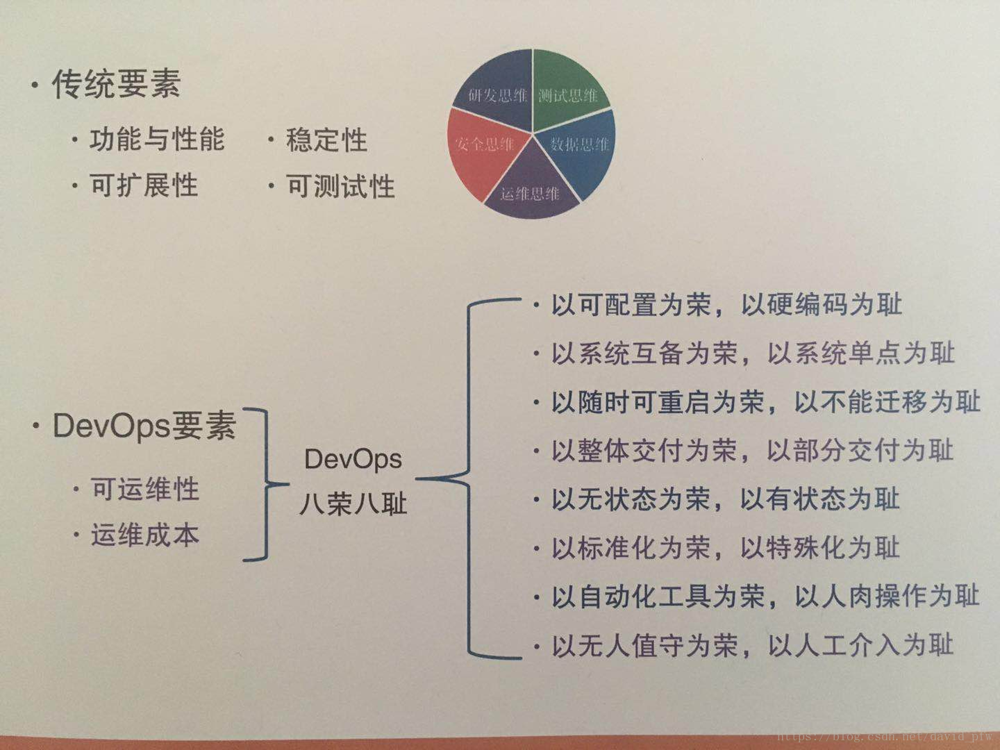

[TOC]


#### unix、c、gnu、linux发展史

> unix有商业版权，linux属于开源自由软件，是gnu自由软件下一款开源操作系统，linux集合gnu其他自由软件，成就了linux

> 开源自由并不等于免费

> linux操作系统可以跑在amd64、x86_64等等架构机器上

- 操作系统运行在某一个架构的机器上，早起不同公司会生产不同架构的计算机
- 肯.汤普森和里奇 在贝尔实验室 创造了unix，unix主要运行在x86架构，i386,...（苹果机器有自己的mac系统，window不能装在苹果机器上）
- 先有unix再有c语言，早起unix通过B语言编写，目前unix通过c语言和汇编语言编写
- 二人又创造了c语言
- unix有版权限制，copy right
- 早期有许多人通过简单修改unix，将它运行在其他架构机器上，软件移植成了问题
- 史托曼发起自由软件计划 - GNU计划，发布GPL版权协议
```
但不能将GPL软件直接售卖，二次改造的软件继续秉承GPL版权协议
```
- 史托曼为C语言写了GCC，GNU C COMPLIEc的编译器 GDBC的调试器
- 托瓦兹不借鉴unix写了linux内核，类unix的操作系统，跑在x86架构的机器上，尊徐GNU下的操作系统，所以GNU/liunux
- 托瓦兹使用C语言，GCC编译出了LINUX内核
- 更多的人开始在linux上写程序并分享出来，linux在内核为基础上，有一个个好用的工具，逐步庞大
- linux确实是linux is not unix
- linux上的软件，逐步通过 ./configure,make,make install,make clean的安装方式


- linux Distributions(linux 发行版)

- 分为二大系统,按照安装软件的区别

  > 发行版千千万万，不是帽子(redhat)就是大便(debian)
```
rpm方式 red hat，fedora，centos
dpkg方法 debian，ubuntu
（安装软件还可以通过源码安装，毕竟linux kernel就是这样安装起来的）
```

```
linux distrubutions = linux kernel+ software + tools
```
```
linux kernel:www.kernel.org
centos:www.centos.org
ubuntu:www.ubuntu.com
```
```
linux 是一个多任务，多用户的操作系统（运行在x86架构的硬件系统）
实现的标准是美国IEEE电气电子工业学会提出的标准，关于可携式操作系统接口POSIX
http://www.ieee.org/index.html
```
- linux主要的二个标准LSB，FHS

#### linux的开机流程

```
1. BIOS 根据记录的启动顺序去找介质
2. CPU读取主引导分区Master Boot Record中的加载程序
3. 加载程序Boot Loader读取具体分区扇区
4. 扇区的内核程序开始启动
```

### devop八荣八耻



#### 同步异步与阻塞非阻塞


- 参考文章
```
https://segmentfault.com/a/1190000003063859#articleHeader11
http://rango.swoole.com/archives/508
```

##### 用户空间与内核空间

```
现在操作系统都是采用虚拟存储器，那么对32位操作系统而言，它的寻址空间（虚拟存储空间）为4G（2的32次方）。操作系统的核心是内核，独立于普通的应用程序，可以访问受保护的内存空间，也有访问底层硬件设备的所有权限。为了保证用户进程不能直接操作内核（kernel），保证内核的安全，操心系统将虚拟空间划分为两部分，一部分为内核空间，一部分为用户空间。针对linux操作系统而言，将最高的1G字节（从虚拟地址0xC0000000到0xFFFFFFFF），供内核使用，称为内核空间，而将较低的3G字节（从虚拟地址0x00000000到0xBFFFFFFF），供各个进程使用，称为用户空间。
```

##### 进程切换

```
为了控制进程的执行，内核必须有能力挂起正在CPU上运行的进程，并恢复以前挂起的某个进程的执行。这种行为被称为进程切换。因此可以说，任何进程都是在操作系统内核的支持下运行的，是与内核紧密相关的。

从一个进程的运行转到另一个进程上运行，这个过程中经过下面这些变化：
1. 保存处理机上下文，包括程序计数器和其他寄存器。
2. 更新PCB信息。
3. 把进程的PCB移入相应的队列，如就绪、在某事件阻塞等队列。
4. 选择另一个进程执行，并更新其PCB。
5. 更新内存管理的数据结构。
6. 恢复处理机上下文。

注：总而言之就是很耗资源，具体的可以参考这篇文章：进程切换
```

##### 进程的阻塞

```
文件描述符（File descriptor）是计算机科学中的一个术语，是一个用于表述指向文件的引用的抽象化概念。

文件描述符在形式上是一个非负整数。实际上，它是一个索引值，指向内核为每一个进程所维护的该进程打开文件的记录表。当程序打开一个现有文件或者创建一个新文件时，内核向进程返回一个文件描述符。在程序设计中，一些涉及底层的程序编写往往会围绕着文件描述符展开。但是文件描述符这一概念往往只适用于UNIX、Linux这样的操作系统。
```

##### 缓存 I/O

```
缓存 I/O 又被称作标准 I/O，大多数文件系统的默认 I/O 操作都是缓存 I/O。在 Linux 的缓存 I/O 机制中，操作系统会将 I/O 的数据缓存在文件系统的页缓存（ page cache ）中，也就是说，数据会先被拷贝到操作系统内核的缓冲区中，然后才会从操作系统内核的缓冲区拷贝到应用程序的地址空间。

缓存 I/O 的缺点：
数据在传输过程中需要在应用程序地址空间和内核进行多次数据拷贝操作，这些数据拷贝操作所带来的 CPU 以及内存开销是非常大的。
```

##### 何为一次完整的io？

```
数据从存储或者网络 存到用户态（进程内存空间）
```

##### 何为阻塞和非阻塞?

```
进程是否被堵塞，被挂起，堵塞时候不占用cpu
```

##### 同步io与异步io

```
数据在完成一次io操作(从存储到用户态)过程中，进程被阻塞，称为同步io
没有被阻塞,称为异步io
```

##### io模式

```
刚才说了，对于一次IO访问（以read举例），数据会先被拷贝到操作系统内核的缓冲区中，然后才会从操作系统内核的缓冲区拷贝到应用程序的地址空间。所以说，当一个read操作发生时，它会经历两个阶段：
1. 等待数据准备 (Waiting for the data to be ready)
2. 将数据从内核拷贝到进程中 (Copying the data from the kernel to the process)

正式因为这两个阶段，linux系统产生了下面五种网络模式的方案。
- 阻塞 I/O（blocking IO）
- 非阻塞 I/O（nonblocking IO）
- I/O 多路复用（ IO multiplexing）
- 信号驱动 I/O（ signal driven IO）
- 异步 I/O（asynchronous IO）
```

##### 内核操作数据梳理

```
kernel

文件描述符

内核态（缓冲区 page cache）

用户态 （进程分配的内存）
```

##### 阻塞io模型流程

```
1.进程调用内核后阻塞
2.直到内核将数据放到用户态后
3. 才唤醒进程
```

##### 非阻塞io模型流程

```
1. 进程调用内核后，内核立马返回状态，进程不阻塞
2. 进程询问内核态数据准备情况
3. 不断询问内核，直到内核态告诉，数据完成
4. 进程阻塞，内核将数据从内核态放到用户态
5. 唤醒进程
```

##### io复用模型流程

```
1. 进程调用select/poll/epoll，进程阻塞
2. 内核将数据放到了内核态后，通知进程，进程被唤醒
3. 进程发指令给内核进行拷贝，再次阻塞
```

##### 异步io

```
1. 进程调用内核后，不阻塞
2. 内核将数据放到用户态后通知进程
3. 进程再处理
期间不会询问内核
```

##### 总结

```
io复用不会提高单个线程吞吐，但是能支持更多链接，提高整个程序吞吐
```


#### 用户管理

##### lnmp用户和目录权限设置


```
新建game01
groupadd game01
useradd game01 -M -s /sbin/nologin -g game01

fpm使用game01运行
fpm.conf:
listen.owner = game01
listen.group = game01
user=game01
group=game01

nginx使用www运行,并将www放入game01组:
usermod -aG game01 www

文件夹权限和所有权,fpm有所有权限，www只有读的权限即可:
chmod 750 -R game01
cd /home/wwwroot/
chown game01.game01 -R game01

vsftp使用game01用户，vsftp是允许禁止登录的用户进行ftp上传
参考：http://blog.51cto.com/cuimk/1306637
```

##### 修改拥有者，组拥有者

```bash
# chown -R user:group dir
# chown user:group file
```
##### 修改权限

```bash
# chmod -R 777 dir
# chmod 777 file
```

##### 发送/接收

```bash
# sz // 发送
# rz // 接收
```
##### vim常用命令

```bash
显示行号
:set number
关闭行号
:set nonumber
多行复制
:100,112 co 188
多行剪切
:100,112 m 188 
多行删除
:100,112 de
跳转到指定行
:12
查找字符串
/str
新开一行
o
跳转文章头
gg
跳转文章尾
G
剪切
：2dd
复制
：2yy
查找
：/str
全局替换，确认
:%s/str1/str2/gc
```
##### less命令

```
# less
b 上一页
空格 下一页
```
##### ls命令

```
ls a*
```
##### grep

```
grep -n "正则"

-a ：将 binary 档案以 text 档案的方式搜寻数据
-c ：计算找到 '搜寻字符串' 的次数
-i ：忽略大小写的不同，所以大小写视为相同
-n ：顺便输出行号
-v ：反向选择，亦即显示出没有 '搜寻字符串' 内容的那一行！

[abc]           ：表示“a”或“b”或“c”
[0-9]           ：表示 0~9 中任意一个数字，等价于[0123456789]
[\u4e00-\u9fa5] :表示任意一个汉字
[^a1<]          :表示除“a”、“1”、“<”外的其它任意一个字符
[^a-z]          :表示除小写字母外的任意一个字符

# grep -n 't[ae]st' regular_express.txt 

# grep -n '^#' regular_express.txt
```
##### 内存编辑器

```bash
sed 不会对源文件进行操作，除非-i
```

##### zip打包

```bash
# zip -r ./avatar.zip ./avatar
# sz ./avatar.zip
# rz
```
##### git

```bash
$git config --global user.name "caokelei"
$git config --global user.email "caokelei@myhexin.com"
$git config -l
$ssh-keygen -t rsa -C "xxx"
版本回退
git reset --hard 3628164
远程分支回滚
加入-f参数，强制提交，远程端将强制跟新到reset版本
git push -f origin 分支名称
git reset --hard HEAD^
```
##### redis

```
set key value

查询key
get key

查询keys
keys *
keys sns* 模糊查找

删除key
del key1

是否存在key
exists key

设置生命周期
expire key 整数值：设置key的生命周期以秒为单位

redis过期时间
查询key过期时间
ttl key

设置过期时间
expire key sconends 秒数
pexpire key mcsecond 毫秒数
expireat key time 
pexpire key microtime

键值过期策略总结：
1.定时删除，内存友好，cpu不友好
2.惰性删除，cpu友好，内存不友好
3.定期删除，折中
redis采用 惰性删除和定期删除这二种策略
```
##### mongodb

```
> show dbs；
> use dbname;
> db.getCollectionNames();
> db.quickReply.find();
> db.quickReply.update({"":""},{$set:{"":""}});
> db.quickReply.update({"_id":ObjectId("")},{$set:{"":""}});
// 删除数据库 - 选择数据库，删除数据库
> use dbname:
> db.dropDatabase();
// 删除collection数据
> db.quickreply.remove({"userid":""})
```

#### dev/shm

```
存放在内存中，快速读取，重新消失，大小上限为内存的一半
```

#### 查看挂载目录以及对应大小

```
df -Th
df -h /dev/shm
mount /dev/shm
umount /dev/shm
fuser -m /dev/shm
```

#### linux登录流程


- 客户端ssh登录
- getty判断客户端输入的用户名和密码
- login 或者 nologin
- login后使用具体bash 如/bin/bash
- 读取/etc/profile全局的shell
```
会去读取/etc/profile.d/*.sh文件
如：/etc/profile.d/lang.sh去读取系统语系
```
- 读取个人的~/.bash_profile
```
会去执行 . .bashrc
```


- bashrc模版
```
位置在/etc/skel/.bashrc
```

#### 命令执行

##### 命令后台执行

```
$ 命令 &
在bash退出后，命令也就结束了
```

##### 命令脱机执行

```
$ nohup 命令 &
在bash退出后，命名也照样执行
```

##### 后台命令查看

```
$ jobs -l
```

##### 后台命令放到前台

```
$ fg %1
1号后台程序，放到前台
```

##### 前台命令放到后台

```
按下ctrl + z
```

##### 后台命令开始启动

```
bg %1
```


#### console与terminal与shell区别

##### 控制台（console）

```
物理设备，与主机相连的控制面板
```

##### shell

```
程序，控制命令和返回
```

##### 终端(terminal)

```
程序，对shell包裹，增加文字输入
```

##### 虚拟终端

```
一共有7个虚拟终端
```


- 参考文章：http://www.jb51.net/LINUXjishu/65800.html


#### 查看某个命令的查找顺序

```
type -a pwd
```

```
优先级：
alias > 内置命令 > $path变量中的命令
```

#### 仅为我新版本替换旧版本命令

```
// 思想修改PATH中的查找顺序
# vim ~/.zshrc

export PATH=/usr/local/newversion/vin:$PATH

# source ~/.zshrc
```

#### 为所有的用户新版本替换旧版本

```
// 思想修改PATH中的查找顺序
# vim /etc/profile

export PATH=/usr/local/newversion/vin:$PATH

```

#### 锁

```
并发情况 | 竞争状态会使用锁

```

##### 互斥锁|独占锁

```
还可以设置上锁的数量
```

##### 读写锁

```
与 互斥锁|独占锁 写锁
共享锁 读锁
```

##### 阻塞与非阻塞

```
是否加阻塞和非阻塞锁
其他进程遇到阻塞锁：其他进程等待，等待其他锁解除
其他进程遇到非阻塞锁：其他进程不等待，程序直接往下走
```

##### 文件锁局限：

```
1. 只能在本台机器
2. 需要文件表项，消耗大
3. 父进程打开的文件表项，可以被子进程共享
```

##### 秒杀，抢购锁的使用：

```
1. 利用mysql主键，上独占锁。
2. 利用redis形成分布式锁，设置key not exist。
```

##### 锁的使用场景:

```
1. 常驻单进程脚本 ：生成文件，上独占和非阻塞锁
```


#### 漫谈视频、音频、图片、文本文件


```
文件有各种格式，以及文件的编码方式。
格式包含多种信息字段，编码方式决定在硬盘的存储结构。
文本文件编码方式有utf8,gb2312等等 格式：txt，data等等
图片文件编码方式与格式基本统一：jpg,gif,png等等
视频文件编码方式h264等等 可以封装成各种格式mp4,flv,mkv等
知道编码方式h264可以获取帧
不同的格式有不同的字段，flv有视频时长字段
```

##### 打开文件的方式

```
文本文件：文本编辑器
图片文件：图片浏览器，网页浏览器【远程文件】
视频文件：视频播放器，网页视频播放器
比如ckplayer: http://www.ckplayer.com/
比如客户端播放：vlcplayer
```


#### rfc文档

##### 什么是rfc

```
文件收集了有关因特网相关资讯，以及UNIX和因特网社群的软件文件.
详细记录说明：互联网通信协议等的文件
```

##### rfc文档列表

```
http://man.chinaunix.net/develop/rfc/default.htm
```

##### 常用rfc文档

```
协议层次 协议缩写 协议英文全称 协议中文名 RFC
Application Layer
COPS Common Open Policy Service 公共开放策略服务 RFC 2748
FANP Flow Attribute Notification Protocol 流属性通知协议 RFC 2129
Finger User Information Protocol 用户信息协议 RFC 1194,1196,1228
FTP File Transfer Protocol 文件传输协议 RFC 959
HTTP Hypertext Transfer Protocol 超文本传输协议 RFC 1945,2616
IMAP4 Internet Message Access Protocol version 4 因特网信息访问协议第四版 RFC 1730
IMPP Instant Messaging and Presence Protocol 即时信息表示协议 RFC 3861
IRC Internet Relay Chat Protocol Internet在线聊天协议 RFC 1459
ISAKMP Internet Security Association and Key Management Protocol ? Interne安全连接和密钥管理协议 RFC 2048
DNS Domain Name System 域名系统 RFC 4343
DHCP Dynamic Host Configuration Protocol 动态主机配置协议 RFC 2131
BOOTP Bootstrap Protocol 引导协议 RFC 951
NTP Network Time Protocol 网络时间协议 RFC 958
NNTP Network News Transfer Protocol 网络新闻传输协议 RFC 977
POP3 Post Office Protocol version 3 邮局协议第三版 RFC 1939
Radius Remote Authentication Dial In User Service 远程用户拨号认证服务协议 RFC 2138
RLOGIN Remote Login 远程登陆协议 RFC 1258,1282
RTSP Real-time Streaming Protocol 实时流协议 RFC 2326
SCTP Stream Control Transmision Protocol 流控制传输协议 RFC 2960
S-HTTP Secure Hypertext Transfer Protocol 安全超文本传输协议 RFC 2660
SLP Service Location Protocol 服务定位协议 RFC 2165
SMTP Simple Mail Transfer Protocol 简单邮件传输协议 RFC 821,2821
ICP Internet Cache Protocol Internet缓存协议 RFC 2186
SNMP Simple Network Management Protocol 简单网络管理协议 RFC 1157
SOCKS Socket Secure 安全套接字协议 RFC 1928
TACACS Terminal Access Controller Access Control System 终端访问控制器访问控制系统协议 RFC 1492
TELNET TCP/IP Terminal Emulation Protocol TCP/IP终端仿真协议 RFC 854
TFTP Trivial File Transfer Protocol 简单文件传输协议 RFC 1350
X-Window X Window X Window RFC 1198
Presentation Layer
NBSSN NetBIOS Session Service NetBIOS会话服务协议 RFC 1001
LPP LightWight Presentation Protocol 轻量级表示协议 RFC 1085
Session Layer
TLS Transport Layer Security 传输层安全协议 RFC 2246
LDAP Lightweight Directory Access Protocol 轻量级目录访问协议 RFC 1777
RPC Remote Procedure Call protocol 远程过程调用协议 RFC 1050,1057,1831
Transport Layer
Mobile IP Mobile IP Protocol 移动IP协议 RFC 2002
RUDP Reliable User Datagram Protocol 可靠的用户数据报协议 RFC 908,1151
TALI Transport Adapter Layer Interface 传输适配层接口协议 RFC 3094
TCP Transmission Control Protocol 传输控制协议 RFC 793
UDP User Datagram Protocol 用户数据报协议 RFC 768
Van Jacobson compressed TCP 压缩TCP协议 RFC 1144
XOT X.25 over TCP 基于TCP之上的X.25协议 RFC 1613
Network Layer
EGP Exterior Gateway Protocol 外部网关协议 RFC 827
OSPF Open Shortest Path First 开放最短路径优先协议 RFC 2178,2328
DVMRP Distance Vector Multicast Routing Protocol 距离矢量组播路由协议 RFC 1075
ICMP Internet Control Message Protocol version 4 Internet控制信息协议 RFC 792
ICMPv6 Internet Control Message Protocol version 6 Internet控制信息协议第6版 RFC 1885,2463
IGMP Internet Group Management Protocol Internet组管理协议 RFC 1112, 2236,3376
IP Internet Protocol version 4 互联网协议 RFC 791
NHRP Next Hop Resolution Protocol 下一跳解析协议 RFC 2332
IPv6 Internet Protocol version 6 互联网协议第6版 RFC 1883,2460
MOSPF Mulitcast Open Shortest Path First 组播开放最短路径优先协议 RFC 1585
PGM Pragamatic General Mulitcast Protocol 实际通用组播协议 RFC 3208
PIM-SM Protocol Independent Multicast-Sparse Mode 稀疏模式独立组播协议 RFC 2362
PIM-DM Protocol Independent Multicast-Dense Mode 密集模式独立组播协议 RFC 3973
SLIP Serial Line IP 串行线路IP协议 RFC 1055
MARS Multicast Address Resolution Server 组播地址解析服务器协议 RFC 2022
RIP2 Routing Information Protocol version 2 路由信息协议第2版 RFC 2453
RIPng for IPv6 Routing Information Protocol for IPv6 IPv6路由信息协议 RFC 2080
RSVP Resource-Reservation Protocol 资源预留协议 RFC 2205,2750
VRRP Virtual Router Redundancy Protocol 虚拟路由器冗余协议 RFC 2338,3768
AH Authentication Header Protocol 认证头协议 RFC 2402
ESP Encapsulating Security Payload 安全封装有效载荷协议 RFC 2406
Data Link Layer
ARP Address Resolution Protocol 地址解析协议 RFC 826
RARP Reverse Address Resolution Protocol 逆向地址解析协议 RFC 903
IARP Inverse Address Resolution Protocol 逆向地址解析协议 RFC 2390
DCAP Data Link Switching Client Access Protocol 数据转接客户访问协议 RFC 2114
MPLS Multi-Protocol Label Switching 多协议标签交换协议 RFC 3031,3032
ATMP Ascend Tunnel Management Protocol 接入隧道管理协议 RFC 2107
L2F The Layer 2 Forwarding Protocol 第二层转发协议 RFC 2341
L2TP Layer 2 Tunneling Protocol 第二层隧道协议 RFC 2661
PPTP Point to Point Tunneling Protocol 点对点隧道协议 RFC 2637
```

##### 英文rfc

```

http://blog.csdn.net/javajiawei/article/details/52371056
```


#### 字节序

##### 参考文章

```
https://www.cnblogs.com/gremount/p/8830707.html
```

```
小端，对于cpu是高效，其他场合，人类书写，网络，存储都是大端序。
```

#### 软件向上兼容与向下兼容

- 参照文章：https://zh.wikipedia.org/wiki/%E5%90%91%E4%B8%8B%E5%85%BC%E5%AE%B9
```
向下兼容 与 向上兼容 相互关系
A 对 B 向下兼容，则 B 对 A 向上兼容
向下兼容 = 向后兼容
向上兼容 = 向前兼容
```

- 向下兼容 = 向后兼容
```
向下兼容（downward compatibility），又称向后兼容（backward compatibility）、回溯兼容，在计算机中指在一个程序、库或硬件更新到较新版本后，
用旧版本程序创建的文档或系统仍能被正常操作或使用（包括输入数据）、在旧版本库的基础上开发的程序仍能正常编译运行，或较旧版的硬件仍可在新版使用的情况。
```

- 举例说明
- 软件
```
在文件系统中，ext4文件系统的设计就是向后兼容的，ext3的文件系统可以被当作ext4文件系统挂载。
通常更新一个软件时，应该为向下兼容性做出一定的考虑，这往往能给用户带来方便并更好地留住用户。Microsoft 特别强调维持软件的向下兼容性。为了实现此一目标，有时微软甚至不惜支持使用了非官方乃至误用的 API 的软件[1]。
但情况并不总是这样，有时为了考虑向下兼容会带来一些累赘，尤其是进行过较多升级后。Python 3.0 便是放弃向下兼容的一个例子[2][3]。
如果一个软件的旧的版本保存的文档不能被新版本读取，即使厂商提供了额外工具对旧文档进行不可逆转的转换，这也不能称作向下兼容。这可能是软件厂商的一种市场战略，强迫用户购买升级软件，随着升级用户逐渐增加，逐渐地使得旧软件能读取的文档越来越少。
```

- 硬件
```
以广为使用的通用串行总线（USB）为例，从最初的1.1版到2015年时的3.1版，A型的插头与插座均可跨版本互相使用，仅新版本所支持的较大传输速率与一些新特性无法为旧版所使用。
此外还有Xbox One对Xbox 360和Wii U对Wii的旧版本游戏在新版本硬件中提供支持。
```

#### 软件许可证
- 参考文章：https://linux.cn/article-2266-1.html

- 阮一峰制作的中文版 选择开源许可证